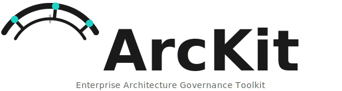
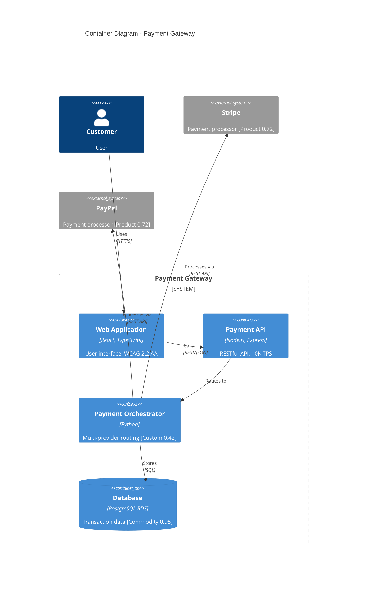
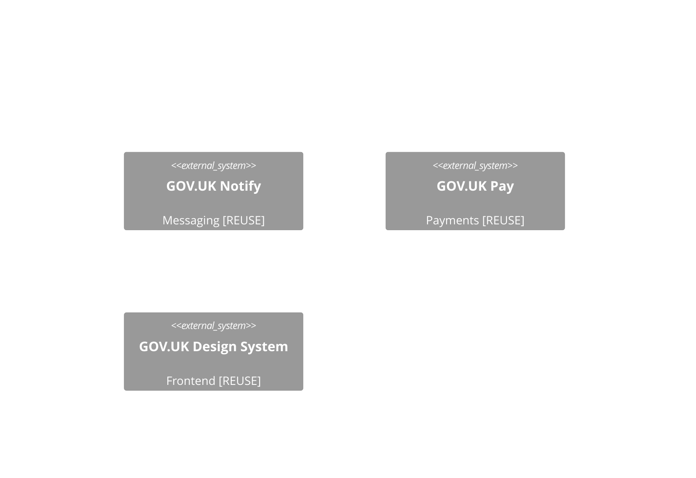
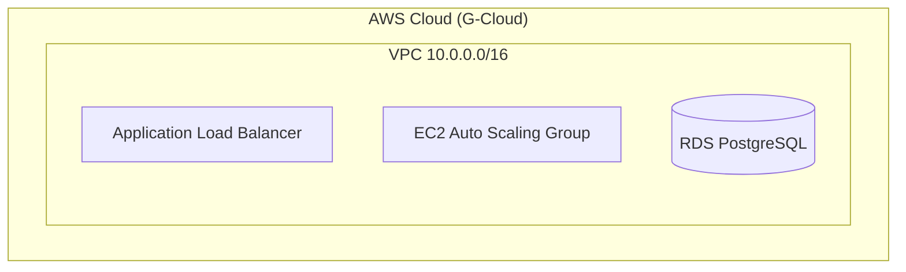
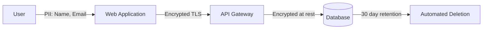

# ArcKit - Enterprise Architecture Governance Toolkit



**Build better enterprise architecture through structured governance, vendor procurement, and design review workflows.**

ArcKit is a toolkit for enterprise architects that transforms architecture governance from scattered documents into a systematic, AI-assisted workflow for:
- 🏛️ Establishing and enforcing architecture principles
- 👥 Analyzing stakeholder drivers, goals, and outcomes
- 🛡️ Risk management (HM Treasury Orange Book)
- 💼 Business case justification (HM Treasury Green Book SOBC)
- 📋 Creating comprehensive requirements documents
- 🗄️ Data modeling with ERD, GDPR compliance, and data governance
- 🔬 Technology research with build vs buy analysis (web search powered)
- 🗺️ Strategic planning with Wardley Mapping
- 📊 Generating visual architecture diagrams (Mermaid)
- 🤝 Managing vendor RFP and selection processes
- ✅ Conducting formal design reviews (HLD/DLD)
- 🔧 ServiceNow service management design
- 🔗 Maintaining requirements traceability

---

## Quick Start

### Installation

Install ArcKit CLI:

```bash
# Install with pip
pip install git+https://github.com/tractorjuice/arc-kit.git

# Or with uv
uv tool install arckit-cli --from git+https://github.com/tractorjuice/arc-kit.git

# Or run without installing
uvx --from git+https://github.com/tractorjuice/arc-kit.git arckit init my-project
```

**Latest Release**: [v0.8.3](https://github.com/tractorjuice/arc-kit/releases/tag/v0.8.3)

### Initialize a Project

```bash
# Create a new architecture governance project
arckit init payment-modernization --ai claude

# Or use OpenAI Codex CLI
arckit init payment-modernization --ai codex

# Or initialize in current directory
arckit init . --ai claude
```

### Start Using ArcKit

```bash
cd payment-modernization
claude  # or your chosen AI assistant

# Inside your AI assistant, use ArcKit commands:
/arckit.principles Create principles for a financial services company
/arckit.requirements Build a payment processing system...
/arckit.sow Generate RFP for vendor selection
```

---

## The ArcKit Workflow

ArcKit guides you through the enterprise architecture lifecycle:

### Phase 0: Project Planning
**`/arckit.plan`** → Create project plan with timeline, phases, and gates

Visualize your entire project delivery:
- GDS Agile Delivery phases (Discovery → Alpha → Beta → Live)
- Mermaid Gantt chart with timeline, dependencies, and milestones
- Workflow diagram showing gates and decision points
- Tailored timeline based on project complexity
- Integration of all ArcKit commands into schedule
- Gate approval criteria for governance

### Phase 1: Establish Governance
**`/arckit.principles`** → Create enterprise architecture principles

Define your organisation's architecture standards:
- Cloud strategy (AWS/Azure/GCP)
- Security frameworks (Zero Trust, compliance)
- Technology standards
- FinOps and cost governance

### Phase 2: Stakeholder Analysis
**`/arckit.stakeholders`** → Analyze stakeholder drivers, goals, and outcomes

**Do this BEFORE business case** to understand who cares about the project and why:
- Identify all stakeholders (internal and external)
- Document underlying drivers (strategic, operational, financial, compliance, risk, personal)
- Map drivers to SMART goals
- Map goals to measurable outcomes
- Create Stakeholder → Driver → Goal → Outcome traceability
- Identify conflicts and synergies
- Define engagement and communication strategies

### Phase 3: Risk Assessment
**`/arckit.risk`** → Create comprehensive risk register (Orange Book)

**Do this BEFORE business case** to identify and assess risks systematically:
- Follow HM Treasury Orange Book 2023 framework
- Identify risks across 6 categories (Strategic, Operational, Financial, Compliance, Reputational, Technology)
- Assess inherent risk (before controls) and residual risk (after controls)
- Apply 4Ts response framework (Tolerate, Treat, Transfer, Terminate)
- Link every risk to stakeholder from RACI matrix
- Monitor risk appetite compliance
- Feed into SOBC Management Case Part E

### Phase 4: Business Case Justification
**`/arckit.sobc`** → Create Strategic Outline Business Case (SOBC)

**Do this BEFORE requirements** to justify investment and secure approval:
- Use HM Treasury Green Book 5-case model (Strategic, Economic, Commercial, Financial, Management)
- Analyze strategic options (Do Nothing, Minimal, Balanced, Comprehensive)
- Map benefits to stakeholder goals (complete traceability)
- Provide high-level cost estimates (Rough Order of Magnitude)
- Economic appraisal (ROI range, payback period)
- Procurement and funding strategy
- Governance and risk management (uses risk register)
- Enable go/no-go decision BEFORE detailed requirements work

### Phase 5: Define Requirements
**`/arckit.requirements`** → Document comprehensive requirements

Create detailed requirements **informed by stakeholder goals** (if SOBC approved):
- Business requirements with rationale
- Functional requirements with acceptance criteria
- Non-functional requirements (performance, security, scalability, compliance)
- Integration requirements (upstream/downstream systems)
- Data requirements (DR-xxx)
- Success criteria and KPIs

### Phase 5.5: Data Modeling
**`/arckit.data-model`** → Create comprehensive data model with ERD

Create data model based on Data Requirements (DR-xxx):
- Visual Entity-Relationship Diagram (ERD) using Mermaid
- Detailed entity catalog with attributes, types, validation rules
- PII identification and GDPR/DPA 2018 compliance
- Data governance matrix (business owners, stewards, custodians)
- CRUD matrix showing component access patterns
- Data integration mapping (upstream sources, downstream consumers)
- Data quality framework with measurable metrics
- Requirements traceability (DR-xxx → Entity → Attribute)

### Phase 6: Technology Research
**`/arckit.research`** → Research technology, services, and products

Research available solutions to meet requirements with build vs buy analysis:
- Dynamic category detection from requirements (authentication, payments, databases, etc.)
- Commercial SaaS options with pricing, reviews, and ratings (WebSearch)
- Open source alternatives with GitHub stats and community maturity
- UK Government GOV.UK platforms (One Login, Pay, Notify, Forms)
- Digital Marketplace suppliers (G-Cloud, DOS)
- Total Cost of Ownership (TCO) comparison (3-year)
- Build vs Buy vs Adopt recommendations
- Vendor shortlisting for deeper evaluation
- Integration with Wardley mapping (evolution positioning)
- Feeds into SOBC Economic Case (cost data, options analysis)

### Phase 7: Strategic Planning with Wardley Mapping
**`/arckit.wardley`** → Create strategic Wardley Maps

Visualize strategic positioning with:
- Component evolution analysis (Genesis → Custom → Product → Commodity)
- Build vs Buy decision framework
- Vendor comparison and procurement strategy
- UK Government Digital Marketplace mapping
- Evolution predictions and strategic gameplay

### Phase 8: Vendor Procurement (if needed)
**`/arckit.sow`** → Generate Statement of Work (RFP)

Create RFP-ready documents with:
- Scope of work and deliverables
- Technical requirements
- Vendor qualifications
- Evaluation criteria
- Contract terms

**`/arckit.dos`** → Digital Outcomes and Specialists (DOS) procurement 🇬🇧

For UK public sector organizations needing custom development:
- Generate DOS-compliant procurement documentation
- Extract requirements from project artifacts (BR/FR/NFR/INT/DR)
- Essential vs desirable skills from requirements
- Success criteria (technology-agnostic)
- Evaluation framework (40% Technical, 30% Team, 20% Quality, 10% Value)
- Audit-ready documentation for Digital Marketplace

**`/arckit.gcloud-search`** → G-Cloud service search with live marketplace search 🇬🇧

For UK public sector organizations needing off-the-shelf cloud services:
- Generate G-Cloud requirements document
- **Live Digital Marketplace search** using WebSearch
- Find actual services with suppliers, prices, features, links
- Service comparison table with recommendations
- Shortlist top 3-5 matching services
- Links to Digital Marketplace guidance (gov.uk)

**`/arckit.gcloud-clarify`** → G-Cloud service validation and gap analysis 🇬🇧

Validate G-Cloud services and generate supplier clarification questions:
- **Systematic gap analysis** (MUST/SHOULD requirements vs service descriptions)
- Detect gaps: ✅ Confirmed, ⚠️ Ambiguous, ❌ Not mentioned
- Generate prioritised questions (🔴 Critical / 🟠 High / 🔵 Medium / 🟢 Low)
- Risk assessment matrix for each service
- Email templates for supplier engagement
- Evidence requirements specification
- Next steps checklist

**`/arckit.evaluate`** → Create vendor evaluation framework

Set up systematic scoring:
- Technical evaluation criteria (100 points)
- Cost evaluation methodology
- Reference check templates
- Decision matrix

**`/arckit.evaluate`** (compare mode) → Compare vendor proposals

Side-by-side analysis of:
- Technical approaches
- Cost breakdowns
- Risk assessments
- Value propositions

### Phase 9: Design Review
**`/arckit.hld-review`** → Review High-Level Design

Validate designs against:
- Architecture principles compliance
- Requirements coverage
- Security and compliance
- Scalability and resilience
- Operational readiness

**`/arckit.dld-review`** → Review Detailed Design

Implementation-ready validation:
- Component specifications
- API contracts (OpenAPI)
- Database schemas
- Security implementation
- Test strategy

### Phase 10: Sprint Planning
**`/arckit.backlog`** → Generate prioritised product backlog

Transform requirements into sprint-ready user stories:
- Convert requirements (BR/FR/NFR/INT/DR) to GDS-format user stories
- Multi-factor prioritization (MoSCoW + risk + value + dependencies)
- Organise into sprint plan with capacity balancing
- Generate traceability matrix (requirements → stories → sprints)
- Export to Jira/Azure DevOps (CSV) or custom tools (JSON)
- **Time savings**: 75%+ (4-6 weeks → 3-5 days)

**When to run**: After HLD approval, before Sprint 1 (Alpha → Beta transition)

### Phase 11: ServiceNow Service Management Design
**`/arckit.servicenow`** → Generate ServiceNow service design

Bridge architecture to operations:
- CMDB design (derived from architecture diagrams)
- SLA definitions (derived from NFRs)
- Incident management design
- Change management plan
- Monitoring and alerting plan
- Service transition plan

### Phase 12: Traceability
**`/arckit.traceability`** → Generate traceability matrix

Ensure complete coverage:
- Requirements → Design mapping
- Design → Test mapping
- Gap analysis and orphan detection
- Change impact tracking

### Phase 13: Quality Assurance
**`/arckit.analyze`** → Comprehensive governance quality analysis

Periodically assess governance quality across all artifacts:
- Architecture principles compliance
- Requirements coverage and traceability
- Stakeholder alignment verification
- Risk management completeness
- Design review quality
- Documentation completeness and quality
- Gap identification and recommendations

**When to use**: Run periodically (before milestones, design reviews, or procurement decisions) to identify gaps and ensure governance standards are maintained.

### Phase 14: Compliance Assessment (UK Government)
For UK Government and public sector projects:

**`/arckit.service-assessment`** → GDS Service Standard assessment preparation

Prepare for mandatory GDS Service Standard assessments:
- Analyze evidence against all 14 Service Standard points
- Identify gaps for alpha, beta, or live assessments
- Generate RAG (Red/Amber/Green) ratings and overall readiness score
- Provide actionable recommendations with priorities and timelines
- Include assessment day preparation guidance
- Map ArcKit artifacts to Service Standard evidence requirements

Run at end of Discovery (for alpha prep), mid-Beta (for beta prep), or before Live to ensure readiness.

**`/arckit.tcop`** → Technology Code of Practice assessment

Assess compliance with all 13 TCoP points:
- Point 1: Define user needs
- Point 2: Make things accessible
- Point 3: Be open and use open source
- Point 4: Make use of open standards
- Point 5: Use cloud first
- Point 6: Make things secure
- Point 7: Make privacy integral
- Point 8: Share, reuse and collaborate
- Point 9: Integrate and adapt technology
- Point 10: Make better use of data
- Point 11: Define your purchasing strategy
- Point 12: Meet the Digital Spend Controls
- Point 13: Define your responsible AI use

**`/arckit.secure`** → UK Government Secure by Design assessment

Security compliance assessment:
- NCSC Cloud Security Principles
- NCSC Cyber Assessment Framework (CAF)
- Cyber Essentials / Cyber Essentials Plus
- UK GDPR and DPA 2018 compliance
- Security architecture review
- Threat modeling

**`/arckit.ai-playbook`** → AI Playbook compliance (for AI systems)

Responsible AI assessment:
- AI ethics principles
- Transparency and explainability
- Fairness and bias mitigation
- Data governance for AI
- Human oversight mechanisms
- Impact assessment

**`/arckit.atrs`** → Algorithmic Transparency Recording Standard

Generate ATRS record for algorithmic decision-making:
- Algorithm details and logic
- Purpose and use case
- Data sources and data quality
- Performance metrics and monitoring
- Impact assessment and mitigation

**For MOD Projects**:

**`/arckit.mod-secure`** → MOD Secure by Design assessment

MOD-specific security compliance:
- JSP 440 (Defence Project & Programme Management)
- Information Assurance Maturity Model (IAMM)
- MOD Security clearances and vetting
- STRAP classification handling
- Security Operating Procedures (SyOPs)
- Supplier attestation requirements

**`/arckit.jsp-936`** → MOD JSP 936 AI Assurance Documentation

For defence projects using AI/ML systems:
- JSP 936 (Dependable Artificial Intelligence in Defence)
- 5 Ethical Principles (Human-Centricity, Responsibility, Understanding, Bias & Harm Mitigation, Reliability)
- 5 Risk Classification Levels (Critical to Minor)
- 8 AI Lifecycle Phases (Planning to Quality Assurance)
- Approval pathways (2PUS/Ministerial → Defence-Level → TLB-Level)
- RAISOs and Ethics Manager governance
- Human-AI teaming strategy and continuous monitoring

### Phase 15: Project Story & Reporting
**`/arckit.story`** → Generate comprehensive project story

Create narrative historical record with complete timeline analysis:
- **Timeline Analysis**: 4 visualization types (Gantt chart, linear flowchart, detailed table, phase duration pie chart)
- **Timeline Metrics**: Project duration, velocity, phase analysis, critical path identification
- **Complete Timeline**: All events from git log or file modification dates with days-from-start
- **8 Narrative Chapters**: Foundation → Business Case → Requirements → Research → Procurement → Design → Delivery → Compliance
- **Traceability Demonstration**: End-to-end chains with Mermaid diagrams showing stakeholder → goals → requirements → stories → sprints
- **Governance Achievements**: Showcase compliance (TCoP, Service Standard, NCSC CAF), risk management, decision rationale
- **Strategic Context**: Wardley Map insights, build vs buy decisions, vendor selection rationale
- **Lessons Learned**: Pacing analysis, timeline deviations, recommendations for future projects
- **Comprehensive Appendices**: Artifact register, chronological activity log, DSM, command reference, glossary

**When to use**: At project milestones or completion to create shareable story for stakeholders, leadership, or portfolio reporting. Perfect for demonstrating systematic governance and ArcKit workflow value.

---

## Why ArcKit?

### Problem: Architecture Governance is Broken

Traditional enterprise architecture suffers from:
- ❌ Scattered documents across tools (Word, Confluence, PowerPoint)
- ❌ Inconsistent governance enforcement
- ❌ Manual vendor evaluation with bias
- ❌ Lost traceability between requirements and design
- ❌ Stale documentation that doesn't match reality

### Solution: Structured, AI-Assisted Governance

ArcKit provides:
- ✅ **Template-Driven Quality**: Comprehensive templates ensure nothing is forgotten
- ✅ **Systematic Workflows**: Clear processes from requirements → procurement → design review
- ✅ **AI Assistance**: Let AI handle document generation, you focus on decisions
- ✅ **Enforced Traceability**: Automatic gap detection and coverage analysis
- ✅ **Version Control**: Git-based workflow for all architecture artifacts

---

## Supported AI Agents

| Agent | Support | Notes |
|-------|---------|-------|
| [Claude Code](https://www.anthropic.com/claude-code) | ✅ | Recommended |
| [OpenAI Codex CLI](https://chatgpt.com/features/codex) | ✅ | ChatGPT Plus/Pro/Enterprise ([Setup Guide](.codex/README.md)) |
| [Gemini CLI](https://github.com/google-gemini/gemini-cli) | ✅ | |

### Using with Codex CLI

For OpenAI Codex CLI users, commands use the `/prompts:` format:

```bash
# Set CODEX_HOME to use project-specific commands
export CODEX_HOME="$(pwd)/.codex"
codex --auto

# Then use ArcKit commands
/prompts:arckit.principles Create principles for financial services
/prompts:arckit.stakeholders Analyze stakeholders for cloud migration
/prompts:arckit.requirements Create comprehensive requirements
```

See [.codex/README.md](.codex/README.md) for full Codex CLI setup and usage.

---

## Example: Payment Modernization Project

```bash
# 1. Initialize project
arckit init payment-modernization --ai claude
cd payment-modernization
claude

# 2. Establish principles
/arckit.principles Create principles for PCI-DSS compliant payment processing with 99.99% availability

# 3. Analyze stakeholders
/arckit.stakeholders Analyze stakeholders where CFO wants cost reduction, CTO wants modern architecture, and Compliance needs PCI-DSS Level 1

# 4. Assess risks
/arckit.risk Create risk register for payment gateway project

# 5. Create business case using risk register
/arckit.sobc Create SOBC for payment gateway modernization with £2M investment

# 6. Document requirements (if SOBC approved)
/arckit.requirements Build a payment gateway that processes credit cards, supports 10K TPS,
complies with PCI-DSS Level 1, integrates with Stripe and PayPal, and provides real-time
fraud detection

# 7. Create data model with ERD and GDPR compliance
/arckit.data-model Create data model for payment gateway with PCI-DSS compliance

# 8. Research technology options with build vs buy analysis
/arckit.research Research technology options for payment gateway - analyze authentication, payments, databases, monitoring

# 9. Create strategic Wardley Map for build vs buy decisions
/arckit.wardley Create current state Wardley Map for payment gateway showing build vs buy strategy

# 10. Generate SOW for vendor RFP
/arckit.sow Generate RFP for vendor selection with 12-month timeline and $2M budget

# 11. After receiving vendor proposals...
/arckit.evaluate Create evaluation framework

# 12. Score vendors
/arckit.evaluate Compare all vendors for payment gateway project

# 13. Review selected vendor's HLD
/arckit.hld-review Review Acme Corp's high-level design

# 14. Review detailed design
/arckit.dld-review Review Acme Corp's detailed design for payment service

# 15. Design ServiceNow service management
/arckit.servicenow Generate ServiceNow design for payment gateway service

# 16. Ensure traceability
/arckit.traceability Generate matrix from requirements through design to tests
```

---

## Project Structure

ArcKit creates this structure:

```
payment-modernization/
├── .arckit/
│   ├── memory/
│   │   └── architecture-principles.md    # Global principles
│   ├── scripts/
│   │   └── bash/                          # Automation scripts
│   └── templates/                         # Document templates
├── projects/
│   └── 001-payment-gateway/
│       ├── stakeholder-drivers.md         # Stakeholder analysis
│       ├── risk-register.md                # Risk register (Orange Book)
│       ├── sobc.md                         # Strategic Outline Business Case
│       ├── requirements.md                 # Comprehensive requirements
│       ├── data-model.md                   # Data model with ERD, GDPR compliance
│       ├── wardley-maps/                   # Strategic Wardley Maps
│       │   ├── current-state.md            # Current architecture positioning
│       │   ├── future-state.md             # Target architecture vision
│       │   ├── gap-analysis.md             # Current vs future comparison
│       │   └── procurement-strategy.md     # Build vs buy decisions
│       ├── sow.md                          # Statement of Work (RFP)
│       ├── evaluation-criteria.md          # Vendor evaluation framework
│       ├── vendors/
│       │   ├── acme-corp/
│       │   │   ├── proposal.pdf
│       │   │   ├── scoring.md
│       │   │   ├── hld-v1.md
│       │   │   └── reviews/
│       │   │       └── hld-v1-review.md
│       │   ├── beta-systems/
│       │   │   └── ...
│       │   └── comparison.md
│       ├── servicenow-design.md            # Service management design
│       ├── traceability-matrix.md
│       └── final/
│           ├── selected-vendor.md
│           ├── approved-hld.md
│           └── dld/
└── .claude/commands/                      # AI assistant commands
```

---

## Available Commands

### Core Commands

| Command | Purpose | Output |
|---------|---------|--------|
| `/arckit.principles` | Establish architecture governance | `memory/architecture-principles.md` |
| `/arckit.stakeholders` | Analyze stakeholder drivers, goals, and outcomes | `projects/XXX/stakeholder-drivers.md` |
| `/arckit.risk` | Create comprehensive risk register (Orange Book) | `projects/XXX/risk-register.md` |
| `/arckit.sobc` | Create Strategic Outline Business Case (Green Book 5-case) | `projects/XXX/sobc.md` |
| `/arckit.requirements` | Define comprehensive requirements | `projects/XXX/requirements.md` |
| `/arckit.data-model` | Create data model with ERD, GDPR compliance, data governance | `projects/XXX/data-model.md` |
| `/arckit.research` | Research technology, services, and products with build vs buy analysis | `projects/XXX/research-findings.md` |
| `/arckit.wardley` | Create strategic Wardley Maps for build vs buy and procurement strategy | `projects/XXX/wardley-maps/{map-name}.md` |
| `/arckit.sow` | Generate vendor RFP | `projects/XXX/sow.md` |
| `/arckit.dos` | Generate Digital Outcomes and Specialists (DOS) procurement docs for UK Digital Marketplace | `projects/XXX/procurement/dos-requirements.md` |
| `/arckit.gcloud-search` | Search G-Cloud services on UK Digital Marketplace with live WebSearch | `projects/XXX/procurement/gcloud-requirements.md` |
| `/arckit.gcloud-clarify` | Validate G-Cloud services and generate supplier clarification questions | `projects/XXX/procurement/gcloud-clarification-questions.md` |

### Sprint Planning

| Command | Purpose | Output |
|---------|---------|--------|
| `/arckit.backlog` | Generate prioritised product backlog - convert requirements to GDS user stories, organise into sprints | `projects/XXX/backlog.md` (+ optional CSV/JSON) |

### Vendor Management

| Command | Purpose | Output |
|---------|---------|--------|
| `/arckit.evaluate` | Create evaluation framework and score vendors | `projects/XXX/evaluation-criteria.md`, `projects/XXX/vendor-comparison.md` |

### Design Review

| Command | Purpose | Output |
|---------|---------|--------|
| `/arckit.hld-review` | Review high-level design | `projects/XXX/vendors/[vendor]/reviews/hld-review.md` |
| `/arckit.dld-review` | Review detailed design | `projects/XXX/vendors/[vendor]/reviews/dld-review.md` |

### Architecture Diagrams

| Command | Purpose | Output |
|---------|---------|--------|
| `/arckit.diagram` | Generate visual architecture diagrams using Mermaid (C4, deployment, sequence, data flow) | `projects/XXX/diagrams/{diagram-type}-{name}.md` |

### Service Management

| Command | Purpose | Output |
|---------|---------|--------|
| `/arckit.servicenow` | Generate ServiceNow service design (CMDB, SLAs, incident/change management, monitoring) | `projects/XXX/servicenow-design.md` |

### Traceability

| Command | Purpose | Output |
|---------|---------|--------|
| `/arckit.traceability` | Generate traceability matrix | `projects/XXX/traceability-matrix.md` |

### Quality Assurance

| Command | Purpose | Output |
|---------|---------|--------|
| `/arckit.analyze` | Comprehensive governance quality analysis across all artifacts | `projects/XXX/analysis-report.md` |

### UK Government Compliance

| Command | Purpose | Output |
|---------|---------|--------|
| `/arckit.service-assessment` | Prepare for GDS Service Standard assessment - analyze evidence against 14 points, identify gaps, generate readiness report | `projects/XXX/service-assessment-{phase}-prep.md` |
| `/arckit.tcop` | Comprehensive Technology Code of Practice assessment (all 13 points, Digital Spend Controls) | `projects/XXX/tcop-review.md` |
| `/arckit.ai-playbook` | Assess AI Playbook compliance for responsible AI | `projects/XXX/ai-playbook-assessment.md` |
| `/arckit.atrs` | Generate Algorithmic Transparency Recording Standard (ATRS) record | `projects/XXX/atrs-record.md` |

### Security Assessment

| Command | Purpose | Output |
|---------|---------|--------|
| `/arckit.secure` | UK Government Secure by Design assessment (NCSC CAF, Cyber Essentials, UK GDPR) | `projects/XXX/ukgov-secure-by-design.md` |
| `/arckit.mod-secure` | MOD Secure by Design assessment (JSP 440, IAMM, security clearances) | `projects/XXX/mod-secure-by-design.md` |
| `/arckit.jsp-936` | MOD JSP 936 AI assurance documentation for defence AI/ML systems | `projects/XXX/jsp-936-assessment.md` |

---

## Wardley Mapping for Strategic Architecture

**ArcKit integrates Wardley Mapping for strategic situational awareness and build vs buy decision-making.**

### What is Wardley Mapping?

Wardley Mapping is a strategic visualization technique that helps you:
- **Map the value chain**: From user needs → capabilities → components
- **Position by evolution**: Genesis (novel) → Custom → Product → Commodity
- **Identify movement**: How components evolve over time
- **Make strategic decisions**: Build vs Buy, vendor selection, technology choices

### Evolution Stages

| Stage | Evolution | Strategic Action | Example |
|-------|-----------|------------------|---------|
| **Genesis** | 0.00-0.25 | Build only if strategic differentiator, R&D focus | Novel AI algorithm, new protocol |
| **Custom** | 0.25-0.50 | Critical build vs buy decision, invest in IP | Custom integration, specialized service |
| **Product** | 0.50-0.75 | Buy from vendors, compare features | Salesforce, Oracle, SAP |
| **Commodity** | 0.75-1.00 | Always use commodity/cloud, never build | AWS S3, Auth0, PostgreSQL |

### Wardley Mapping in ArcKit

The `/arckit.wardley` command creates strategic maps for:

**Current State Mapping**:
- Understand existing system landscape
- Identify technical debt and inertia
- Baseline for transformation

**Future State Mapping**:
- Visualize target architecture
- Plan evolution paths
- Strategic roadmap development

**Gap Analysis**:
- Compare current vs future state
- Prioritize investments
- Identify migration paths

**Vendor Comparison**:
- Compare vendor proposals strategically
- Assess vendor lock-in risks
- Validate vendor evolution positioning

**Procurement Strategy** (UK Government):
- Map components to Digital Marketplace frameworks
- Identify GOV.UK service reuse opportunities
- Align with Technology Code of Practice

### Example: Benefits Eligibility Chatbot (UK Government)

```bash
# Create Wardley Map for procurement strategy
/arckit.wardley Create procurement strategy Wardley Map for DWP benefits eligibility chatbot

# Map output shows:
# - BUILD: Benefits rules engine (Custom, 0.42) - domain expertise
# - BUILD: Human review queue (Custom, 0.45) - HIGH-RISK AI requirement
# - BUY (G-Cloud): GPT-4 (Product, 0.72) - commercial LLM
# - BUY (G-Cloud): Cloud hosting (Commodity, 0.95) - AWS via G-Cloud
# - REUSE: GOV.UK Notify (Commodity, 0.92) - email/SMS notifications
# - REUSE: GOV.UK Design System (Product, 0.75) - accessibility compliance
```

**Strategic Insights**:
- 40% build (competitive advantage components)
- 35% buy via G-Cloud (commodity/product components)
- 25% reuse GOV.UK services (avoid duplication)

### Wardley Mapping Integration

Wardley Maps integrate throughout the ArcKit workflow:

- **Requirements Phase**: Identify components and evolution stages
- **Procurement Phase**: Guide build vs buy decisions
- **Vendor Evaluation**: Compare vendor architectures strategically
- **Design Review**: Validate designs against strategic positioning
- **Analysis**: Detect misaligned decisions (building commodity components)

### Visualization

All Wardley Maps use the **OnlineWardleyMaps** format and can be visualized at:

**[https://create.wardleymaps.ai](https://create.wardleymaps.ai)**

Simply paste the map code from the generated document to see the visual map.

---

## Architecture Diagrams with Mermaid

**ArcKit generates visual architecture diagrams using Mermaid for clear technical communication.**

### What are Architecture Diagrams?

Architecture diagrams visualize system structure, interactions, and deployment for:
- **Technical Communication**: Share architecture with stakeholders
- **Design Documentation**: Document current and future state
- **Vendor Evaluation**: Compare vendor technical approaches
- **UK Government Compliance**: Visualize Cloud First, GOV.UK services, PII handling

### Diagram Types

ArcKit supports 6 essential diagram types based on the C4 Model and enterprise architecture best practices:

| Diagram Type | Level | Purpose | When to Use |
|--------------|-------|---------|-------------|
| **C4 Context** | Level 1 | System in context with users and external systems | After requirements, to show system boundaries |
| **C4 Container** | Level 2 | Technical containers and technology choices | After HLD, for vendor review |
| **C4 Component** | Level 3 | Internal components within a container | After DLD, for implementation |
| **Deployment** | Infrastructure | Cloud resources and network topology | Cloud First compliance, cost estimation |
| **Sequence** | Interaction | API flows and request/response patterns | Integration requirements, API design |
| **Data Flow** | Data | How data moves, PII handling, GDPR compliance | UK GDPR, DPIA requirements |

### Using /arckit.diagram

The `/arckit.diagram` command generates diagrams automatically from your architecture artifacts:

```bash
# Auto-detect diagram type from context
/arckit.diagram Generate architecture diagram for payment gateway

# Explicit diagram type
/arckit.diagram context Generate C4 context diagram for benefits chatbot
/arckit.diagram container Generate C4 container diagram showing AWS services
/arckit.diagram component Generate component diagram for payment orchestrator
/arckit.diagram deployment Generate deployment diagram for production environment
/arckit.diagram sequence Generate sequence diagram for payment authorisation flow
/arckit.diagram dataflow Generate data flow diagram showing PII handling for UK GDPR
```

### Strategic Integration with Wardley Maps

Diagrams integrate with Wardley Maps to show strategic positioning:



**Note**: Components are annotated with evolution stages from Wardley Map:
- `[Custom 0.42]` = Build (competitive advantage)
- `[Product 0.72]` = Buy from vendor
- `[Commodity 0.95]` = Use cloud/utility service

### UK Government Compliance in Diagrams

Diagrams automatically include UK Government compliance elements:

**GOV.UK Services**:


**Cloud First (TCoP Point 5)**:


**PII Handling (UK GDPR)**:


### Example: Benefits Eligibility Chatbot (UK Government)

```bash
# 1. Context diagram - system boundaries
/arckit.diagram context Generate C4 context diagram for DWP benefits eligibility chatbot

# Output shows:
# - Users: Citizens, DWP case workers, administrators
# - System: Benefits eligibility chatbot (HIGH-RISK AI)
# - External: GOV.UK Notify, GOV.UK Design System, DWP benefits database

# 2. Container diagram - technical architecture
/arckit.diagram container Generate container diagram showing GOV.UK services and AWS

# Output shows:
# - Frontend: GOV.UK Design System (WCAG 2.2 AA) [REUSE]
# - Backend: Node.js API, GPT-4 (via Azure) [BUY]
# - Custom: Benefits rules engine [BUILD 0.42], Human review queue [BUILD 0.45]
# - Data: PostgreSQL RDS [USE 0.95], S3 audit logs [USE 0.98]
# - Integrations: GOV.UK Notify [REUSE], DWP benefits API

# 3. Data flow diagram - UK GDPR compliance
/arckit.diagram dataflow Generate data flow diagram showing PII handling and GDPR compliance

# Output shows:
# - PII types: Name, NI number, address, financial data
# - Legal basis: Public task (Article 6(1)(e))
# - Retention: 6 years (aligned with DWP retention schedule)
# - Encryption: TLS 1.3 in transit, AES-256 at rest
# - DPIA: Required (HIGH-RISK AI processing sensitive data)
```

### Diagram Integration Throughout Workflow

Architecture diagrams integrate with the full ArcKit workflow:

- **Requirements Phase**: Generate context diagrams to visualize system boundaries
- **Procurement Phase**: Create deployment diagrams for cost estimation
- **Vendor Evaluation**: Compare vendor container diagrams side-by-side
- **HLD Review**: Validate container diagrams against architecture principles
- **DLD Review**: Review component diagrams and sequence diagrams
- **Traceability**: Link components to requirements in traceability matrix

### Component Inventory

All diagrams include a component inventory table with:

| Component | Type | Technology | Responsibility | Evolution Stage | Build/Buy |
|-----------|------|------------|----------------|-----------------|--------------|
| Payment Orchestrator | Service | Python | Multi-provider routing | Custom 0.42 | BUILD |
| Database | Data Store | PostgreSQL RDS | Transaction persistence | Commodity 0.95 | USE |
| Stripe Integration | External API | REST | Credit card processing | Product 0.72 | BUY |

**Evolution Stage Legend**:
- **Genesis (0.0-0.25)**: Novel, unproven, rapidly changing → BUILD only if strategic differentiator
- **Custom (0.25-0.50)**: Bespoke, emerging practices → Critical BUILD vs BUY decision
- **Product (0.50-0.75)**: Commercial products with features → BUY from vendors
- **Commodity (0.75-1.0)**: Utility services, standardized → USE cloud/commodity services

### Visualization

All diagrams use **Mermaid syntax** and can be visualized:

**GitHub**: Renders automatically in markdown preview
**VS Code**: Install [Mermaid Preview extension](https://marketplace.visualstudio.com/items?itemName=vstirbu.vscode-mermaid-preview)
**Online**: [https://mermaid.live](https://mermaid.live) - paste code to visualize
**Export**: Use mermaid.live to export as PNG/SVG/PDF

### Example Output Structure

```
projects/001-payment-gateway/
├── diagrams/
│   ├── context-payment-gateway.md         # C4 Level 1
│   ├── container-payment-gateway.md       # C4 Level 2
│   ├── component-orchestrator.md          # C4 Level 3
│   ├── deployment-production.md           # Infrastructure
│   ├── sequence-payment-flow.md           # API interactions
│   └── dataflow-pii-handling.md           # UK GDPR compliance
```

Each diagram includes:
- Mermaid code (copy-paste ready)
- Component inventory with evolution stages
- Architecture decisions and rationale
- Requirements traceability
- Security controls
- UK Government compliance (if applicable)
- Change log and versioning

---

## ServiceNow Service Management Design

**ArcKit bridges the gap between architecture design and operational implementation with ServiceNow service management design.**

### The Architecture-to-Operations Gap

Most enterprise architecture tools stop at design documentation. ArcKit goes further by generating actionable ServiceNow configuration specifications that operations teams can implement directly.

### What is ServiceNow Design?

ServiceNow is the leading enterprise service management platform (ITSM, CMDB, Change Management). The `/arckit.servicenow` command automatically generates comprehensive service designs from your architecture artifacts.

### Key Features

**CMDB Design (Configuration Management Database)**:
- Automatically generates CMDB structure from architecture diagrams
- CI hierarchy maps 1:1 with C4 container diagrams
- Component attributes (technology stack, cloud resources, health checks)
- CI relationships (hosted on, depends on, connected to)

**SLA Definitions (Service Level Agreements)**:
- Availability SLA derived from NFR-Availability requirements
- Performance SLA derived from NFR-Performance requirements
- Incident resolution SLA based on service tier (Tier 1/2/3)
- Support coverage hours (24/7 vs business hours)

**Incident Management Design**:
- Priority matrix (P1-P5) aligned with service criticality
- Incident categories mapped to architecture components
- Assignment groups for each component
- Complete P1 incident response runbook
- Escalation paths and on-call rotation

**Change Management Plan**:
- Change categories (Standard/Normal/Emergency/Major)
- Risk assessment matrix
- Maintenance windows and blackout periods
- Rollback plans and decision criteria

**Monitoring & Alerting**:
- Health check endpoints from sequence diagrams
- Technical metrics (CPU, memory, error rate, response time)
- Alert routing rules (PagerDuty, Slack, ServiceNow)
- Operational and business dashboards

**Service Transition Plan**:
- Go-live readiness checklist (40+ items)
- Cutover plan with timeline and rollback triggers
- Training plan for support teams
- Post-go-live review schedule

### Using /arckit.servicenow

Generate ServiceNow design after completing architecture:

```bash
# After creating requirements and architecture diagrams
/arckit.servicenow Generate ServiceNow design for payment gateway - Tier 1 critical service with 24/7 support

# Output includes:
# - Service Overview (owner, dependencies)
# - Service Catalog entry design
# - CMDB structure (6 CIs for payment gateway)
# - Change Management plan
# - Incident Management design (P1 response: 15 min)
# - SLA definitions (99.95% availability, <500ms p95)
# - Monitoring & alerting plan
# - Knowledge base article plan
# - Service transition checklist
# - Requirements traceability
```

### Architecture Integration

ServiceNow design is derived from existing architecture artifacts:

**From Requirements** → SLAs:
- NFR-Availability: 99.9% → Service Tier 2 → 99.9% SLA
- NFR-Performance: <500ms → <500ms p95 response time SLA
- NFR-Security: PCI-DSS → Strict change control, ECAB for emergency changes
- NFR-Capacity: 10K concurrent users → Throughput SLA

**From Architecture Diagrams** → CMDB:
- C4 Context diagram → Top-level Service CI + external dependencies
- C4 Container diagram → Application CIs (web app, API, database)
- Deployment diagram → Infrastructure CIs (EC2, RDS, Lambda)
- Data flow diagram → CMDB relationships (which components depend on which)
- Sequence diagram → Health check endpoints for monitoring

**From Wardley Map** → Change Risk:
- Genesis/Custom components → High risk changes (CAB required)
- Product components → Medium risk (CAB for major changes)
- Commodity components → Low risk (standard changes possible)

### Example: Payment Gateway

**Input** (from architecture artifacts):
- Requirements: 99.9% availability, <500ms response time, PCI-DSS
- Container diagram: Web App, Payment API, Orchestrator, PostgreSQL, Stripe/PayPal
- Wardley Map: Orchestrator is Custom (0.42), Stripe is Product (0.72), PostgreSQL is Commodity (0.95)

**Output** (ServiceNow design):
```markdown
**Service**: Payment Gateway
**Service Tier**: Tier 2 (Important)
**Availability SLA**: 99.9% (43.8 min downtime/month)
**Performance SLA**: <500ms p95 response time
**Support**: 24/7 on-call (financial service)

**CMDB Structure**:
├── Payment Gateway (Service CI)
    ├── Payment Web App (Application CI) - Product 0.72
    ├── Payment API (Application CI) - Product 0.72
    ├── Payment Orchestrator (Application CI) - Custom 0.42 [BUILD]
    ├── PostgreSQL RDS (Database CI) - Commodity 0.95 [USE]
    ├── Stripe Integration (External CI) - Product 0.72 [BUY]
    └── PayPal Integration (External CI) - Product 0.72 [BUY]

**Incident Management**:
- P1 (Critical): 1 hour response, 8 hours resolution
- P2 (High): 4 hours response, 24 hours resolution
- Categories: Auth, API, Database, Frontend, Infrastructure
- Assignment Groups: PaymentGateway-Backend-L2, DBA-Support, etc.

**Change Management**:
- Payment Orchestrator: CAB required (Custom component, high business value)
- Database schema changes: CAB + ECAB option (data risk)
- Stripe/PayPal config: Standard change (vendor-managed)
- Maintenance window: Sunday 02:00-06:00 UTC
- Blackout periods: Black Friday week, year-end (peak transaction volume)
```

### ITIL v4 Alignment

ServiceNow designs follow ITIL v4 best practices:

**Service Value Chain Activities**:
- **Plan**: Change Management (CAB, risk assessment)
- **Improve**: Post-incident reviews, quarterly runbook reviews
- **Engage**: Service Catalog, user training
- **Design & Transition**: CMDB design, go-live checklist
- **Obtain/Build**: Change management for releases
- **Deliver & Support**: Incident Management, SLA monitoring

**Continual Improvement**:
- Post-incident reviews within 48 hours of major incidents
- Runbook reviews quarterly
- SLA performance reviews monthly
- Service design reviews after architectural changes

### UK Government Integration

For UK Government projects, ServiceNow design includes:

**GDS Service Standard Compliance** (Point 13):
- Service Standard assessment criteria
- Performance metrics aligned with KPIs
- Accessibility monitoring (WCAG 2.2 AA)

**Technology Code of Practice** (from TCoP assessment):
- Cloud First (Point 5): AWS/Azure/GCP infrastructure CIs
- Open Standards (Point 4): API contracts, data formats
- Security (Point 6): Security controls in change management
- Data (Point 10): Data retention, UK GDPR compliance

**GOV.UK Services**:
- CMDB CIs for GOV.UK Notify, Pay, Design System (REUSE)
- Service dependencies mapped
- SLAs aligned with GOV.UK service availability

### Example: DWP Benefits Chatbot (UK Government)

```bash
/arckit.servicenow Generate ServiceNow design for DWP Benefits Eligibility Chatbot - Tier 1 HIGH-RISK AI service

# Output includes:
# - Service Tier: Tier 1 (99.95% SLA) - critical service for benefits access
# - CMDB: 8 CIs (Web, API, GPT-4, Rules Engine, Human Review Queue, DB, GOV.UK Notify, DWP Legacy)
# - Incident Management: P1 response 15 min (citizens blocked from benefits)
# - Change Management: HIGH-RISK AI → ECAB + senior leadership approval for changes
# - Compliance: DPIA completed, ATRS published, AI Playbook compliance
# - Monitoring: Bias metrics, human-in-loop SLA (100% of advice reviewed before citizen sees it)
```

### Benefits

**For Operations Teams**:
- ✅ Ready-to-implement ServiceNow configuration
- ✅ Complete runbooks for incident response
- ✅ Clear escalation paths and on-call requirements
- ✅ Monitoring plan with specific metrics and thresholds

**For Architecture Teams**:
- ✅ Ensures architecture decisions map to operational reality
- ✅ Forces thinking about operational readiness early
- ✅ Validates NFRs are achievable with proposed design
- ✅ Bridges design-to-operations handoff gap

**For Business Stakeholders**:
- ✅ Clear SLA commitments with measurable targets
- ✅ Incident response timeframes (what to expect during outages)
- ✅ Change windows and impact communication
- ✅ Service costs and support requirements

### Validation

ServiceNow designs are validated for:
- **Completeness**: Every NFR has an SLA, every component has a CMDB CI
- **Accuracy**: SLA targets match NFRs exactly (not more aggressive, not more lenient)
- **Traceability**: Every requirement maps to operational design element
- **Achievability**: SLA targets are realistic for the proposed architecture

### Next Steps After Generation

1. **Review with stakeholders**: Service owner, technical lead, operations manager
2. **Create ServiceNow CIs**: Import CMDB structure into ServiceNow pre-production
3. **Configure incident categories**: Set up assignment groups and routing rules
4. **Set up monitoring**: Implement health checks and alerting rules
5. **Train support team**: Use runbooks from Section 8 for training
6. **Go-live**: Execute service transition plan from Section 9

---

## UK Government Support

**ArcKit fully supports UK Government Technology Code of Practice (TCoP) and AI Playbook compliance.**

### Technology Code of Practice Assessment

The `/arckit.tcop` command helps UK government departments and public sector organizations assess compliance with all 13 TCoP points:

1. ✅ Define User Needs
2. ✅ Make Things Accessible and Inclusive
3. ✅ Be Open and Use Open Source
4. ✅ Make Use of Open Standards
5. ✅ Use Cloud First
6. ✅ Make Things Secure
7. ✅ Make Privacy Integral
8. ✅ Share, Reuse and Collaborate
9. ✅ Integrate and Adapt Technology
10. ✅ Make Better Use of Data
11. ✅ Define Your Purchasing Strategy
12. ✅ Make Your Technology Sustainable
13. ✅ Meet the Service Standard

### Example: UK Government Project

```bash
# Initialize project for UK government department
arckit init digital-service-modernization --ai claude
cd digital-service-modernization
claude

# Assess TCoP compliance (Discovery/Alpha/Beta/Live phase)
/arckit.tcop Assess Technology Code of Practice compliance for HMRC tax filing in Beta phase

# Generate requirements aligned with TCoP
/arckit.requirements Define requirements for GOV.UK service with WCAG 2.2 AA accessibility

# Include TCoP in design reviews
/arckit.hld-review Review HLD ensuring Cloud First and Open Standards compliance
```

### AI Playbook Assessment

The `/arckit.ai-playbook` command helps assess compliance with the UK Government AI Playbook for responsible AI deployment:

**10 Core Principles**:
1. ✅ Understanding AI - Capabilities and limitations
2. ✅ Lawful and Ethical Use - DPIA, EqIA, Human Rights
3. ✅ Security - AI-specific threats (prompt injection, data poisoning)
4. ✅ Human Control - Human-in-the-loop for high-risk AI
5. ✅ Lifecycle Management - Selection to decommissioning
6. ✅ Right Tool Selection - AI only when genuinely better
7. ✅ Collaboration - Cross-government, academia, civil society
8. ✅ Commercial Partnership - Responsible AI in contracts
9. ✅ Skills and Expertise - Multidisciplinary teams
10. ✅ Organizational Alignment - Governance and assurance

**6 Ethical Themes**:
- Safety, Security, and Robustness
- Transparency and Explainability (ATRS)
- Fairness, Bias, and Discrimination
- Accountability and Responsibility
- Contestability and Redress
- Societal Wellbeing and Public Good

### Security Assessment

ArcKit provides comprehensive security assessment commands for UK Government projects:

**`/arckit.secure` - UK Government Secure by Design (Civilian Departments)**

For civilian departments (HMRC, DWP, Home Office, DEFRA, etc.):
- **NCSC Cyber Assessment Framework (CAF)**: All 14 principles across 4 objectives
  - Objective A: Managing Security Risk (Governance, Risk Management, Asset Management, Supply Chain)
  - Objective B: Protecting Against Cyber Attack (6 principles including Identity, Data Security, System Security)
  - Objective C: Detecting Cyber Security Events (Monitoring, Proactive Discovery)
  - Objective D: Minimising Impact of Incidents (Response, Recovery, Improvement)
- **Cyber Essentials / Cyber Essentials Plus**: 5 controls (Firewalls, Secure Config, Access Control, Malware, Patching)
- **UK GDPR compliance**: DPO, DPIA, data subject rights, ICO reporting (72 hours)
- **Data classifications**: PUBLIC, OFFICIAL, OFFICIAL-SENSITIVE
- **SIRO sign-off**: Senior Information Risk Owner approval requirements

**`/arckit.mod-secure` - MOD Secure by Design (Defence Projects)**

For UK Ministry of Defence projects:
- **JSP 440 compliance**: MOD Information Assurance Policy
- **IAMM levels**: Information Assurance Maturity Model (Levels 0-5)
- **Security clearances**: BPSS, SC, DV, eDV requirements
- **Data classifications**: OFFICIAL, SECRET, TOP SECRET
- **CESG cryptography**: UK cryptographic standards for classified systems
- **10 Security Domains**: Classification, Accreditation, Threat Modeling, Technical Controls, SDLC, Supply Chain, Operations, Personnel, Compliance
- **MOD Security Principles**: Defence in Depth, Secure by Default, Least Privilege, Assume Breach

```bash
# Example: Civilian UK Government project
/arckit.secure Generate Secure by Design assessment for HMRC tax filing Beta phase - OFFICIAL-SENSITIVE data

# Example: MOD project - security assessment
/arckit.mod-secure Generate MOD Secure by Design assessment for Army logistics system - SECRET classification

# Example: MOD project - AI assurance
/arckit.jsp-936 Generate JSP 936 AI assurance documentation for threat detection ML system
```

### Built-in UK Government Support

- **Technology Code of Practice template** with all 13 points (enhanced with Digital Spend Controls form)
- **AI Playbook template** with 10 principles + 6 ethical themes
- **Algorithmic Transparency Recording Standard (ATRS)** template and generator
- **UK Government Secure by Design** (NCSC CAF, Cyber Essentials, UK GDPR)
- **MOD Secure by Design** (JSP 440, IAMM, security clearances)
- **MOD JSP 936 AI Assurance** (Dependable AI in Defence, ethical principles, risk classification, lifecycle documentation)
- **Service Standard alignment** (Point 13)
- **WCAG 2.2 Level AA** accessibility requirements
- **UK GDPR and DPIA** compliance tracking
- **Digital Marketplace** procurement guidance (G-Cloud, DOS)
- **GOV.UK services integration** (Pay, Notify, Design System)
- **Cyber Essentials** security requirements
- **Open Standards Profile** compliance
- **Greening Government ICT** sustainability requirements
- **AI risk assessment** (High/Medium/Low risk AI systems)

---

## Comparison to Other Tools

| Feature | ArcKit | Sparx EA | Ardoq | LeanIX | Confluence |
|---------|--------|----------|-------|--------|------------|
| **AI-Assisted** | ✅ | ❌ | ❌ | ❌ | ❌ |
| **Wardley Mapping** | ✅ | ❌ | ⚠️ Limited | ❌ | ❌ |
| **Version Control** | ✅ Git | ❌ | ❌ | ❌ | ⚠️ Limited |
| **Vendor RFP** | ✅ | ❌ | ❌ | ❌ | ⚠️ Manual |
| **Design Review Gates** | ✅ | ⚠️ Manual | ❌ | ❌ | ⚠️ Manual |
| **Traceability** | ✅ Automated | ⚠️ Manual | ✅ | ⚠️ Limited | ❌ |
| **Cost** | Free | $$$$ | $$$$ | $$$$ | $$ |
| **Learning Curve** | Low | High | Medium | Medium | Low |

---

## Requirements

- **Python 3.11+**
- **Git** (optional but recommended)
- **AI Coding Agent**: Claude Code, OpenAI Codex CLI, or Gemini CLI
- **uv** for package management: [Install uv](https://docs.astral.sh/uv/)

---

## Installation from Source

```bash
# Clone the repository
git clone https://github.com/tractorjuice/arc-kit.git
cd arc-kit

# Install in development mode
pip install -e .

# Run the CLI
arckit init my-project
```

---

## Documentation

### Core Guides

- **[Architecture Principles Guide](docs/principles.md)** - How to establish governance
- **[Requirements Guide](docs/requirements.md)** - Writing comprehensive requirements
- **[Vendor Procurement Guide](docs/procurement.md)** - Managing RFP and selection
- **[Design Review Guide](docs/design-review.md)** - Conducting HLD/DLD reviews

### Workflow & Dependencies

- **[Workflow Diagrams](WORKFLOW-DIAGRAMS.md)** - Visual Mermaid diagrams for all 5 project paths (Standard, UK Gov, UK Gov AI, MOD, MOD AI) with Gantt charts and decision trees
- **[Dependency Structure Matrix](DEPENDENCY-MATRIX.md)** - Complete 28×28 command dependency matrix showing mandatory, recommended, and optional relationships
- **[Traceability Guide](docs/traceability.md)** - Maintaining requirement coverage

---

## Relationship to Spec Kit

ArcKit is inspired by [Spec Kit](https://github.com/github/spec-kit) but targets a different audience:

| | Spec Kit | ArcKit |
|---|----------|--------|
| **Audience** | Product Managers, Developers | Enterprise Architects, Procurement |
| **Focus** | Feature development (0→1 code generation) | Architecture governance & vendor management |
| **Workflow** | Spec → Plan → Tasks → Code | Requirements → RFP → Design Review → Traceability |
| **Output** | Working code | Architecture documentation & governance |

---

## Contributing

We welcome contributions! Please see [CONTRIBUTING.md](CONTRIBUTING.md) for guidelines.

**Areas we need help**:
- Integration with enterprise tools (Jira, Azure DevOps)
- Additional AI agent support
- Template improvements based on real-world usage
- Documentation and examples
- ServiceNow API integration for automated CI creation

---

## Troubleshooting

### Token Limit Error

If you see: `API Error: Claude's response exceeded the 32000 output token maximum`

**The Problem**: ArcKit generates large documents that can exceed Claude's 32K token output limit.

**⚠️ IMPORTANT**: Your Claude subscription plan determines the maximum tokens:
- 🔴 Free/Pro plans: **32K max** (cannot be increased)
- ✅ Team/Enterprise plans: Can increase to 64K via environment variable

**Solutions**:

1. **For Team/Enterprise plans** - Increase token limit:
   ```bash
   export CLAUDE_CODE_MAX_OUTPUT_TOKENS=64000
   ```

2. **For ALL plans** (including Free/Pro) - Use **Write tool strategy**:
   ```
   User: /arckit.requirements but write directly to file using Write tool, show me only a summary
   ```

   This tells Claude to use the Write tool to create the file (doesn't count toward output tokens) and only show you a summary.

**Which commands are affected?**
- 🔴 HIGH RISK: `/arckit.research`, `/arckit.sobc`, `/arckit.requirements`, `/arckit.data-model`, `/arckit.sow`
- 🟡 MEDIUM RISK: `/arckit.risk`, `/arckit.evaluation`, `/arckit.principles`

**See full guide**: [docs/TOKEN-LIMITS.md](docs/TOKEN-LIMITS.md)

### Common Issues

**Command not found**: Ensure Claude Code is installed and commands are loaded
```bash
# Check if .claude/commands/ directory exists
ls .claude/commands/
```

**Template not found**: Ensure you've run `/arckit.principles` first
```bash
# Check if templates exist
ls templates/
```

**Project creation fails**: Ensure you have an ArcKit repository initialized
```bash
# Initialize if needed
arckit init .
```

---

## Support

- **Issues**: [GitHub Issues](https://github.com/tractorjuice/arc-kit/issues)
- **Releases**: [GitHub Releases](https://github.com/tractorjuice/arc-kit/releases)
- **Latest Version**: [v0.8.3](https://github.com/tractorjuice/arc-kit/releases/tag/v0.8.3)

---

## License

MIT License - see [LICENSE](LICENSE) for details

---

## Acknowledgements

ArcKit is inspired by the methodology and patterns from [Spec Kit](https://github.com/github/spec-kit), adapted for enterprise architecture governance workflows.

---

<p align="center">
  
</p>

<p align="center">
  <strong>Built with ❤️ for enterprise architects who want systematic, AI-assisted governance.</strong>
</p>
