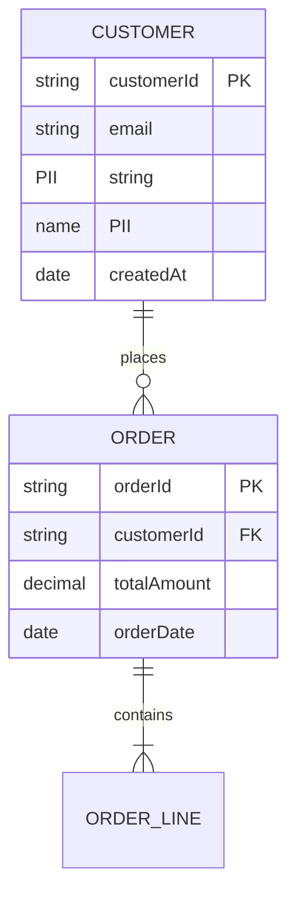

# Data Model Guide

A comprehensive guide to creating data models with ERD diagrams and GDPR compliance using ArcKit.

---

## What is a Data Model?

A data model defines the structure, relationships, and rules for storing and managing data. It includes entities, attributes, relationships, and constraints.

### Why Data Modeling Matters

Without proper data modeling:
- ❌ Data inconsistencies and duplication
- ❌ GDPR compliance violations (PII not identified)
- ❌ Poor performance (missing indexes)
- ❌ Integration challenges (no clear contracts)
- ❌ Audit failures (no data lineage)

With comprehensive data modeling:
- ✅ Clean, normalized data structure
- ✅ GDPR compliance (PII identified, retention policies)
- ✅ Optimized performance (proper indexing)
- ✅ Clear integration contracts
- ✅ Complete data governance and traceability

---

## When to Create Data Model

Run `/arckit.data-model` after requirements, before procurement:

```
5. /arckit.requirements      ← Define DR-xxx Data Requirements
6. /arckit.data-model        ← CREATE DATA MODEL (START HERE)
7. /arckit.wardley           ← Strategic planning
8. /arckit.sow               ← Vendor procurement
```

**CRITICAL**: You **must** run `/arckit.requirements` first because the data model is derived from DR-xxx (Data Requirements).

---

## Creating Data Model with ArcKit

### Step 1: Ensure Requirements Exist

```bash
# MANDATORY - Data model needs DR-xxx requirements
ls projects/NNN-project-name/requirements.md

# If missing, create requirements first
/arckit.requirements Create requirements for [your project]
```

### Step 2: Run Data Model Command

```bash
/arckit.data-model Create data model for [your project]
```

**Examples**:
```bash
/arckit.data-model Create data model for payment gateway project

/arckit.data-model Generate ERD with GDPR compliance for customer portal

/arckit.data-model Create data model for NHS appointment booking
```

### Step 3: Review the Output

ArcKit creates `projects/NNN-project-name/data-model.md` containing:

1. **Entity-Relationship Diagram** - Visual Mermaid ERD
2. **Entity Catalog** - Detailed entity definitions with attributes
3. **GDPR Compliance** - PII inventory, legal basis, retention
4. **Data Governance** - Ownership, stewardship, access control
5. **CRUD Matrix** - Which components access which entities
6. **Integration Mapping** - Upstream/downstream data flows
7. **Data Quality Framework** - Metrics and standards

---

## Entity-Relationship Diagram (ERD)

ArcKit generates visual diagrams using Mermaid:



**Relationship Types**:
- `||--o{` - One-to-many
- `||--||` - One-to-one
- `}o--o{` - Many-to-many

---

## GDPR Compliance

### PII Identification
Every entity with Personally Identifiable Information is flagged:

**Direct PII**:
- Name, email, phone, address
- National Insurance Number, passport
- Payment card details

**Indirect PII**:
- IP address, device ID, cookies
- Location data, behavioral data

### Legal Basis for Processing
- **Consent**: User explicitly agreed
- **Contract**: Necessary to fulfill contract
- **Legal Obligation**: Required by law
- **Legitimate Interest**: Legitimate business need

### Data Subject Rights
- **Access**: Right to see their data
- **Rectification**: Right to correct data
- **Erasure**: Right to be forgotten
- **Portability**: Right to export data
- **Objection**: Right to opt-out of processing

### Retention Policies
```
Entity: CUSTOMER
PII: email, name, address
Retention: 7 years after last transaction (financial records)
Deletion: Anonymize after retention period
```

---

## Data Governance Matrix

| Entity | Business Owner | Data Steward | Technical Custodian | Classification |
|--------|----------------|--------------|---------------------|----------------|
| CUSTOMER | Sales Director | CRM Manager | DBA Team | CONFIDENTIAL |
| ORDER | Finance Director | Finance Manager | DBA Team | INTERNAL |
| PRODUCT | Product Director | Product Manager | DBA Team | PUBLIC |

**Business Owner**: Accountable for data (from stakeholder RACI)
**Data Steward**: Enforces quality and compliance
**Technical Custodian**: Manages storage and backups

---

## Best Practices

### 1. Normalize to Avoid Redundancy
❌ Bad: Storing customer name in every order
✅ Good: Customer reference, join to get name

### 2. Identify All PII
❌ Bad: Not flagging email as PII
✅ Good: Tag all PII fields for GDPR compliance

### 3. Plan for Scale
- Index frequently queried fields
- Consider partitioning for large tables
- Archive old data

### 4. Document Relationships
- Foreign keys enforced
- Cascade rules defined (delete, update)
- Orphan prevention

---

## Support

For issues or questions:
- GitHub Issues: https://github.com/tractorjuice/arc-kit/issues

---

**Last updated**: 2025-10-28
**ArcKit Version**: 0.3.6
