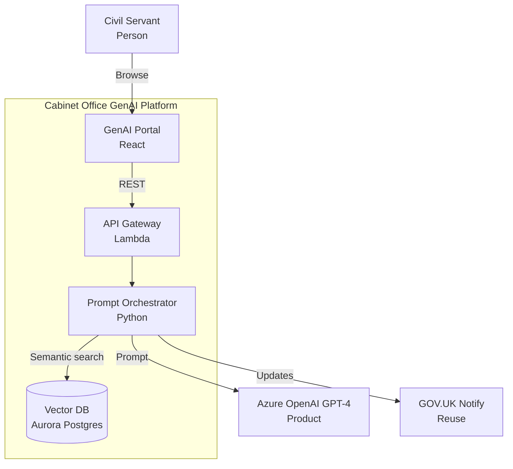

# Architecture Diagram Guide

`/arckit.diagram` converts architecture artefacts into Mermaid diagrams that render in markdown, GitHub, and mermaid.live.

---

## Supported Diagram Types

| Command | Diagram | Use When | Output Highlights |
|---------|---------|----------|-------------------|
| `/arckit.diagram context` | C4 Level 1 | Discovery / stakeholder briefings | Users, external systems, boundaries |
| `/arckit.diagram container` | C4 Level 2 | HLD reviews | Services, databases, queues, technology stack |
| `/arckit.diagram component` | C4 Level 3 | DLD & developer handover | Internal modules, repos, adapters |
| `/arckit.diagram deployment` | Infrastructure | Cloud First evidence, cost modelling | Regions, VPCs, subnets, HA/DR |
| `/arckit.diagram sequence` | Interaction | API design, integration workshops | Request/response steps, actors |
| `/arckit.diagram dataflow` | Data privacy | GDPR/DPIA, audit | PII flows, encryption, retention |

Run without a suffix to auto-detect (`/arckit.diagram Describe architecture...`).

---

## Example Output (Excerpt)

Paste into [https://mermaid.live](https://mermaid.live) for PNG/SVG export.

---

## Review Checklist

- Components and integrations reference requirement IDs where relevant.
- Compliance call-outs (GOV.UK Pay/Notify, Cloud First, GDPR) appear in annotations.
- Evolution tags from Wardley Maps show build/buy decisions when needed.
- Deployment diagrams include regions, availability zones, and failover notes.
- Dataflow diagrams highlight lawful basis, retention, and subject rights.

---

## Tips

- Re-run diagrams whenever the design review highlights changes to avoid drift.
- Embed diagrams in HLD/DLD outputs and service assessments for consistent visuals.
- Pair `/arckit.diagram` with `/arckit.servicenow` so operations inherit the same component hierarchy.
