# Architecture Diagram Guide

A guide to creating architecture diagrams using ArcKit and Mermaid.

---

## What are Architecture Diagrams?

Architecture diagrams visualize system structure, components, and relationships using standardized notation. ArcKit generates diagrams using **Mermaid** syntax, which renders beautifully in markdown.

### Why Create Diagrams?

Without diagrams:
- ❌ Architecture discussions lack shared visual reference
- ❌ New team members struggle to understand system structure
- ❌ Design reviews focus on text instead of visuals
- ❌ Stakeholders can't visualize the solution

With diagrams:
- ✅ Shared understanding of architecture
- ✅ Faster onboarding for new team members
- ✅ Visual design reviews
- ✅ Stakeholder alignment on solution approach

---

## When to Create Diagrams

```bash
/arckit.diagram Create [diagram type] diagram for [your project]
```

**Create diagrams at these points:**
- **Discovery/Alpha** - Context diagram to show system boundaries
- **Alpha/Beta** - Container and component diagrams for HLD
- **Beta** - Deployment diagram for infrastructure
- **Design reviews** - Visual aids for HLD/DLD reviews
- **Documentation** - Architecture documentation repository

---

## Diagram Types (C4 Model)

ArcKit uses the **C4 Model** for architecture diagrams:

### 1. Context Diagram (Level 1)

**Purpose**: Show the system in its environment

**Audience**: Everyone (stakeholders, users, developers)

**Shows**:
- Your system (single box)
- External systems it integrates with
- Users/actors who interact with it
- High-level relationships

**Example**:
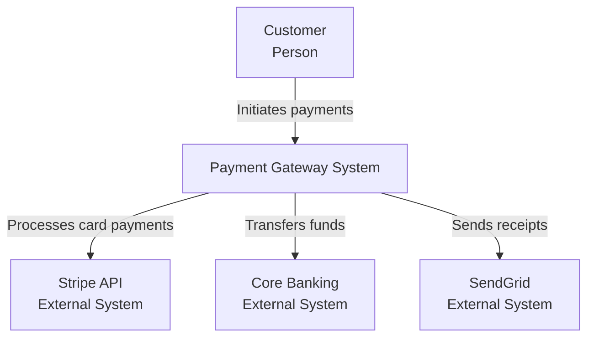

**When to use**: Discovery, Alpha - to define system boundaries

---

### 2. Container Diagram (Level 2)

**Purpose**: Show major technology containers (apps, databases, services)

**Audience**: Technical team, architects, senior stakeholders

**Shows**:
- Web applications
- Mobile apps
- API services
- Databases
- Message queues
- Technology choices

**Example**:
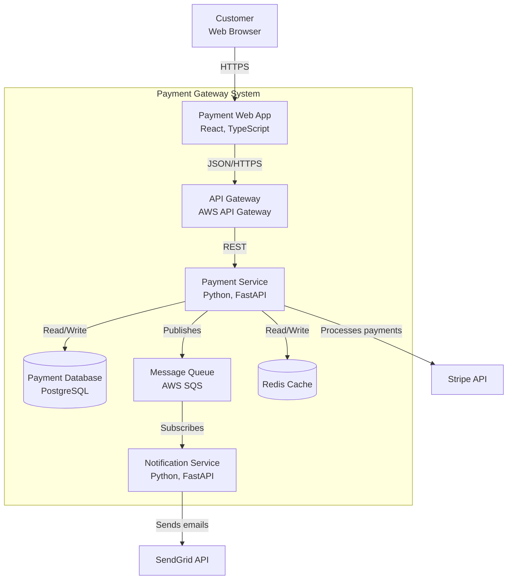

**When to use**: Alpha, Beta - for HLD documentation

---

### 3. Component Diagram (Level 3)

**Purpose**: Show internal structure of a container

**Audience**: Developers, technical leads

**Shows**:
- Components within a service
- Controllers, services, repositories
- Internal dependencies
- Design patterns

**Example**:
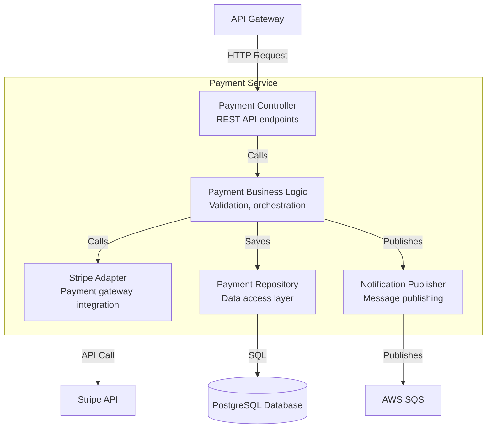

**When to use**: Beta - for DLD documentation

---

### 4. Deployment Diagram (Level 4)

**Purpose**: Show physical/virtual infrastructure

**Audience**: DevOps, infrastructure team, operations

**Shows**:
- Servers/containers/instances
- Networks and subnets
- Load balancers
- Databases (instances)
- Availability zones/regions

**Example**:
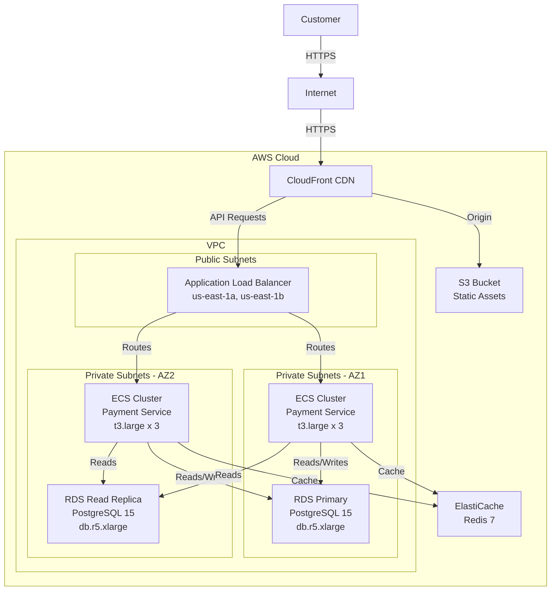

**When to use**: Beta, Live - for deployment planning and ops documentation

---

## Mermaid Syntax

### Basic Flowchart

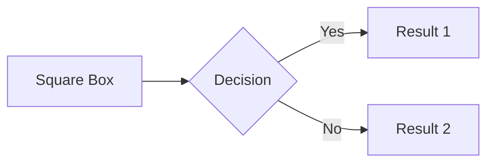

### Entity Relationship Diagram (ERD)

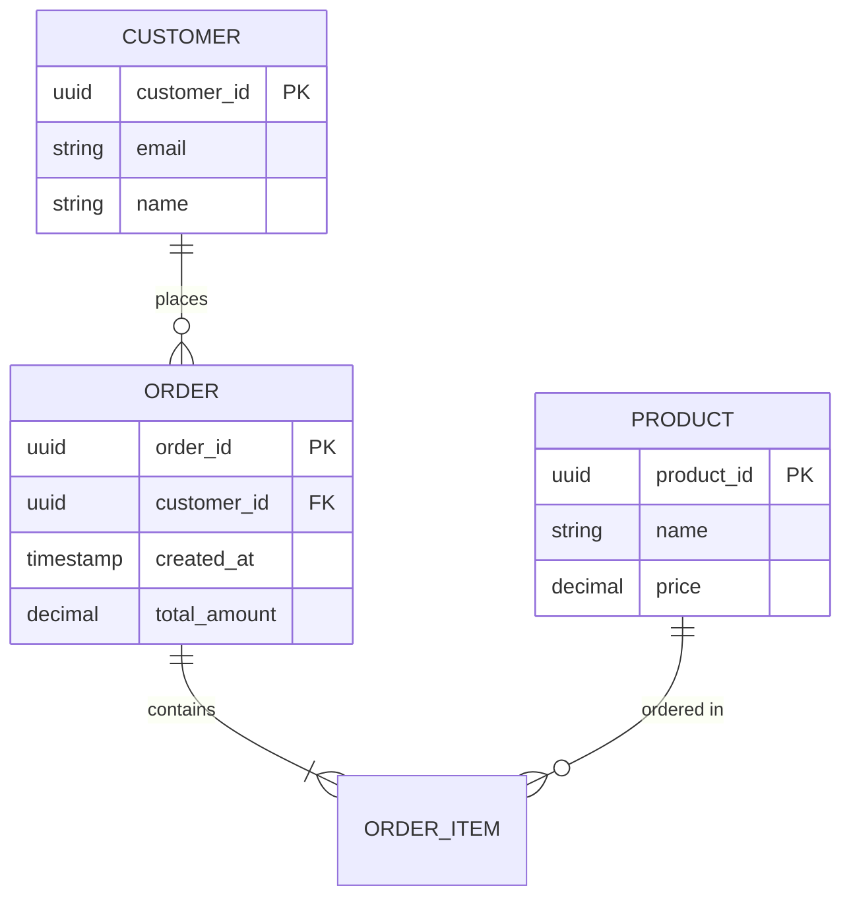

### Sequence Diagram

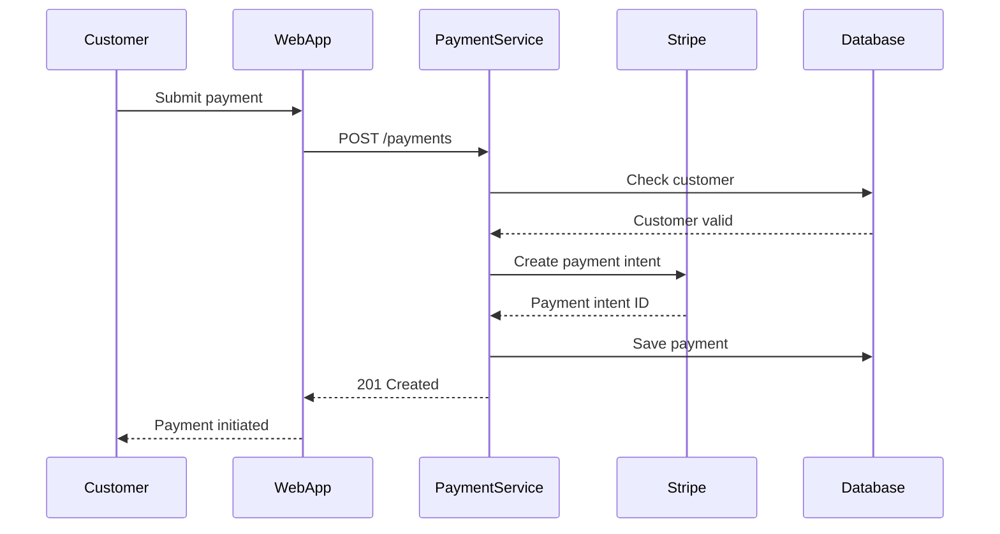

### State Diagram

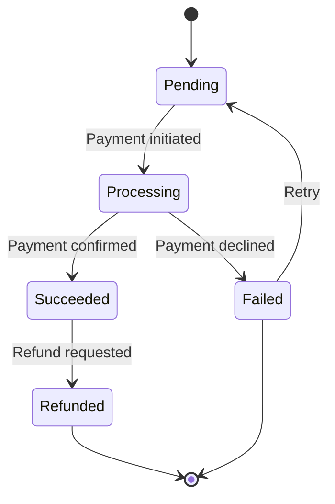

---

## Best Practices

### 1. Use the Right Level of Abstraction

- **Context**: Don't show internal details, only boundaries
- **Container**: Don't show classes, only major deployable units
- **Component**: Don't show every class, only significant components
- **Deployment**: Show actual infrastructure, not logical

### 2. Keep Diagrams Simple

- **7±2 rule**: Maximum 5-9 boxes per diagram
- If more complex, split into multiple diagrams
- Focus on what's important for the audience

### 3. Use Consistent Notation

- Solid lines: Synchronous calls
- Dashed lines: Asynchronous messages
- Colors: Same technology/layer same color
- Shape: Rectangles for systems, cylinders for databases

### 4. Label Relationships

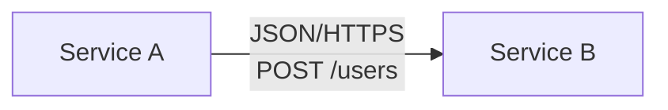

Better than:
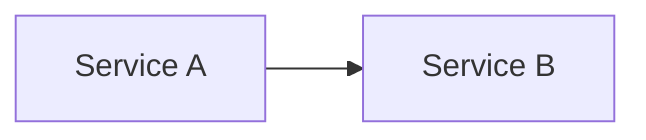

### 5. Update Diagrams with Code

- Diagrams are documentation - keep them current
- Store diagrams in git with code
- Review diagrams in PRs
- Automate diagram generation where possible

---

## Common Diagram Patterns

### Microservices Architecture

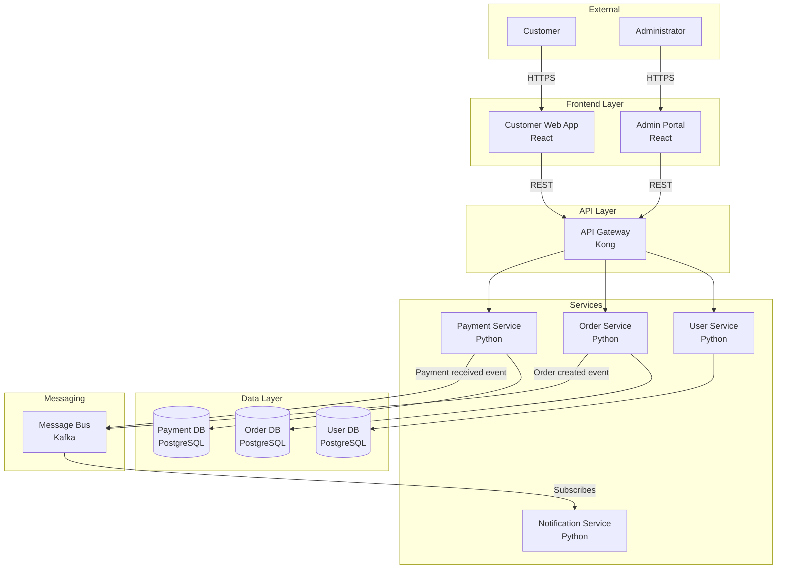

### Event-Driven Architecture

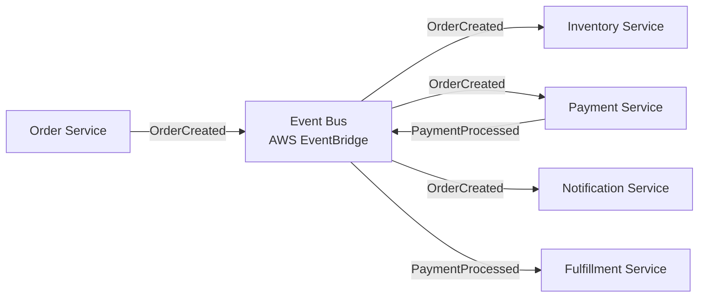

### CQRS Pattern

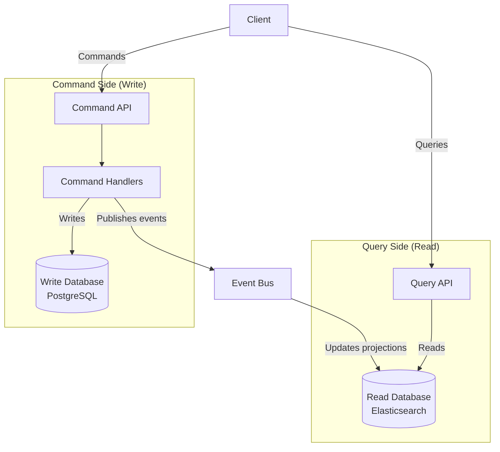

---

## Integration with Other Requirements

Architecture diagrams integrate with and visualize other ArcKit artifacts:

### Links to Requirements

**Diagrams must show how requirements are implemented:**
- Functional requirements (FR-xxx) → Components that implement them
- Integration requirements (INT-xxx) → External systems and APIs shown
- Non-functional requirements (NFR-xxx) → Architecture patterns visible
- Data requirements (DR-xxx) → Databases and data flows shown

**Example:**
If FR-015 requires "Process credit card payments":
- ✅ Context diagram shows Stripe API external system
- ✅ Container diagram shows Payment Service component
- ✅ Component diagram shows PaymentProcessor class
- ✅ Deployment diagram shows PCI-compliant network zone

**Action:** Annotate diagrams with requirement IDs (e.g., "Payment Service [FR-015, FR-018]").

### Links to Architecture Principles

**Diagrams must reflect architecture principles:**
- Security principles → Security zones, encryption shown
- Scalability principles → Load balancers, horizontal scaling shown
- Reliability principles → Redundancy, failover paths shown
- Cloud principles → Cloud-native services, multi-region shown

**Example:**
If principle SEC-001 states "Zero Trust Architecture":
- ✅ No implicit trust relationships in diagrams
- ✅ Every service-to-service call shows authentication
- ✅ Network boundaries enforce least privilege
- ✅ Deployment diagram shows micro-segmentation

**Action:** Add principle references to diagram legends.

### Links to Data Model

**Diagrams must show data architecture:**
- Container diagram → All databases/data stores from data model
- Component diagram → Data access patterns (repository, DAO)
- Deployment diagram → Data replication, backups, encryption at rest

**Example:**
If data model has Entity E-004 (PaymentHistory):
- ✅ Container diagram shows PaymentHistoryDB
- ✅ Component diagram shows PaymentHistoryRepository
- ✅ Deployment diagram shows database in private subnet
- ✅ Data flows show PII encryption

**Action:** Ensure every entity in data model has a corresponding database in diagrams.

### Links to Risk Register

**Diagrams must show risk mitigations:**
- High availability risks → Redundant components, failover paths
- Security risks → Security controls, encrypted channels
- Performance risks → Caching layers, load balancing
- Vendor lock-in risks → Abstraction layers, multi-cloud

**Example:**
If RISK-003 is "Single point of failure (HIGH)":
- ✅ Deployment diagram shows active-active configuration
- ✅ Container diagram shows message queue for async processing
- ✅ Component diagram shows circuit breaker pattern

**Action:** Add mitigation annotations (e.g., "Multi-AZ deployment mitigates RISK-003").

### Links to Stakeholder Analysis

**Diagrams must address stakeholder concerns:**
- CFO cost concerns → Show cost-optimized architecture (serverless, auto-scaling)
- Operations uptime concerns → Show HA, monitoring, alerting
- Security concerns → Show security boundaries, encryption
- Business agility concerns → Show microservices, API-first

**Example:**
If Operations Director has concern "System availability":
- ✅ Deployment diagram shows multi-region setup
- ✅ Container diagram shows health check endpoints
- ✅ Component diagram shows retry/timeout patterns

**Action:** Create diagram views tailored to key stakeholder concerns.

### Links to Design Reviews

**Diagrams are the centrepiece of design reviews:**
- HLD Review → Context + Container diagrams reviewed
- DLD Review → Component + Deployment diagrams reviewed
- Review checklist → Diagram quality criteria
- Design decisions → Documented in diagram annotations

**Example:**
For `/arckit.hld-review`, reviewers check:
- ✅ Container diagram matches NFR requirements
- ✅ All integrations (INT-xxx) shown
- ✅ Data flows align with data model
- ✅ Security boundaries visible

**Action:** Generate diagrams BEFORE design reviews, not after.

### Integration Timeline

**When to create each diagram type:**

1. **Discovery Phase** - Create Context Diagram
   - After stakeholder analysis
   - After initial requirements (BR + high-level FR)
   - Before business case (visualize the solution)

2. **Alpha Phase** - Create Container Diagram
   - After detailed requirements (all FR, NFR, INT, DR)
   - After data model designed
   - Before HLD review

3. **Beta Phase** - Create Component Diagrams
   - During detailed design (one per complex container)
   - Before DLD review
   - Before implementation starts

4. **Beta Phase** - Create Deployment Diagram
   - After infrastructure requirements finalized
   - After security/compliance requirements addressed
   - Before production deployment

**Action:** Don't wait until "documentation time" - diagrams drive design, not document it.

### Integration Summary

**Diagrams are the visual bridge between:**
- Requirements (what to build) → Architecture (how to build it)
- Principles (how to decide) → Design (what was decided)
- Risks (what might fail) → Mitigations (how to prevent failure)
- Stakeholders (who cares) → Solutions (how we address their concerns)

**Without diagrams, these connections are implicit. With diagrams, they're explicit.**

---

## Diagram Checklist

### Context Diagram
- [ ] System boundary clearly defined
- [ ] All external systems shown
- [ ] All user types/actors shown
- [ ] Relationships labeled with purpose
- [ ] Technology choices NOT shown (too detailed for context)

### Container Diagram
- [ ] All deployable units shown (apps, services, databases)
- [ ] Technology stack labeled (language, framework)
- [ ] Communication protocols specified (HTTP, gRPC, messaging)
- [ ] Data stores shown separately
- [ ] Internal vs external systems distinguished

### Component Diagram
- [ ] Significant components only (not every class)
- [ ] Component responsibilities clear
- [ ] Dependencies shown
- [ ] Design patterns evident (adapter, repository, etc.)
- [ ] Interfaces/APIs labeled

### Deployment Diagram
- [ ] Infrastructure components shown (servers, containers, networks)
- [ ] Availability zones / regions shown
- [ ] Load balancers, caches, CDNs included
- [ ] Instance types/sizes specified
- [ ] Network security boundaries (VPC, subnets, security groups)

---

## Common Gaps and How to Fix Them

### Gap 1: Diagrams Don't Match Requirements

**Symptom:**
- Container diagram shows 5 services but requirements mention 8 integration points
- Diagram shows SQL database but DR-xxx require NoSQL for scalability
- No components visible for FR-015 to FR-022

**Why It Happens:**
- Diagrams created independently from requirements
- Architect doesn't read requirements thoroughly
- Requirements change but diagrams not updated

**How to Fix:**
1. Open `requirements.md` while creating diagrams
2. For each FR/NFR/INT/DR, ask "Where is this shown in my diagram?"
3. Create traceability: annotate diagram elements with requirement IDs
   - Example: "Payment Service [FR-015, FR-018, NFR-P-002]"
4. Review diagram with requirements author for validation

**Prevention:** Create diagrams AFTER requirements are finalized, not before.

### Gap 2: Missing Non-Functional Requirements

**Symptom:**
- Deployment diagram shows single-AZ deployment but NFR-R-001 requires 99.95% uptime
- No caching layer shown but NFR-P-001 requires < 200ms response time
- No security boundaries shown but NFR-S-003 requires zero-trust

**Why It Happens:**
- Focus on functional "happy path" architecture
- NFRs seen as implementation details, not architecture
- Performance/reliability/security added "later"

**How to Fix:**
1. Review all NFR-xxx requirements before creating Container/Deployment diagrams
2. For each NFR category, add architecture elements:
   - **Performance (NFR-P)** → Caches, CDN, load balancers, async queues
   - **Reliability (NFR-R)** → Multi-AZ, active-active, circuit breakers, retries
   - **Security (NFR-S)** → Security zones, encryption, auth gateways, secrets management
   - **Scalability (NFR-SC)** → Horizontal scaling, auto-scaling groups, sharding
3. Annotate NFR solutions in diagrams
4. Validate in HLD review: "Does this architecture achieve NFR-xxx?"

**Prevention:** Create separate "NFR realization" diagram showing how each NFR is achieved.

### Gap 3: Technology Choices Not Shown

**Symptom:**
- Container diagram shows "Database" but doesn't specify PostgreSQL vs MongoDB
- Component diagram shows "Cache" but doesn't specify Redis vs Memcached
- Deployment diagram shows "Cloud" but doesn't specify AWS, Azure, or GCP

**Why It Happens:**
- Architect wants to "stay technology-agnostic"
- Fear of commitment to specific technologies
- Technology decisions not yet made

**How to Fix:**
1. Context diagrams → Technology-agnostic (OK)
2. Container diagrams → Specific technologies (PostgreSQL 15, Redis 7, Node.js 20)
3. Component diagrams → Frameworks and libraries (Express.js, Sequelize ORM)
4. Deployment diagrams → Specific infrastructure (AWS ECS Fargate, RDS Multi-AZ)
5. If technology not decided, show options: "Database (PostgreSQL or MongoDB TBD)"

**Prevention:** Make technology decisions during Alpha, document in Container diagram.

### Gap 4: No Data Flows Shown

**Symptom:**
- Diagram shows components but not how data moves between them
- No indication of synchronous vs asynchronous communication
- Data stores shown but not read/write patterns

**Why It Happens:**
- Focus on "what exists" not "how it works"
- Data flows seen as obvious or implementation details
- Reluctance to clutter diagrams

**How to Fix:**
1. Add arrows showing data flow direction
2. Label arrows with:
   - Protocol (HTTP REST, gRPC, AMQP, SQL)
   - Data format (JSON, Protobuf, Avro)
   - Sync vs async (solid arrow = sync, dashed arrow = async)
3. Show read vs write operations:
   - "Web App --[reads via REST]--> API Gateway"
   - "Order Service --[writes to]--> Order Queue"
4. For complex flows, create sequence diagrams

**Prevention:** Ask "How does data get from A to B?" for every connection.

### Gap 5: Security Boundaries Not Visible

**Symptom:**
- Deployment diagram shows all components in same network
- No firewall rules, security groups, or network ACLs shown
- PII data flows through public internet without encryption

**Why It Happens:**
- Security seen as ops problem, not architecture problem
- Network security "handled by platform"
- Architect not familiar with security patterns

**How to Fix:**
1. Define security zones:
   - **Public Zone**: Load balancers, CDN (internet-facing)
   - **DMZ**: API gateways, web servers (controlled access)
   - **Application Zone**: Business logic, services (internal only)
   - **Data Zone**: Databases, data lakes (most restricted)
2. Show security boundaries as dashed boxes or colors
3. Add security controls:
   - WAF (Web Application Firewall) at public zone
   - API authentication at DMZ
   - Service mesh for internal auth
   - Database access via private subnets only
4. Label encrypted connections (TLS/SSL)
5. Show secrets management (AWS Secrets Manager, HashiCorp Vault)

**Prevention:** For every connection, ask "Is this encrypted?" and "Who can access this?"

### Gap 6: Single Points of Failure Not Addressed

**Symptom:**
- Deployment diagram shows single instance of critical service
- Database has no replica or backup shown
- Load balancer itself is single instance

**Why It Happens:**
- Cost concerns ("redundancy is expensive")
- Assumption that cloud provider handles HA
- NFR-R requirements not taken seriously

**How to Fix:**
1. Identify critical path: user request → response
2. For every component on critical path:
   - Add redundancy (min 2 instances)
   - Show active-active or active-passive
   - Add health checks and auto-healing
3. For databases:
   - Show primary + read replicas
   - Show cross-AZ or cross-region replication
   - Show backup/restore strategy
4. For stateful services:
   - Show session replication or sticky sessions
   - Show distributed caching
5. Annotate HA strategy: "Multi-AZ deployment (99.99% SLA)"

**Prevention:** Run "what if X fails?" exercise for every component.

### Gap 7: Scalability Not Designed In

**Symptom:**
- No auto-scaling groups shown
- Vertical scaling only (bigger instances)
- Databases not sharded for growth

**Why It Happens:**
- "We'll scale when we need to"
- Current load is low
- Scalability requirements vague (NFR-SC-001: "System must scale")

**How to Fix:**
1. Define scaling triggers in NFR-SC requirements:
   - "Auto-scale API instances when CPU > 70%"
   - "Shard database when table > 1TB"
   - "Add read replicas when read latency > 100ms"
2. Show scaling architecture:
   - Horizontal scaling groups (1-10 instances)
   - Database sharding strategy (by customer ID, by region)
   - Caching for read-heavy workloads
3. Show bottlenecks:
   - "Database writes → vertical scaling limit → re-architect for sharding"
4. Document scale limits:
   - "Current architecture supports 10K concurrent users"
   - "Beyond 10K requires Redis Cluster and DB sharding"

**Prevention:** Design for 10x current load, document 100x limit.

### Gap 8: Diagrams Out of Date

**Symptom:**
- Deployment diagram shows EC2 instances but team moved to containers 6 months ago
- Container diagram shows monolith but team split into microservices
- Component diagram references deleted services

**Why It Happens:**
- Diagrams created once, never updated
- No process for diagram maintenance
- Architecture changes not reflected in docs

**How to Fix:**
1. Store diagrams in version control (Mermaid in markdown files)
2. Update diagrams when:
   - Architecture Decision Records (ADRs) created
   - Major refactoring completed
   - New services added
   - Technology migrations occur
3. Include diagram review in:
   - Sprint retrospectives (every 2 weeks)
   - Design reviews (always)
   - Architecture reviews (quarterly)
4. Use "last updated" footer with date
5. Assign diagram ownership (tech lead responsible)

**Prevention:** Treat diagrams as code - they live in git, they have owners, they get reviewed.

---

## Tools and Rendering

### Mermaid Renderers

**GitHub/GitLab**: Native rendering in markdown
**VS Code**: Mermaid Preview extension
**Online**: mermaid.live for testing
**Documentation**: Docusaurus, MkDocs support Mermaid

### Alternative Tools

**For complex diagrams**:
- draw.io (diagrams.net)
- Lucidchart
- PlantUML
- Structurizr (C4 model tooling)

**Best practice**: Start with Mermaid (code-based, version control friendly). Use visual tools only if Mermaid can't represent complexity.

---

## Related Documentation

- [Design Review Guide](design-review.md) - Using diagrams in HLD/DLD reviews
- [Principles Guide](principles.md) - Architecture principles that inform diagrams
- [Data Model Guide](data-model.md) - Creating ERD diagrams for data models
- [Requirements Guide](requirements.md) - Deriving architecture from requirements

---

## Support

For issues or questions:
- GitHub Issues: https://github.com/tractorjuice/arc-kit/issues
- Mermaid Documentation: https://mermaid.js.org/
- C4 Model: https://c4model.com/

---

**Last updated**: 2025-10-28
**ArcKit Version**: 0.6.0
