# Project Plan Guide

A comprehensive guide to creating project plans with timelines, gates, and Mermaid diagrams using ArcKit.

---

## What is a Project Plan?

A project plan is a **visual timeline** that shows how your project flows from start to finish:
- **Phases** - Discovery, Alpha, Beta, Live (GDS Agile Delivery)
- **Activities** - What gets done in each phase
- **Gates** - Decision points with approval criteria
- **Dependencies** - What must happen before what
- **Timeline** - When things happen (Gantt chart)
- **Workflow** - How artifacts flow through gates

### Why Project Plans Matter

Without project plans:
- ❌ Stakeholders unclear on timeline and milestones
- ❌ ArcKit commands run in wrong order or at wrong time
- ❌ Gates missed or bypassed (design reviews, assessments)
- ❌ Dependencies not understood (HLD blocks DLD)
- ❌ Resource conflicts (team assigned to conflicting work)
- ❌ Budget spent without clear phase alignment
- ❌ No critical path visibility

With project plans:
- ✅ Clear timeline visible to all stakeholders
- ✅ ArcKit workflow integrated into phases
- ✅ Gates enforced with approval criteria
- ✅ Dependencies mapped and respected
- ✅ Resource planning aligned to phases
- ✅ Budget tracking by phase
- ✅ Critical path identified and managed

**Mandatory for:**
- UK Government projects (GDS Service Standard)
- Projects > 3 months duration
- Multi-phase delivery (Discovery → Alpha → Beta → Live)
- Vendor-delivered projects
- Projects requiring governance gate approvals

---

## When to Create Plans

```bash
/arckit.plan Create project plan for [your project]
```

**Create at these points:**
- **Project initiation** - Initial plan for Discovery phase
- **Discovery exit** - Detailed plan for Alpha/Beta/Live
- **Gate reviews** - Update plan based on decisions
- **Major changes** - Timeline, scope, or resource changes
- **Monthly** - Refresh plan with actual progress

**Run at key gates:**
- **Before Discovery** - Create initial plan
- **Discovery Assessment** - Update with Alpha/Beta timeline
- **Alpha Assessment** - Confirm Beta/Live plan
- **Beta Assessment** - Finalize Go-Live plan

---

## UK Government Delivery Phases (GDS)

ArcKit plans follow the **GDS Agile Delivery framework**:

### Discovery Phase
**Duration**: 4-8 weeks
**Objective**: Understand the problem, validate the approach
**Team**: Small (3-5 people)
**Budget**: Low (research and planning)

**Key Activities**:
- Stakeholder analysis and engagement
- User research and needs identification
- Problem validation
- High-level requirements (Business Requirements)
- Architecture principles definition
- Initial business case
- Initial risk register

**ArcKit Commands**:
- `/arckit.stakeholders` - Identify stakeholders and drivers
- `/arckit.requirements` - Capture high-level BRs
- `/arckit.principles` - Define architecture principles
- `/arckit.business-case` - Draft business case
- `/arckit.risk-register` - Initial risk identification
- `/arckit.service-assessment` - Prepare for Discovery Assessment (run 2 weeks before)

**Gate**: Discovery Assessment
- **Criteria**: Problem validated, approach feasible, business case sound
- **Approvers**: Senior Responsible Owner (SRO), Architecture Board
- **Outcomes**: Go to Alpha / Pivot / Stop

### Alpha Phase
**Duration**: 8-12 weeks
**Objective**: Prove feasibility, create detailed designs
**Team**: Medium (5-10 people)
**Budget**: Medium (design and prototyping)

**Key Activities**:
- Detailed requirements (FR, NFR, INT, DR)
- Architecture design (HLD)
- Vendor procurement (if needed)
- Security threat modeling
- Proof of concept / prototyping
- HLD review and approval
- Updated business case
- Updated risk register

**ArcKit Commands**:
- `/arckit.requirements` - Complete FR, NFR, INT, DR
- `/arckit.diagram` - Create architecture diagrams (C4)
- `/arckit.sow` - Generate SOW/RFP for vendors
- `/arckit.evaluate` - Score vendor proposals
- `/arckit.threat-model` - STRIDE threat modeling
- `/arckit.hld-review` - HLD approval gate
- `/arckit.business-case` - Update with detailed costs
- `/arckit.risk-register` - Update with design risks
- `/arckit.service-assessment` - Prepare for Alpha Assessment (run 2 weeks before)

**Gate**: Alpha Assessment
- **Criteria**: HLD approved, requirements complete, vendor selected
- **Approvers**: Architecture Board, Security, Tech Authority
- **Outcomes**: Go to Beta / Refine Alpha / Stop

### Beta Phase
**Duration**: 12-24 weeks
**Objective**: Build production-ready system
**Team**: Large (10-20 people)
**Budget**: High (implementation and testing)

**Key Activities**:
- Detailed design (DLD)
- DLD review and approval
- Implementation (sprints)
- Testing (functional, security, performance)
- User acceptance testing (UAT)
- Operational readiness
- Production environment setup
- Data migration (if applicable)

**ArcKit Commands**:
- `/arckit.dld-review` - DLD approval gate
- `/arckit.analyze` - Quality checks during implementation
- `/arckit.traceability` - Verify design → code → tests
- `/arckit.atrs` - Algorithmic Transparency (if AI)
- `/arckit.ai-playbook` - AI compliance (if AI)
- `/arckit.service-assessment` - Prepare for Beta Assessment (run 2 weeks before)

**Gate**: Beta Assessment (Go/No-Go)
- **Criteria**: All tests passed, UAT complete, production ready
- **Approvers**: SRO, Security, Operations, Service Owner
- **Outcomes**: Go-Live / Extend Beta / Stop

### Live Phase
**Duration**: Ongoing
**Objective**: Operate and improve system
**Team**: Small (3-5 people for support)
**Budget**: Medium (operations and enhancements)

**Key Activities**:
- Production deployment
- Hypercare (2-4 weeks intensive support)
- Benefits realization tracking
- Incident management
- Continuous improvement
- Periodic security reviews
- Annual architecture reviews

**ArcKit Commands**:
- `/arckit.analyze` - Periodic quality reviews
- `/arckit.risk-register` - Update operational risks
- `/arckit.business-case` - Track benefits realization

---

## Project Plan Structure

### 1. Executive Summary

```markdown
# Project Plan: Payment Gateway Modernization

## Executive Summary

**Project**: Payment Gateway Modernization
**Duration**: 36 weeks (9 months)
**Budget**: £850,000
**Team**: 12 FTE (average)
**Delivery Model**: GDS Agile Delivery (Discovery → Alpha → Beta → Live)

**Objective**: Replace legacy payment gateway with cloud-native solution to improve performance, security, and scalability.

**Success Criteria**:
- Process 10,000 TPS (10x current)
- Response time < 2 seconds (P95)
- 99.99% uptime SLA
- PCI-DSS Level 1 certified
- Reduce operational costs 30%

**Key Milestones**:
- Discovery Complete: Week 8
- Alpha Complete (HLD approved): Week 20
- Beta Complete (Go-Live approved): Week 36
- Production Launch: Week 37
```

### 2. Gantt Timeline


### 3. Workflow & Gates

```mermaid
graph TB
    Start[Project Initiation] --> Discovery

    Discovery[Discovery Phase<br/>• Stakeholders<br/>• BRs<br/>• Principles<br/>• Business Case] --> DiscGate{Discovery<br/>Assessment}

    DiscGate -->|✅ Approved| Alpha
    DiscGate -->|❌ Rejected| Stop1[Stop/Pivot]

    Alpha[Alpha Phase<br/>• Detailed Requirements<br/>• HLD<br/>• Vendor Procurement<br/>• Threat Model] --> HLDGate{HLD Review}

    HLDGate -->|✅ Approved| AlphaGate{Alpha<br/>Assessment}
    HLDGate -->|❌ Rejected| RefineHLD[Refine HLD]
    RefineHLD --> HLDGate

    AlphaGate -->|✅ Approved| Beta
    AlphaGate -->|❌ Rejected| RefineAlpha[Refine Approach]
    RefineAlpha --> Alpha

    Beta[Beta Phase<br/>• DLD<br/>• Implementation<br/>• Testing<br/>• UAT] --> DLDGate{DLD Review}

    DLDGate -->|✅ Approved| Build[Implementation<br/>Sprints 1-4]
    DLDGate -->|❌ Rejected| RefineDLD[Refine DLD]
    RefineDLD --> DLDGate

    Build --> Testing[Security &<br/>Performance<br/>Testing]
    Testing --> UAT{UAT Pass?}
    UAT -->|✅ Pass| BetaGate{Beta Assessment<br/>Go/No-Go}
    UAT -->|❌ Fail| FixIssues[Fix Issues]
    FixIssues --> UAT

    BetaGate -->|✅ Go-Live| Live[Production<br/>Deployment]
    BetaGate -->|❌ No-Go| FixBlockers[Address<br/>Blockers]
    FixBlockers --> Beta

    Live --> Hypercare[Hypercare<br/>4 weeks]
    Hypercare --> BAU[Business As Usual<br/>Support]

    style DiscGate fill:#FFE4B5
    style HLDGate fill:#FFE4B5
    style AlphaGate fill:#FFE4B5
    style DLDGate fill:#FFE4B5
    style BetaGate fill:#FFE4B5
    style Stop1 fill:#FFB6C1
```



### 4. Phase Details

```markdown
## Discovery Phase (Weeks 1-8)

**Objective**: Validate problem and approach

### Activities & Timeline

| Week | Activity | ArcKit Command | Deliverable |
|------|----------|----------------|-------------|
| 1-2 | Stakeholder Analysis | `/arckit.stakeholders` | Stakeholder map, drivers, goals |
| 3-4 | User Research | Manual | User needs, pain points |
| 5-6 | Business Requirements | `/arckit.requirements` | BRs with acceptance criteria |
| 7 | Architecture Principles | `/arckit.principles` | 10-15 principles |
| 8 | Initial Business Case | `/arckit.business-case` | Cost/benefit analysis |
| 8 | Initial Risk Register | `/arckit.risk-register` | Top 10 risks |
| 6-7 | Service Assessment Prep | `/arckit.service-assessment` | Readiness report for gate |

### Gate: Discovery Assessment (Week 8)

**Approval Criteria**:
- [ ] Problem clearly defined and validated
- [ ] User needs documented
- [ ] Business Requirements defined (15-25 BRs)
- [ ] Architecture principles agreed
- [ ] Business case shows positive ROI
- [ ] No critical risks without mitigation
- [ ] Stakeholder buy-in confirmed

**Approvers**: SRO, Architecture Board

**Possible Outcomes**:
- ✅ **Go to Alpha** - Problem validated, approach feasible
- 🔄 **Pivot** - Adjust approach based on findings
- ❌ **Stop** - Problem not worth solving or approach not feasible

---

## Alpha Phase (Weeks 9-20)

**Objective**: Prove feasibility and create detailed designs

### Activities & Timeline

| Week | Activity | ArcKit Command | Deliverable |
|------|----------|----------------|-------------|
| 9-11 | Detailed Requirements | `/arckit.requirements` | FR, NFR, INT, DR (50-100 total) |
| 12-15 | Architecture Design (HLD) | `/arckit.diagram` | HLD, C4 diagrams |
| 11-12 | Generate SOW/RFP | `/arckit.sow` | SOW document |
| 13-15 | Vendor Evaluation | `/arckit.evaluate` | Vendor scores, selection |
| 16 | Security Threat Model | `/arckit.threat-model` | STRIDE model |
| 17 | HLD Review Prep | Manual | HLD document finalized |
| 18 | HLD Review | `/arckit.hld-review` | HLD approval or feedback |
| 18-19 | Service Assessment Prep | `/arckit.service-assessment` | Readiness report for gate |
| 19 | Updated Business Case | `/arckit.business-case` | Detailed costs, ROI |
| 20 | Alpha Assessment | Manual | Gate decision |

### Gate: HLD Review (Week 18)

**Approval Criteria**:
- [ ] All architecture principles validated
- [ ] All requirements mapped to components
- [ ] Scalability strategy adequate
- [ ] Security architecture comprehensive
- [ ] Technology stack approved
- [ ] No anti-patterns identified
- [ ] Vendor selected (if applicable)

**Approvers**: Architecture Board, Security Architect

**Outcomes**:
- ✅ **Approved** - Proceed to DLD
- 🔄 **Approved with Conditions** - Fix blockers first
- ❌ **Rejected** - Significant issues, refine HLD

### Gate: Alpha Assessment (Week 20)

**Approval Criteria**:
- [ ] HLD approved
- [ ] All requirements complete and traced
- [ ] Vendor selected (if applicable)
- [ ] Security threat model complete
- [ ] Business case updated with detailed costs
- [ ] Risk register updated

**Approvers**: SRO, Architecture Board, Security, Tech Authority

**Outcomes**:
- ✅ **Go to Beta** - Ready for implementation
- 🔄 **Refine Alpha** - Address gaps before Beta
- ❌ **Stop** - Not feasible or not viable

---

## Beta Phase (Weeks 21-36)

**Objective**: Build production-ready system

### Activities & Timeline

| Week | Activity | ArcKit Command | Deliverable |
|------|----------|----------------|-------------|
| 21-24 | Detailed Design (DLD) | Manual | DLD, API specs, schemas |
| 25 | DLD Review | `/arckit.dld-review` | DLD approval |
| 26-28 | Sprint 1 - Core Services | Manual | Payment processing |
| 29-31 | Sprint 2 - Integrations | Manual | Stripe, banking APIs |
| 32-34 | Sprint 3 - UI & Reporting | Manual | Dashboard, reports |
| 29-31 | Quality Analysis | `/arckit.analyze` | Quality report |
| 32-33 | Security Testing | Manual | SAST, DAST, pen test |
| 34-35 | Performance Testing | Manual | Load tests, 10K TPS |
| 35-36 | User Acceptance Testing | Manual | UAT sign-off |
| 34-35 | Service Assessment Prep | `/arckit.service-assessment` | Readiness report for gate |
| 36 | Operational Readiness | Manual | Runbooks, monitoring |
| 36 | Beta Assessment | Manual | Go/No-Go decision |

### Gate: DLD Review (Week 25)

**Approval Criteria**:
- [ ] HLD conditions met
- [ ] API specifications complete (OpenAPI)
- [ ] Database schemas defined
- [ ] Security implementation detailed
- [ ] Test strategy complete
- [ ] Deployment procedures defined
- [ ] No ambiguities or TBDs

**Approvers**: Tech Lead, Security, DevOps

**Outcomes**:
- ✅ **Approved** - Implementation can start
- 🔄 **Approved with Conditions** - Fix blockers in Sprint 1
- ❌ **Rejected** - Major issues, refine DLD

### Gate: Beta Assessment (Week 36) - Go/No-Go

**Approval Criteria**:
- [ ] All functional tests passed (100%)
- [ ] Security tests passed (SAST, DAST, pen test)
- [ ] Performance tests passed (10K TPS, <2s response)
- [ ] UAT sign-off from business
- [ ] Production environment ready
- [ ] Operational readiness confirmed
- [ ] Rollback plan tested
- [ ] Monitoring and alerting configured

**Approvers**: SRO, Service Owner, Security, Operations

**Outcomes**:
- ✅ **Go-Live** - Deploy to production
- 🔄 **Extend Beta** - Minor issues, fix before Go-Live
- ❌ **No-Go** - Critical issues, significant rework needed

---

## Live Phase (Week 37+)

**Objective**: Operate and improve

### Activities & Timeline

| Week | Activity | ArcKit Command | Deliverable |
|------|----------|----------------|-------------|
| 37 | Production Deployment | Manual | Live system |
| 37-40 | Hypercare | Manual | 24/7 support |
| 41-48 | Benefits Realization | `/arckit.business-case` | Benefits tracking |
| Ongoing | Incident Management | Manual | P1/P2/P3 resolution |
| Quarterly | Risk Review | `/arckit.risk-register` | Updated risks |
| Annually | Architecture Review | `/arckit.analyze` | Quality assessment |
```

---

## Integration with Other Requirements

### Stakeholder Analysis
- **Link**: [Stakeholder Analysis Guide](stakeholder-analysis.md)
- **Integration**: Plan shows when stakeholder engagement happens
- **Action**: Run `/arckit.stakeholders` in Discovery week 1-2

### Requirements Documentation
- **Link**: [Requirements Guide](requirements.md)
- **Integration**: Plan maps requirements activities to Discovery/Alpha
- **Action**: BRs in Discovery, FR/NFR/INT/DR in Alpha

### Architecture Principles
- **Link**: [Principles Guide](principles.md)
- **Integration**: Principles defined in Discovery, validated in HLD review
- **Action**: Run `/arckit.principles` in Discovery week 7

### Design Reviews
- **Link**: [Design Review Guide](design-review.md)
- **Integration**: HLD review at Alpha gate, DLD review at Beta gate
- **Action**: Schedule reviews 1 week before gate

### Vendor Procurement
- **Link**: [Procurement Guide](procurement.md)
- **Integration**: SOW generation and vendor evaluation in Alpha
- **Action**: Start procurement week 11, select by week 16

### Risk Management
- **Link**: [Risk Management Guide](risk-management.md)
- **Integration**: Risk register created in Discovery, updated at every gate
- **Action**: Review risks before every gate decision

### Business Case
- **Link**: [Business Case Guide](business-case.md)
- **Integration**: Draft in Discovery, detailed in Alpha, benefits tracking in Live
- **Action**: Update business case at Discovery and Alpha gates

### Technology Code of Practice (UK Gov)
- **Link**: [Technology Code of Practice](uk-government/technology-code-of-practice.md)
- **Integration**: TCoP compliance checked at gates (especially Points 1-13)
- **Action**: Validate TCoP at Discovery, Alpha, and Beta assessments

---

## Project Plan Checklist

### Discovery Phase
- [ ] Stakeholder analysis complete
- [ ] User research conducted
- [ ] Business Requirements defined (15-25 BRs)
- [ ] Architecture principles agreed (10-15 principles)
- [ ] Initial business case shows positive ROI
- [ ] Initial risk register created (top 10 risks)
- [ ] Discovery Assessment completed
- [ ] Approval to proceed to Alpha

### Alpha Phase
- [ ] Detailed requirements complete (FR, NFR, INT, DR)
- [ ] Architecture diagrams created (Context, Container, Component)
- [ ] SOW/RFP generated (if vendor needed)
- [ ] Vendor evaluated and selected (if applicable)
- [ ] Security threat model complete (STRIDE)
- [ ] HLD review conducted and approved
- [ ] Business case updated with detailed costs
- [ ] Risk register updated with design risks
- [ ] Alpha Assessment completed
- [ ] Approval to proceed to Beta

### Beta Phase
- [ ] Detailed design (DLD) complete
- [ ] DLD review conducted and approved
- [ ] Implementation sprints completed
- [ ] Functional testing passed (100%)
- [ ] Security testing passed (SAST, DAST, pen test)
- [ ] Performance testing passed (meets NFRs)
- [ ] User acceptance testing (UAT) sign-off
- [ ] Production environment ready
- [ ] Operational readiness confirmed (runbooks, monitoring)
- [ ] Beta Assessment completed (Go/No-Go)
- [ ] Approval to Go-Live

### Live Phase
- [ ] Production deployment successful
- [ ] Hypercare completed (2-4 weeks)
- [ ] Benefits realization tracking started
- [ ] Incident management process in place
- [ ] Quarterly risk reviews scheduled
- [ ] Annual architecture reviews scheduled

---

## Common Gaps and How to Fix Them

### Gap 1: No Clear Gates
**Problem**: Work continues from Discovery to Live without approval gates
**Fix**: Define clear gates with approval criteria and decision authority

### Gap 2: ArcKit Commands in Wrong Order
**Problem**: Running `/arckit.hld-review` before requirements are complete
**Fix**: Follow plan sequence - requirements → HLD → HLD review

### Gap 3: Skipping Phases
**Problem**: Jumping from Discovery to Beta without Alpha
**Fix**: Respect GDS phases - each phase has specific purpose

### Gap 4: No Timeline Visibility
**Problem**: Stakeholders don't know when milestones happen
**Fix**: Create Gantt chart showing all phases, gates, and milestones

### Gap 5: Gates Without Criteria
**Problem**: "Gate review" with no defined approval criteria
**Fix**: Define specific, measurable criteria for each gate

### Gap 6: No Dependency Management
**Problem**: DLD starts before HLD is approved
**Fix**: Use Gantt dependencies - HLD approval blocks DLD start

### Gap 7: Unrealistic Timelines
**Problem**: 4 weeks for Beta phase with 6 months of work
**Fix**: Use historical data - typical Beta is 12-24 weeks

### Gap 8: No Vendor Time
**Problem**: Procurement timeline not included in Alpha
**Fix**: Add 6-8 weeks for vendor SOW, evaluation, selection

---

## Timeline Estimates

### Typical Project Durations (by Complexity)

**Small Projects** (Simple integrations, minor enhancements):
- Discovery: 2-4 weeks
- Alpha: 4-8 weeks
- Beta: 8-12 weeks
- **Total**: 3-6 months

**Medium Projects** (New services, significant changes):
- Discovery: 4-8 weeks
- Alpha: 8-12 weeks
- Beta: 12-24 weeks
- **Total**: 6-12 months

**Large Projects** (Major transformations, complex systems):
- Discovery: 8-12 weeks
- Alpha: 12-16 weeks
- Beta: 24-52 weeks
- **Total**: 12-24 months

**Factors Affecting Duration**:
- Complexity (integrations, data migration, compliance)
- Vendor involvement (procurement adds 6-8 weeks)
- Security requirements (PCI-DSS, GDPR adds 4-8 weeks)
- Organizational readiness (stakeholder alignment, approvals)
- Team experience (new tech stack adds 20-30%)

---

## Related Documentation

- [Stakeholder Analysis Guide](stakeholder-analysis.md) - Discovery phase
- [Requirements Guide](requirements.md) - Discovery and Alpha phases
- [Principles Guide](principles.md) - Discovery phase
- [Business Case Guide](business-case.md) - Discovery and Alpha phases
- [Procurement Guide](procurement.md) - Alpha phase
- [Design Review Guide](design-review.md) - Alpha and Beta gates
- [Risk Management Guide](risk-management.md) - All phases
- [Traceability Guide](traceability.md) - Beta phase
- [Technology Code of Practice](uk-government/technology-code-of-practice.md) - All gates

---

## Support

For issues or questions:
- GitHub Issues: https://github.com/tractorjuice/arc-kit/issues
- GDS Service Manual: https://www.gov.uk/service-manual/agile-delivery
- GDS Phases: https://www.gov.uk/service-manual/agile-delivery/how-the-discovery-phase-works

---

**Remember**: A plan is a living document. Update it as the project progresses. Gates are there to catch issues early - don't bypass them.

---

**Last updated**: 2025-10-30
**ArcKit Version**: 0.6.0
