# UK Government Digital Policy & Standards Map

This reference maps the major UK government functional standards, digital policies, and assurance frameworks that apply to technology-enabled services. It highlights how top-level **GovS functional standards** drive the application of specific guidance such as the **Service Standard**, **Technology Code of Practice**, **AI Playbook**, and security, commercial, and finance controls.

---

## Relationship Overview

```mermaid
flowchart TD
    GOVS001["GovS 001<br/>Government Functions"]

    GOVS001 --> GOVS002["GovS 002<br/>Project Delivery"]
    GOVS001 --> GOVS003["GovS 003<br/>People"]
    GOVS001 --> GOVS004["GovS 004<br/>Property"]
    GOVS001 --> GOVS005["GovS 005<br/>Digital"]
    GOVS001 --> GOVS006["GovS 006<br/>Finance"]
    GOVS001 --> GOVS007["GovS 007<br/>Security"]
    GOVS001 --> GOVS008["GovS 008<br/>Commercial"]
    GOVS001 --> GOVS009["GovS 009<br/>Internal Audit"]
    GOVS001 --> GOVS010["GovS 010<br/>Analysis"]
    GOVS001 --> GOVS011["GovS 011<br/>Communication"]
    GOVS001 --> GOVS013["GovS 013<br/>Counter Fraud"]
    GOVS001 --> GOVS014["GovS 014<br/>Debt"]
    GOVS001 --> GOVS015["GovS 015<br/>Grants"]

    GOVS002 --> HM_GREEN_BOOK["HM Treasury<br/>Green Book 5-Case Model"]
    GOVS002 --> IPA_ASSURANCE["Infrastructure & Projects Authority<br/>GMPP / Project Assessment Review"]
    GOVS002 --> GOVS006

    GOVS006 --> MANAGING_PUBLIC_MONEY["Managing Public Money"]
    GOVS006 --> SPEND_CONTROLS["Cabinet Office Digital & Technology Spend Controls"]

    GOVS008 --> SOURCING_PLAYBOOK["Sourcing & Construction Playbooks"]
    GOVS008 --> DIGITAL_MARKETPLACE["Digital Marketplace<br/>G-Cloud & DOS"]

    GOVS007 --> NCSC_CAF["NCSC Cyber Assessment Framework"]
    GOVS007 --> CYBER_ESSENTIALS["Cyber Essentials Plus"]
    GOVS007 --> UKG_SECURE_BY_DESIGN["UK Gov Secure by Design"]
    GOVS007 --> DSP_GDSP["Defence:<br/>JSP 440 / JSP 604 / DCPP"]
    UKG_SECURE_BY_DESIGN --> DPIA["Data Protection Impact Assessment (UK GDPR)"]

    GOVS005 --> SERVICE_STANDARD["Government Service Standard"]
    GOVS005 --> TCOP["Technology Code of Practice"]
    GOVS005 --> DDaT_PLAYBOOK["DDaT Playbook & Service Manual"]
    GOVS005 --> DATA_ETHICS["Data Ethics Framework"]
    GOVS005 --> AI_PLAYBOOK["UK Government AI Playbook"]
    AI_PLAYBOOK --> ATRS["Algorithmic Transparency<br/>Recording Standard"]
    AI_PLAYBOOK --> JSP936["MOD JSP 936<br/>Dependable AI"]

    SERVICE_STANDARD --> SERVICE_ASSESSMENT["Alpha / Beta / Live<br/>Service Assessments"]
    SERVICE_STANDARD --> ACCESSIBILITY["WCAG 2.2 AA & Accessibility Regs"]
    TCOP --> SPEND_CONTROLS
    TCOP --> DIGITAL_MARKETPLACE

    GOVS010 --> DATA_MANAGEMENT["Government Data Quality Framework"]
    GOVS013 --> COUNTER_FRAUD_FUN["GovS 013 Guidance & Fraud Functional Standard"]
```

*Blue nodes* (GovS) are functional standards published by the Cabinet Office. *Grey nodes* represent the downstream policies, playbooks, and assurance activities most relevant to digital delivery.

---

## Lifecycle Application

| Delivery Stage | Mandatory / Expected Standards | Key Artefacts |
|----------------|--------------------------------|---------------|
| **Strategy & Discovery** | GovS 005 (Digital), GovS 002 (Project Delivery), GovS 006 (Finance), GovS 008 (Commercial) | Problem definition, Strategic Outline Business Case (Green Book), stakeholder analysis, risk register |
| **Alpha** | Service Standard (Points 1–7), Technology Code of Practice (baseline), Spend Controls gating, Secure by Design (context) | Alpha assessment pack, architecture principles, DPIA screening, sourcing strategy |
| **Private/Public Beta** | Service Standard (full 14 points), TCoP compliance, Secure by Design (controls), Cyber Essentials, NCSC CAF for hosting, G-Cloud/DOS procurement, Managing Public Money | Beta assessment evidence, detailed design reviews, procurement evaluation, security accreditation plan |
| **Live** | Ongoing Service Standard adherence, TCoP updates, spend control renewals, AI Playbook (if applicable), ATRS publication, JSP 936 (MOD AI), internal audit (GovS 009), fraud controls (GovS 013) | Live service assessment, operational metrics, transparency record, assurance logs |
| **Operations & Improvement** | Continuous improvement against functional standards, data ethics review, counter fraud and debt standards, accessibility monitoring | Service roadmap, quarterly compliance checks, audit trail, lessons learned |

---

## Reference Links

- [Functional Standards overview (GovS 001–GovS 015)](https://www.gov.uk/government/collections/functional-standards)
- [Government Service Standard](https://www.gov.uk/service-manual/service-standard)
- [Technology Code of Practice](https://www.gov.uk/guidance/the-technology-code-of-practice)
- [UK Government Service Manual & DDaT Playbook](https://www.gov.uk/service-manual)
- [UK Government AI Playbook](https://www.gov.uk/government/publications/ai-playbook-for-the-uk-government)
- [Algorithmic Transparency Recording Standard Hub](https://www.gov.uk/government/collections/algorithmic-transparency-recording-standard-hub)
- Secure by Design (NCSC collection)
- [Cyber Assessment Framework](https://www.ncsc.gov.uk/collection/caf)
- [Managing Public Money](https://www.gov.uk/government/publications/managing-public-money)
- [Sourcing and Consultancy Playbooks](https://www.gov.uk/government/publications/the-sourcing-and-consultancy-playbooks) / [Digital Marketplace](https://www.digitalmarketplace.service.gov.uk/)
- [HM Treasury Green Book](https://www.gov.uk/government/publications/the-green-book-appraisal-and-evaluation-in-central-government)

Use this map when planning UK government digital or AI services to ensure the correct policies, approvals, and evidence are in scope from the outset.
