# Data Model: ONS Data Platform Modernisation

> **Template Status**: Live | **Version**: 0.11.2 | **Command**: `/arckit.data-model`

## Document Control

| Field | Value |
|-------|-------|
| **Document ID** | ARC-001-DATA-v1.1 |
| **Document Type** | Data Model & Entity Relationship Design |
| **Project** | ONS Data Platform Modernisation (Project 001) |
| **Classification** | OFFICIAL |
| **Status** | DRAFT |
| **Version** | 1.1 |
| **Created Date** | 2025-11-12 |
| **Last Modified** | 2026-01-26 |
| **Review Cycle** | Annual |
| **Next Review Date** | 2027-01-26 |
| **Owner** | Chief Data Architect, ONS |
| **Reviewed By** | PENDING |
| **Approved By** | PENDING |
| **Distribution** | Architecture Board, Data Governance Board, Platform Engineering, Security Team |

## Revision History

| Version | Date | Author | Changes | Approved By | Approval Date |
|---------|------|--------|---------|-------------|---------------|
| 1.0 | 2025-11-12 | ArcKit AI | Initial creation from `/arckit.data-model` command | PENDING | PENDING |
| 1.1 | 2026-01-26 | ArcKit AI | Updated to template v0.11.2 format; enhanced document control | PENDING | PENDING |

---

## Executive Summary

### Overview

This data model defines the comprehensive entity structure for the ONS Data Platform Modernisation project, supporting the publication of 500+ statistical series through modern APIs. The model covers statistical data storage, publication workflows, metadata management, user access control, and compliance requirements under Statistics Act 2007, GDPR/DPA 2018, and UK Government security standards.

The model is designed for cloud-native deployment with scalability to census-scale volumes (67M records), SDMX compliance for international interoperability, and automated Statistical Disclosure Control (SDC) for privacy protection.

### Model Statistics

- **Total Entities**: 15 entities defined (E-001 through E-015)
- **Total Attributes**: 187 attributes across all entities
- **Total Relationships**: 24 relationships mapped
- **Data Classification**:
  - 🟢 Public: 8 entities (published statistics, metadata, catalogs)
  - 🟡 Internal: 3 entities (workflows, quality indicators, lineage)
  - 🟠 Confidential: 3 entities (users, pre-release access, source data)
  - 🔴 Restricted: 1 entity (survey microdata with PII)

### Compliance Summary

- **GDPR/DPA 2018 Status**: COMPLIANT with DPIA required for microdata processing
- **PII Entities**: 2 entities contain personally identifiable information (E-009: User, E-014: Survey Microdata)
- **Data Protection Impact Assessment (DPIA)**: REQUIRED for E-014 (survey microdata processing)
- **Data Retention**: Maximum 7 years for audit logs, permanent for published statistics, variable for source data (1-10 years)
- **Cross-Border Transfers**: NO - All data stored in UK cloud regions (compliance with UK GDPR)

### Key Data Governance Stakeholders

- **Data Owner (Business)**: Director of Statistical Production - Accountable for statistical accuracy and publication standards
- **Data Steward**: Head of Data Publishing - Responsible for data governance policies and quality standards
- **Data Custodian (Technical)**: Chief Data Architect - Manages data infrastructure, schemas, and security
- **Data Protection Officer**: ONS DPO - Ensures GDPR compliance and privacy protection
- **Security Authority**: Head of Cyber Security - Defines classification and access controls

---

## Visual Entity-Relationship Diagram (ERD)

```mermaid
erDiagram
    STATISTICAL_SERIES ||--o{ STATISTICAL_OBSERVATION : contains
    STATISTICAL_SERIES ||--o{ PUBLICATION : published_in
    STATISTICAL_SERIES ||--|| SDMX_METADATA : described_by
    STATISTICAL_SERIES }o--|| CLASSIFICATION : categorized_by
    STATISTICAL_SERIES ||--o{ DATA_LINEAGE : traced_by

    PUBLICATION ||--o{ PRE_RELEASE_ACCESS : grants
    PUBLICATION }o--|| USER : created_by
    PUBLICATION ||--o{ AUDIT_LOG : logged_by

    USER ||--o{ PRE_RELEASE_ACCESS : has
    USER ||--o{ AUDIT_LOG : performed

    STATISTICAL_OBSERVATION }o--|| GEOGRAPHY : located_in
    STATISTICAL_OBSERVATION }o--|| TIME_PERIOD : observed_in
    STATISTICAL_OBSERVATION ||--o{ QUALITY_INDICATOR : assessed_by

    WORKFLOW }o--|| STATISTICAL_SERIES : processes
    WORKFLOW ||--o{ WORKFLOW_STEP : contains

    DATA_LINEAGE }o--|| SOURCE_SYSTEM : sourced_from

    SURVEY_MICRODATA }o--|| STATISTICAL_SERIES : aggregated_to

    STATISTICAL_SERIES {
        uuid series_id PK "Unique identifier"
        string series_code UK "e.g. CPIH, GDP, LMS"
        string title "Short descriptive title"
        string description "Full methodology description"
        string category "Economy, Population, Health, etc."
        string frequency "Daily, Monthly, Quarterly, Annual"
        string classification "OFFICIAL, OFFICIAL-SENSITIVE"
        timestamp first_published "Initial publication date"
        timestamp last_updated "Most recent update"
        boolean is_active "Published or archived"
    }

    STATISTICAL_OBSERVATION {
        uuid observation_id PK "Unique identifier"
        uuid series_id FK "Statistical series reference"
        uuid geography_id FK "Geographic area"
        uuid time_period_id FK "Time period"
        string dimension "Age, Sex, Industry breakdown"
        decimal value "Statistical value"
        string unit "Percent, Count, Index"
        string status "Provisional, Final, Revised"
        boolean sdc_suppressed "Statistical Disclosure Control applied"
        timestamp published_at "Publication timestamp"
    }

    PUBLICATION {
        uuid publication_id PK "Unique identifier"
        uuid series_id FK "Statistical series"
        string release_title "Publication release name"
        timestamp scheduled_time "Scheduled 9:30 AM release"
        timestamp actual_time "Actual publication time"
        string status "SCHEDULED, PUBLISHED, CANCELLED"
        uuid created_by FK "User who scheduled"
        string version "v1.0, v1.1 for revisions"
        integer observation_count "Number of observations"
    }

    USER {
        uuid user_id PK "Unique identifier"
        string email UK "Email address (PII)"
        string first_name "First name (PII)"
        string last_name "Last name (PII)"
        string organisation "ONS, BEIS, HMT, etc."
        string role "STATISTICIAN, ANALYST, ADMIN, API_USER"
        boolean mfa_enabled "Multi-factor authentication"
        timestamp last_login "Last login timestamp"
        boolean is_active "Active account"
    }

    PRE_RELEASE_ACCESS {
        uuid access_id PK "Unique identifier"
        uuid publication_id FK "Publication reference"
        uuid user_id FK "Designated user"
        timestamp access_granted "When access enabled"
        timestamp access_expires "Max 24 hours per Statistics Act"
        timestamp first_accessed "First view timestamp"
        string justification "Legal basis for pre-release"
        string approval_authority "Minister, Permanent Secretary"
    }

    SDMX_METADATA {
        uuid metadata_id PK "Unique identifier"
        uuid series_id FK "Statistical series"
        string dsd_id "Data Structure Definition ID"
        string agency_id "UK.ONS"
        json dimensions "Geography, Time, Breakdown dims"
        json attributes "Unit, Status, Confidentiality"
        json codelists "Valid dimension values"
        string contact_email "Statistician contact"
        string methodology_url "Methodology documentation"
        timestamp last_updated "Metadata update timestamp"
    }

    GEOGRAPHY {
        uuid geography_id PK "Unique identifier"
        string geo_code UK "ISO 3166 or ONS code"
        string geo_name "England, Wales, K02000001"
        string geo_type "Country, Region, Local Authority"
        string parent_code "Hierarchical relationship"
        json coordinates "GeoJSON boundary"
        timestamp valid_from "Geographic validity period"
        timestamp valid_to "Geographic validity end"
    }

    TIME_PERIOD {
        uuid period_id PK "Unique identifier"
        string period_code UK "2024Q1, 2024-03, 2024"
        string period_type "Day, Month, Quarter, Year"
        date start_date "ISO 8601 start date"
        date end_date "ISO 8601 end date"
        integer year "Year component"
        integer quarter "Quarter component (1-4)"
        integer month "Month component (1-12)"
    }

    CLASSIFICATION {
        uuid classification_id PK "Unique identifier"
        string code UK "SIC2007, ICD10, SOC2020"
        string title "Standard Industrial Classification"
        string type "Industry, Occupation, Health"
        string parent_code "Hierarchical classification"
        string description "Classification definition"
        integer level "Hierarchy level (1=top)"
        timestamp valid_from "Classification version validity"
    }

    QUALITY_INDICATOR {
        uuid indicator_id PK "Unique identifier"
        uuid observation_id FK "Observation reference"
        string quality_dimension "Accuracy, Coverage, Timeliness"
        string quality_level "EXCELLENT, GOOD, ACCEPTABLE, POOR"
        decimal confidence_interval "95% CI for estimates"
        integer sample_size "Survey sample size"
        decimal response_rate "Survey response rate %"
        string quality_notes "Caveats or limitations"
        timestamp assessed_at "Quality assessment date"
    }

    WORKFLOW {
        uuid workflow_id PK "Unique identifier"
        uuid series_id FK "Statistical series"
        string workflow_name "GDP Publication Pipeline"
        string status "DRAFT, ACTIVE, ARCHIVED"
        json workflow_definition "Workflow steps configuration"
        timestamp created_at "Workflow creation"
        uuid created_by FK "User who created"
        timestamp last_run "Last execution timestamp"
    }

    WORKFLOW_STEP {
        uuid step_id PK "Unique identifier"
        uuid workflow_id FK "Workflow reference"
        integer step_order "Execution sequence"
        string step_type "VALIDATE, SDC, PUBLISH"
        string step_name "Statistical Disclosure Control"
        json step_config "Step parameters"
        string status "PENDING, RUNNING, COMPLETE, FAILED"
        timestamp started_at "Step start time"
        timestamp completed_at "Step completion time"
        string error_message "Failure details if failed"
    }

    DATA_LINEAGE {
        uuid lineage_id PK "Unique identifier"
        uuid series_id FK "Target statistical series"
        uuid source_system_id FK "Source system"
        string transformation "SQL, Python script reference"
        string transformation_version "Git commit SHA"
        json input_datasets "Source tables/files"
        json output_datasets "Target tables/files"
        timestamp transformation_timestamp "Execution time"
        string lineage_type "INGESTION, TRANSFORMATION, AGGREGATION"
    }

    SOURCE_SYSTEM {
        uuid source_id PK "Unique identifier"
        string system_name "Labour Force Survey System"
        string system_code UK "LFS, LCFS, CENSUS"
        string system_type "Survey, Admin Data, External"
        string integration_method "SFTP, API, File Transfer"
        string contact_team "Survey Operations Team"
        string sla "Data delivery SLA"
        boolean is_active "System operational status"
    }

    AUDIT_LOG {
        uuid log_id PK "Unique identifier"
        uuid user_id FK "User who performed action"
        uuid publication_id FK "Publication if applicable"
        timestamp event_timestamp "Event occurrence time"
        string event_type "LOGIN, ACCESS, PUBLISH, DELETE"
        string event_category "AUTHENTICATION, DATA_ACCESS, ADMIN"
        string resource_type "PUBLICATION, USER, SERIES"
        uuid resource_id "Resource affected"
        string action "CREATE, READ, UPDATE, DELETE"
        string ip_address "Client IP address"
        string user_agent "Browser/client info"
        json event_details "Additional event context"
        string security_classification "Log sensitivity"
    }

    SURVEY_MICRODATA {
        uuid microdata_id PK "Unique identifier"
        uuid series_id FK "Aggregated to which series"
        uuid source_id FK "Survey system source"
        string survey_name "Labour Force Survey Q1 2024"
        json respondent_data "Anonymized survey responses"
        string anonymization_method "Suppression, Perturbation, Aggregation"
        timestamp collected_at "Survey collection date"
        timestamp retention_expires "GDPR retention limit"
        boolean sdc_applied "SDC rules applied"
        string classification "RESTRICTED - contains PII"
    }
```

**Diagram Notes**:
- **Cardinality**: `||` = exactly one, `o{` = zero or more, `|{` = one or more, `}o` = zero or one
- **Primary Keys (PK)**: UUID v4 for all entities (distributed system scalability)
- **Foreign Keys (FK)**: Reference other entities with cascading rules defined per relationship
- **Unique Keys (UK)**: Business keys that must be unique (codes, emails)

---

## Entity Catalog

### Entity E-001: STATISTICAL_SERIES

**Description**: Master registry of all statistical series published by ONS. Each series represents a coherent set of statistics (e.g., Consumer Price Index, GDP, Labour Market Statistics) with consistent methodology.

**Source Requirements**:
- DR-001: Data Classification - Series classified as OFFICIAL or OFFICIAL-SENSITIVE
- DR-004: Statistical Metadata (SDMX) - Series described with SDMX metadata
- FR-001: Statistical Data Publication API - Series exposed via RESTful APIs

**Business Context**: Statistical series are the fundamental unit of ONS publishing. Each series has consistent methodology, release schedule, and governance. Series are cataloged for discoverability and accessed via APIs.

**Data Ownership**:
- **Business Owner**: Director of Statistical Production - Accountable for statistical accuracy and methodology
- **Technical Owner**: Platform Engineering Team - Maintains schema and infrastructure
- **Data Steward**: Head of Data Publishing - Enforces publication standards and metadata quality

**Data Classification**: **PUBLIC** (once published), **INTERNAL** (before publication)

**Volume Estimates**:
- **Initial Volume**: 500 statistical series at go-live
- **Growth Rate**: +20 new series per year
- **Peak Volume**: 700 series at Year 5
- **Average Record Size**: 2 KB (metadata-rich)

**Data Retention**:
- **Active Period**: Permanent for active series (historical continuity required)
- **Archive Period**: Archived series retained permanently (statistical archive)
- **Total Retention**: Permanent (driven by Statistics Act 2007 archival duty)
- **Deletion Policy**: Never deleted, only marked inactive (is_active = false)

#### Attributes

| Attribute | Type | Required | PII | Description | Validation Rules | Default | Source Req |
|-----------|------|----------|-----|-------------|------------------|---------|------------|
| series_id | UUID | Yes | No | Unique identifier | UUID v4 format | Auto-generated | DR-001 |
| series_code | VARCHAR(50) | Yes | No | Short series code | Alphanumeric, unique, e.g. "CPIH", "GDP" | None | FR-001 |
| title | VARCHAR(255) | Yes | No | Descriptive title | Non-empty, 10-255 chars | None | FR-003 |
| description | TEXT | Yes | No | Full methodology description | Non-empty, markdown supported | None | DR-004 |
| category | VARCHAR(100) | Yes | No | Broad category | Enum: Economy, Population, Health, Social, Environment | None | FR-003 |
| frequency | VARCHAR(20) | Yes | No | Publication frequency | Enum: Daily, Weekly, Monthly, Quarterly, Annual, Adhoc | None | DR-004 |
| classification | VARCHAR(30) | Yes | No | Security classification | Enum: OFFICIAL, OFFICIAL-SENSITIVE | OFFICIAL | DR-001 |
| first_published | TIMESTAMP | Yes | No | Initial publication date | ISO 8601, cannot be future | NULL | FR-001 |
| last_updated | TIMESTAMP | Yes | No | Most recent update | ISO 8601, auto-update | NOW() | FR-001 |
| is_active | BOOLEAN | Yes | No | Active or archived | true/false | true | FR-001 |
| created_at | TIMESTAMP | Yes | No | Record creation time | ISO 8601, auto-set | NOW() | - |
| created_by | UUID | Yes | No | User who created | References E-009.user_id | NULL | - |

**Attribute Notes**:
- **PII Attributes**: None - series metadata is non-personal
- **Encrypted Attributes**: None required - PUBLIC classification
- **Derived Attributes**: None
- **Audit Attributes**: created_at, created_by, last_updated for change tracking

#### Relationships

**Outgoing Relationships** (this entity references others):
- **categorized_by**: E-001 → E-009 (many-to-one)
  - Foreign Key: created_by references E-009.user_id
  - Description: User who created the series record
  - Cascade Delete: NO - Set NULL if user deleted
  - Orphan Check: OPTIONAL - Can exist without creator reference

**Incoming Relationships** (other entities reference this):
- **contains**: E-002 → E-001 (many-to-one)
  - Description: Statistical observations belong to a series
  - Usage: Observations cannot exist without parent series
- **published_in**: E-003 → E-001 (many-to-one)
  - Description: Publications release series data
  - Usage: Publications reference which series they contain
- **described_by**: E-006 → E-001 (one-to-one)
  - Description: SDMX metadata describes series
  - Usage: Each series has exactly one SDMX metadata record

#### Indexes

**Primary Key**:
- `pk_statistical_series` on `series_id` (clustered index)

**Unique Constraints**:
- `uk_series_code` on `series_code` (business key uniqueness)

**Performance Indexes**:
- `idx_series_category` on `category` (catalog filtering)
- `idx_series_frequency` on `frequency` (publication scheduling)
- `idx_series_active` on `is_active` (active series queries)
- `idx_series_classification` on `classification` (security filtering)

**Full-Text Indexes**:
- `ftx_series_search` on `(title, description)` (catalog search functionality)

#### Privacy & Compliance

**GDPR/DPA 2018 Considerations**:
- **Contains PII**: NO
- **Legal Basis for Processing**: Public Task (Statistics Act 2007 duty to publish)
- **Data Subject Rights**: Not applicable (no personal data)
- **Data Breach Impact**: LOW - Metadata is public once published
- **Cross-Border Transfers**: None - UK-only storage
- **Data Protection Impact Assessment (DPIA)**: NOT REQUIRED

**Sector-Specific Compliance**:
- **Statistics Act 2007**: Series must be published openly per statutory duty
- **Government Security Classification**: OFFICIAL (unclassified published statistics)

**Audit Logging**:
- **Access Logging**: Not Required (public data)
- **Change Logging**: Required - All series modifications logged to E-015
- **Retention of Logs**: 7 years for compliance

---

### Entity E-002: STATISTICAL_OBSERVATION

**Description**: Individual statistical observations representing data points within a series. Each observation has dimensions (geography, time, breakdown) and a statistical value.

**Source Requirements**:
- FR-001: Statistical Data Publication API - Observations returned by API queries
- FR-005: Statistical Disclosure Control (SDC) - SDC rules applied to suppress sensitive cells
- FR-006: Data Quality Validation - Quality checks applied at ingestion
- DR-003: Data Lineage - Observations traced to source data

**Business Context**: Observations are the atomic unit of statistical data. Each represents a specific measurement (e.g., "CPI for England in March 2024 was 105.3"). Observations are immutable once published (append-only for statistical integrity).

**Data Ownership**:
- **Business Owner**: Divisional Statisticians (by statistical domain)
- **Technical Owner**: Data Engineering Team
- **Data Steward**: Head of Data Quality

**Data Classification**: **PUBLIC** (once published, with SDC applied)

**Volume Estimates**:
- **Initial Volume**: 50 million observations at go-live (historical data migration)
- **Growth Rate**: +5 million observations per month
- **Peak Volume**: 350 million observations at Year 5
- **Average Record Size**: 200 bytes

**Data Retention**:
- **Active Period**: 10 years in hot storage (frequently accessed)
- **Archive Period**: Permanent in cold storage (historical time series)
- **Total Retention**: Permanent (Statistics Act 2007 archival duty)
- **Deletion Policy**: Never deleted (immutable statistical record), only marked revised

#### Attributes

| Attribute | Type | Required | PII | Description | Validation Rules | Default | Source Req |
|-----------|------|----------|-----|-------------|------------------|---------|------------|
| observation_id | UUID | Yes | No | Unique identifier | UUID v4 format | Auto-generated | FR-001 |
| series_id | UUID | Yes | No | Parent statistical series | References E-001.series_id | None | FR-001 |
| geography_id | UUID | Yes | No | Geographic area | References E-007.geography_id | None | FR-001 |
| time_period_id | UUID | Yes | No | Time period | References E-008.time_period_id | None | FR-001 |
| dimension | VARCHAR(100) | No | No | Additional breakdown | e.g., "Age 18-24", "Manufacturing" | NULL | FR-001 |
| value | DECIMAL(20,6) | Yes | No | Statistical value | Non-null, precision for accuracy | None | FR-001 |
| unit | VARCHAR(50) | Yes | No | Unit of measurement | e.g., "Percent", "Index", "Count" | None | FR-001 |
| status | VARCHAR(20) | Yes | No | Observation status | Enum: Provisional, Final, Revised | Provisional | FR-001 |
| sdc_suppressed | BOOLEAN | Yes | No | SDC suppression flag | true if suppressed for disclosure control | false | FR-005 |
| published_at | TIMESTAMP | Yes | No | Publication timestamp | ISO 8601, immutable after publish | NULL | FR-001 |
| created_at | TIMESTAMP | Yes | No | Record creation time | ISO 8601, auto-set | NOW() | - |

**Attribute Notes**:
- **PII Attributes**: None - aggregated statistics only
- **Encrypted Attributes**: None required - PUBLIC after SDC applied
- **Immutable Attributes**: value, published_at (cannot be updated after publication, only revised via new observation)
- **Audit Attributes**: created_at for lineage tracking

#### Relationships

**Outgoing Relationships**:
- **belongs_to_series**: E-002 → E-001 (many-to-one, REQUIRED)
  - Foreign Key: series_id references E-001.series_id
  - Cascade Delete: RESTRICT (cannot delete series with observations)
  - Orphan Check: REQUIRED (observations must have parent series)
- **located_in**: E-002 → E-007 (many-to-one, REQUIRED)
  - Foreign Key: geography_id references E-007.geography_id
  - Cascade Delete: RESTRICT (preserve observations if geography redefined)
- **observed_in**: E-002 → E-008 (many-to-one, REQUIRED)
  - Foreign Key: time_period_id references E-008.time_period_id
  - Cascade Delete: RESTRICT (preserve observations if period redefined)

**Incoming Relationships**:
- **assessed_by**: E-010 → E-002 (one-to-many)
  - Description: Quality indicators assess observation quality
  - Usage: Each observation may have multiple quality dimensions assessed

#### Indexes

**Primary Key**:
- `pk_observation` on `observation_id` (clustered index)

**Foreign Keys**:
- `fk_obs_series` on `series_id` (restrict delete)
- `fk_obs_geography` on `geography_id` (restrict delete)
- `fk_obs_time` on `time_period_id` (restrict delete)

**Unique Constraints**:
- `uk_obs_unique` on `(series_id, geography_id, time_period_id, dimension)` (prevent duplicates)

**Performance Indexes**:
- `idx_obs_series_time` on `(series_id, time_period_id)` (time series queries)
- `idx_obs_geography` on `geography_id` (geographic queries)
- `idx_obs_published` on `published_at` (recent publications)
- `idx_obs_sdc` on `sdc_suppressed` (find suppressed cells)

**Partitioning**:
- Partition by `time_period_id` (range partitioning for efficient historical queries)

#### Privacy & Compliance

**GDPR/DPA 2018 Considerations**:
- **Contains PII**: NO (aggregated statistics, SDC applied)
- **Legal Basis for Processing**: Public Task (Statistics Act 2007)
- **SDC Requirements**: Cells <3 individuals suppressed (sdc_suppressed = true)
- **Data Breach Impact**: LOW (aggregated data, no individual identification possible)
- **DPIA**: NOT REQUIRED (aggregated statistical data)

**Statistics Act 2007 Compliance**:
- Published simultaneously to all users (no preferential access except 24-hour pre-release)
- Immutable after publication (revisions handled as new observations)
- Disclosure control applied to prevent identification

**Audit Logging**:
- **Access Logging**: Required for pre-publication access only
- **Change Logging**: Not applicable (immutable after publication)

---

### Entity E-003: PUBLICATION

**Description**: Publication releases that make statistical series data publicly available at scheduled times. Publications enforce Statistics Act 2007 simultaneous release requirements.

**Source Requirements**:
- FR-002: Automated Publication Workflow - Publications scheduled and executed automatically
- FR-004: Pre-Release Access Control - 24-hour pre-release window enforced
- NFR-C-002: Statistics Act 2007 Compliance - Simultaneous public release

**Business Context**: Publications are scheduled releases of statistical data, typically at 9:30 AM GMT per ONS convention. Pre-release access (max 24 hours) is granted to designated government officials per Statistics Act. Publications are immutable audit events.

**Data Ownership**:
- **Business Owner**: Head of Data Publishing
- **Technical Owner**: Platform Engineering Team
- **Data Steward**: Chief Statistician (Statistics Act compliance)

**Data Classification**: **INTERNAL** (publication metadata), **OFFICIAL** (pre-release access list)

**Volume Estimates**:
- **Initial Volume**: 0 at go-live
- **Growth Rate**: +1,500 publications per year (3-4 per day)
- **Peak Volume**: 10,000 publications at Year 5
- **Average Record Size**: 1 KB

**Data Retention**:
- **Active Period**: 7 years in hot storage (Statistics Act audit requirement)
- **Archive Period**: Permanent in cold storage (statistical archive)
- **Total Retention**: Permanent
- **Deletion Policy**: Never deleted (immutable audit record)

#### Attributes

| Attribute | Type | Required | PII | Description | Validation Rules | Default | Source Req |
|-----------|------|----------|-----|-------------|------------------|---------|------------|
| publication_id | UUID | Yes | No | Unique identifier | UUID v4 format | Auto-generated | FR-002 |
| series_id | UUID | Yes | No | Statistical series | References E-001.series_id | None | FR-002 |
| release_title | VARCHAR(255) | Yes | No | Publication release name | Non-empty, descriptive | None | FR-002 |
| scheduled_time | TIMESTAMP | Yes | No | Scheduled 9:30 AM release | ISO 8601, typically 09:30 GMT | None | FR-002 |
| actual_time | TIMESTAMP | No | No | Actual publication time | ISO 8601, set when published | NULL | FR-002 |
| status | VARCHAR(20) | Yes | No | Publication status | Enum: SCHEDULED, PUBLISHED, CANCELLED | SCHEDULED | FR-002 |
| created_by | UUID | Yes | No | User who scheduled | References E-009.user_id | None | FR-002 |
| version | VARCHAR(20) | Yes | No | Version number | Semantic versioning, e.g., "v1.0", "v1.1" | v1.0 | FR-002 |
| observation_count | INTEGER | Yes | No | Number of observations | Non-negative integer | 0 | FR-002 |
| created_at | TIMESTAMP | Yes | No | Record creation time | ISO 8601, auto-set | NOW() | - |

#### Relationships

**Outgoing Relationships**:
- **publishes**: E-003 → E-001 (many-to-one, REQUIRED)
  - Foreign Key: series_id references E-001.series_id
  - Description: Publication releases a statistical series
  - Cascade Delete: RESTRICT (cannot delete series with publications)

**Incoming Relationships**:
- **grants**: E-004 → E-003 (one-to-many)
  - Description: Pre-release access grants for this publication
  - Usage: Track who has pre-release access
- **logged_by**: E-015 → E-003 (one-to-many)
  - Description: Audit logs for publication events
  - Usage: Track all access and actions on publication

#### Indexes

**Primary Key**:
- `pk_publication` on `publication_id`

**Foreign Keys**:
- `fk_pub_series` on `series_id` (restrict delete)
- `fk_pub_created_by` on `created_by` (set null on user delete)

**Performance Indexes**:
- `idx_pub_scheduled` on `scheduled_time` (upcoming publications query)
- `idx_pub_status` on `status` (filter by status)
- `idx_pub_series` on `series_id` (publication history per series)

#### Privacy & Compliance

**GDPR/DPA 2018 Considerations**:
- **Contains PII**: NO
- **Legal Basis**: Public Task (Statistics Act 2007)
- **DPIA**: NOT REQUIRED

**Statistics Act 2007 Compliance**:
- Simultaneous public release enforced (scheduled_time immutable)
- Pre-release access limited to 24 hours maximum
- Publication schedule published in advance
- Audit trail of all pre-release access maintained

**Audit Logging**:
- **Access Logging**: Required - All publication access logged
- **Change Logging**: Required - Status changes, cancellations logged
- **Retention**: 7 years minimum

---

### Entity E-004: PRE_RELEASE_ACCESS

**Description**: Pre-release access grants for designated government officials to view statistics up to 24 hours before public release per Statistics Act 2007.

**Source Requirements**:
- FR-004: Pre-Release Access Control - MFA required, 24-hour limit, audit trail
- NFR-C-002: Statistics Act 2007 Compliance - Statutory compliance

**Business Context**: Statistics Act permits limited pre-release access (max 24 hours) for government ministers and designated officials to prepare policy responses. Abuse undermines statistical independence, so strict controls and audit trails are mandatory.

**Data Ownership**:
- **Business Owner**: Chief Statistician (Statistics Act compliance)
- **Technical Owner**: Security Engineering Team
- **Data Steward**: Head of Statistical Governance

**Data Classification**: **OFFICIAL-SENSITIVE** (pre-release access is privileged information)

**Volume Estimates**:
- **Initial Volume**: 0 at go-live
- **Growth Rate**: +15,000 access grants per year (10 users × 1,500 publications)
- **Peak Volume**: 100,000 access grants at Year 5
- **Average Record Size**: 500 bytes

**Data Retention**:
- **Active Period**: 7 years (Statistics Act audit requirement)
- **Archive Period**: Permanent (accountability archive)
- **Total Retention**: Permanent
- **Deletion Policy**: Never deleted (immutable audit record)

#### Attributes

| Attribute | Type | Required | PII | Description | Validation Rules | Default | Source Req |
|-----------|------|----------|-----|-------------|------------------|---------|------------|
| access_id | UUID | Yes | No | Unique identifier | UUID v4 format | Auto-generated | FR-004 |
| publication_id | UUID | Yes | No | Publication reference | References E-003.publication_id | None | FR-004 |
| user_id | UUID | Yes | No | Designated user | References E-009.user_id | None | FR-004 |
| access_granted | TIMESTAMP | Yes | No | When access enabled | ISO 8601, auto-set | NOW() | FR-004 |
| access_expires | TIMESTAMP | Yes | No | Max 24 hours | ISO 8601, max 24h from scheduled | NOW() + 24h | FR-004 |
| first_accessed | TIMESTAMP | No | No | First view timestamp | ISO 8601, set on first access | NULL | FR-004 |
| justification | TEXT | Yes | No | Legal basis for pre-release | Minister preparation, policy response | None | FR-004 |
| approval_authority | VARCHAR(100) | Yes | No | Who approved access | Minister, Permanent Secretary | None | FR-004 |
| created_at | TIMESTAMP | Yes | No | Record creation | ISO 8601, auto-set | NOW() | - |

#### Relationships

**Outgoing Relationships**:
- **granted_for**: E-004 → E-003 (many-to-one, REQUIRED)
  - Foreign Key: publication_id references E-003.publication_id
  - Description: Access granted for specific publication
  - Cascade Delete: CASCADE (if publication cancelled, revoke access)
- **granted_to**: E-004 → E-009 (many-to-one, REQUIRED)
  - Foreign Key: user_id references E-009.user_id
  - Description: User with pre-release access
  - Cascade Delete: CASCADE (if user deleted, revoke access)

#### Indexes

**Primary Key**:
- `pk_pre_release_access` on `access_id`

**Foreign Keys**:
- `fk_access_publication` on `publication_id` (cascade delete)
- `fk_access_user` on `user_id` (cascade delete)

**Performance Indexes**:
- `idx_access_expires` on `access_expires` (expire access)
- `idx_access_user_pub` on `(user_id, publication_id)` (check user access)

**Unique Constraints**:
- `uk_access_user_pub` on `(user_id, publication_id)` (one grant per user per publication)

#### Privacy & Compliance

**GDPR/DPA 2018 Considerations**:
- **Contains PII**: NO (user_id is not PII, references E-009)
- **Legal Basis**: Legal Obligation (Statistics Act 2007 compliance)
- **DPIA**: NOT REQUIRED

**Statistics Act 2007 Compliance**:
- Pre-release access limited to 24 hours maximum (access_expires enforced)
- Designated user list maintained and audited
- Justification and approval authority documented
- First access timestamp recorded for accountability
- Alert if 24-hour limit breached (compliance violation)

**Audit Logging**:
- **Access Logging**: Required - Every access logged to E-015
- **Change Logging**: Required - Access grants/revocations logged
- **Retention**: 7 years minimum, permanent archive

---

### Entity E-009: USER

**Description**: User accounts for ONS statisticians, government analysts, and API consumers accessing the platform.

**Source Requirements**:
- FR-004: Pre-Release Access Control - MFA required for pre-release access
- NFR-SEC-001: Zero Trust Architecture - RBAC with least privilege

**Business Context**: Users authenticate to access pre-release data, schedule publications, and use APIs. Role-Based Access Control (RBAC) enforces least privilege. MFA is mandatory for pre-release access per Statistics Act.

**Data Ownership**:
- **Business Owner**: Head of Cyber Security
- **Technical Owner**: Identity and Access Management Team
- **Data Steward**: Data Protection Officer (PII owner)

**Data Classification**: **CONFIDENTIAL** (contains PII: names, emails)

**Volume Estimates**:
- **Initial Volume**: 1,000 users at go-live (500 ONS staff, 500 early API users)
- **Growth Rate**: +1,000 users per year
- **Peak Volume**: 15,000 users at Year 5 (5,000 ONS staff + 10,000 API users)
- **Average Record Size**: 500 bytes

**Data Retention**:
- **Active Period**: Active account duration
- **Archive Period**: 7 years after account closure (audit requirement)
- **Total Retention**: 7 years post-closure
- **Deletion Policy**: Anonymize after 7 years (GDPR right to erasure, balanced with audit retention)

#### Attributes

| Attribute | Type | Required | PII | Description | Validation Rules | Default | Source Req |
|-----------|------|----------|-----|-------------|------------------|---------|------------|
| user_id | UUID | Yes | No | Unique identifier | UUID v4 format | Auto-generated | - |
| email | VARCHAR(255) | Yes | Yes | Email address (PII) | RFC 5322 format, unique | None | NFR-SEC-001 |
| first_name | VARCHAR(100) | Yes | Yes | First name (PII) | Non-empty, 1-100 chars | None | - |
| last_name | VARCHAR(100) | Yes | Yes | Last name (PII) | Non-empty, 1-100 chars | None | - |
| organisation | VARCHAR(100) | Yes | No | Organisation | e.g., ONS, BEIS, HMT | None | FR-004 |
| role | VARCHAR(50) | Yes | No | User role | Enum: STATISTICIAN, ANALYST, ADMIN, API_USER | API_USER | NFR-SEC-001 |
| mfa_enabled | BOOLEAN | Yes | No | Multi-factor authentication | true/false, mandatory for pre-release | false | NFR-SEC-001 |
| last_login | TIMESTAMP | No | No | Last login timestamp | ISO 8601, updated on login | NULL | - |
| is_active | BOOLEAN | Yes | No | Active account | true/false | true | - |
| created_at | TIMESTAMP | Yes | No | Account creation | ISO 8601, auto-set | NOW() | - |
| updated_at | TIMESTAMP | Yes | No | Last update | ISO 8601, auto-update | NOW() | - |

**Attribute Notes**:
- **PII Attributes**: email, first_name, last_name (subject to GDPR rights)
- **Encrypted Attributes**: Password hash stored separately in secure credential store (not in this entity)
- **Sensitive Attributes**: mfa_enabled, role (determine access privileges)

#### Relationships

**Incoming Relationships**:
- **has**: E-004 → E-009 (many-to-one)
  - Description: User has pre-release access grants
  - Usage: Track user's pre-release access history
- **performed**: E-015 → E-009 (many-to-one)
  - Description: User performed audited actions
  - Usage: Audit trail of user activity

#### Indexes

**Primary Key**:
- `pk_user` on `user_id`

**Unique Constraints**:
- `uk_user_email` on `email` (email uniqueness)

**Performance Indexes**:
- `idx_user_role` on `role` (RBAC queries)
- `idx_user_active` on `is_active` (active users only)
- `idx_user_organisation` on `organisation` (filter by org)

#### Privacy & Compliance

**GDPR/DPA 2018 Considerations**:
- **Contains PII**: YES (email, first_name, last_name)
- **PII Attributes**: email, first_name, last_name
- **Legal Basis for Processing**: Contract (employment contract for ONS staff), Consent (API users)
- **Data Subject Rights**:
  - **Right to Access**: User can request all data via API endpoint /api/user/{user_id}/data-export
  - **Right to Rectification**: User can update own profile via account settings
  - **Right to Erasure**: User can request account deletion; anonymized after 7-year audit retention
  - **Right to Portability**: Export in JSON format
  - **Right to Object**: Not applicable (employment/contract basis)
- **Data Breach Impact**: HIGH - Names and emails exposed could enable phishing attacks
- **Cross-Border Transfers**: None - UK-only storage
- **DPIA**: NOT REQUIRED (standard user account processing)

**ICO Registration**: ONS registered as data controller

**Audit Logging**:
- **Access Logging**: Required - All user authentication and access logged
- **Change Logging**: Required - Profile updates, role changes logged
- **Retention**: 7 years for audit compliance

---

### Entity E-006: SDMX_METADATA

**Description**: SDMX (Statistical Data and Metadata eXchange) compliant metadata describing statistical series for international interoperability.

**Source Requirements**:
- DR-004: Statistical Metadata (SDMX) - SDMX-compliant metadata for all series
- FR-001: Statistical Data Publication API - Metadata returned with API responses

**Business Context**: SDMX is the ISO standard for statistical metadata exchange. Compliance enables ONS integration with Eurostat, UN, OECD, and other international statistical systems. Metadata includes data structure definitions, codelists, and methodology documentation.

**Data Ownership**:
- **Business Owner**: Head of Statistical Methods
- **Technical Owner**: Metadata Engineering Team
- **Data Steward**: SDMX Standards Lead

**Data Classification**: **PUBLIC** (metadata for published statistics)

**Volume Estimates**:
- **Initial Volume**: 500 metadata records (1 per statistical series)
- **Growth Rate**: +20 metadata records per year
- **Peak Volume**: 700 metadata records at Year 5
- **Average Record Size**: 10 KB (JSON metadata)

**Data Retention**:
- **Active Period**: Permanent for active series
- **Archive Period**: Permanent for archived series
- **Total Retention**: Permanent
- **Deletion Policy**: Never deleted (versioned metadata history)

#### Attributes

| Attribute | Type | Required | PII | Description | Validation Rules | Default | Source Req |
|-----------|------|----------|-----|-------------|------------------|---------|------------|
| metadata_id | UUID | Yes | No | Unique identifier | UUID v4 format | Auto-generated | DR-004 |
| series_id | UUID | Yes | No | Statistical series | References E-001.series_id, unique | None | DR-004 |
| dsd_id | VARCHAR(100) | Yes | No | Data Structure Definition ID | SDMX naming convention | None | DR-004 |
| agency_id | VARCHAR(50) | Yes | No | Agency identifier | "UK.ONS" per SDMX standard | UK.ONS | DR-004 |
| dimensions | JSON | Yes | No | Dimension definitions | JSON schema: {geography, time, breakdowns} | {} | DR-004 |
| attributes | JSON | Yes | No | Attribute definitions | JSON schema: {unit, status, confidentiality} | {} | DR-004 |
| codelists | JSON | Yes | No | Valid dimension values | JSON schema: codelist definitions | {} | DR-004 |
| contact_email | VARCHAR(255) | Yes | No | Statistician contact | RFC 5322 email format | None | DR-004 |
| methodology_url | VARCHAR(500) | Yes | No | Methodology documentation | HTTPS URL to methodology page | None | DR-004 |
| last_updated | TIMESTAMP | Yes | No | Metadata update timestamp | ISO 8601, auto-update | NOW() | DR-004 |

#### Relationships

**Outgoing Relationships**:
- **describes**: E-006 → E-001 (one-to-one, REQUIRED)
  - Foreign Key: series_id references E-001.series_id
  - Description: SDMX metadata describes one statistical series
  - Cascade Delete: CASCADE (if series deleted, delete metadata)
  - Orphan Check: REQUIRED (metadata must have parent series)

#### Indexes

**Primary Key**:
- `pk_sdmx_metadata` on `metadata_id`

**Foreign Keys**:
- `fk_sdmx_series` on `series_id` (cascade delete)

**Unique Constraints**:
- `uk_sdmx_series` on `series_id` (one metadata record per series)

**Performance Indexes**:
- `idx_sdmx_dsd` on `dsd_id` (SDMX registry queries)

#### Privacy & Compliance

**GDPR/DPA 2018 Considerations**:
- **Contains PII**: NO (metadata only)
- **Legal Basis**: Public Task (Statistics Act 2007)
- **DPIA**: NOT REQUIRED

**Interoperability Compliance**:
- SDMX 2.1 specification compliance
- ISO 17369 (Statistical Data and Metadata eXchange)

---

### Entity E-007: GEOGRAPHY

**Description**: Geographic area reference data using ISO 3166 country codes and ONS geography codes for UK regions and local authorities.

**Source Requirements**:
- FR-001: Statistical Data Publication API - Geographic dimension for observations
- DR-004: Statistical Metadata (SDMX) - Geographic codelists

**Business Context**: Geographic hierarchies (Country → Region → Local Authority) enable aggregation and drill-down. Geographic codes are versioned to handle boundary changes over time.

**Data Classification**: **PUBLIC**

**Volume Estimates**:
- **Initial Volume**: 10,000 geographic areas
- **Growth Rate**: +100 per year (boundary changes)
- **Peak Volume**: 15,000 geographic areas at Year 5
- **Average Record Size**: 2 KB

**Data Retention**: Permanent (historical geographic boundaries)

#### Attributes

| Attribute | Type | Required | PII | Description | Validation Rules | Default | Source Req |
|-----------|------|----------|-----|-------------|------------------|---------|------------|
| geography_id | UUID | Yes | No | Unique identifier | UUID v4 | Auto-generated | - |
| geo_code | VARCHAR(50) | Yes | No | ISO 3166 or ONS code | Alphanumeric, unique | None | DR-004 |
| geo_name | VARCHAR(255) | Yes | No | Geographic name | e.g., "England", "K02000001" | None | FR-001 |
| geo_type | VARCHAR(50) | Yes | No | Geographic type | Enum: Country, Region, Local Authority | None | FR-001 |
| parent_code | VARCHAR(50) | No | No | Parent geography | Hierarchical relationship | NULL | FR-001 |
| coordinates | JSON | No | No | GeoJSON boundary | GeoJSON polygon | NULL | - |
| valid_from | DATE | Yes | No | Validity start | ISO 8601 date | None | - |
| valid_to | DATE | No | No | Validity end | ISO 8601 date, NULL if current | NULL | - |

#### Indexes

**Primary Key**: `pk_geography` on `geography_id`

**Unique Constraints**: `uk_geo_code_valid` on `(geo_code, valid_from)` (temporal uniqueness)

**Performance Indexes**:
- `idx_geo_type` on `geo_type` (filter by type)
- `idx_geo_valid` on `valid_from, valid_to` (temporal queries)

#### Privacy & Compliance

**GDPR/DPA 2018 Considerations**: Not applicable (geographic reference data)

---

### Entity E-008: TIME_PERIOD

**Description**: Time period reference data using ISO 8601 standards for days, months, quarters, years.

**Source Requirements**:
- FR-001: Statistical Data Publication API - Temporal dimension for observations
- DR-004: Statistical Metadata (SDMX) - Temporal codelists

**Business Context**: Time periods standardized for consistent querying and aggregation. Support for various frequencies (daily, monthly, quarterly, annual).

**Data Classification**: **PUBLIC**

**Volume Estimates**:
- **Initial Volume**: 5,000 time periods (100 years × 12 months + quarters + years)
- **Growth Rate**: +365 per year (daily periods)
- **Peak Volume**: 20,000 time periods at Year 5

**Data Retention**: Permanent

#### Attributes

| Attribute | Type | Required | PII | Description | Validation Rules | Default | Source Req |
|-----------|------|----------|-----|-------------|------------------|---------|------------|
| period_id | UUID | Yes | No | Unique identifier | UUID v4 | Auto-generated | - |
| period_code | VARCHAR(50) | Yes | No | ISO 8601 code | e.g., "2024Q1", "2024-03" | None | DR-004 |
| period_type | VARCHAR(20) | Yes | No | Period type | Enum: Day, Month, Quarter, Year | None | FR-001 |
| start_date | DATE | Yes | No | Period start | ISO 8601 date | None | FR-001 |
| end_date | DATE | Yes | No | Period end | ISO 8601 date | None | FR-001 |
| year | INTEGER | Yes | No | Year component | 1900-2100 | None | - |
| quarter | INTEGER | No | No | Quarter (1-4) | 1, 2, 3, or 4 | NULL | - |
| month | INTEGER | No | No | Month (1-12) | 1-12 | NULL | - |

#### Indexes

**Primary Key**: `pk_time_period` on `period_id`

**Unique Constraints**: `uk_period_code` on `period_code`

**Performance Indexes**:
- `idx_period_type_year` on `(period_type, year)` (temporal queries)

---

### Entity E-010: QUALITY_INDICATOR

**Description**: Data quality assessments for statistical observations including accuracy, coverage, timeliness metrics.

**Source Requirements**:
- FR-006: Data Quality Validation - Quality checks and indicators
- DR-003: Data Lineage - Quality tracked through pipeline

**Business Context**: Quality indicators (confidence intervals, sample sizes, response rates) published alongside statistics to support user interpretation.

**Data Classification**: **PUBLIC**

**Volume Estimates**:
- **Initial Volume**: 10 million quality indicators (20% of observations)
- **Growth Rate**: +1 million per month
- **Peak Volume**: 70 million at Year 5

**Data Retention**: Permanent (quality history)

#### Attributes

| Attribute | Type | Required | PII | Description | Validation Rules | Default | Source Req |
|-----------|------|----------|-----|-------------|------------------|---------|------------|
| indicator_id | UUID | Yes | No | Unique identifier | UUID v4 | Auto-generated | - |
| observation_id | UUID | Yes | No | Observation reference | References E-002.observation_id | None | FR-006 |
| quality_dimension | VARCHAR(50) | Yes | No | Quality dimension | Enum: Accuracy, Coverage, Timeliness | None | FR-006 |
| quality_level | VARCHAR(20) | Yes | No | Quality assessment | Enum: EXCELLENT, GOOD, ACCEPTABLE, POOR | None | FR-006 |
| confidence_interval | DECIMAL(10,6) | No | No | 95% CI for estimates | Positive decimal | NULL | FR-006 |
| sample_size | INTEGER | No | No | Survey sample size | Non-negative | NULL | FR-006 |
| response_rate | DECIMAL(5,2) | No | No | Survey response % | 0-100 | NULL | FR-006 |
| quality_notes | TEXT | No | No | Caveats or limitations | Markdown supported | NULL | FR-006 |
| assessed_at | TIMESTAMP | Yes | No | Assessment date | ISO 8601 | NOW() | - |

#### Indexes

**Primary Key**: `pk_quality_indicator` on `indicator_id`

**Foreign Keys**: `fk_quality_obs` on `observation_id` (cascade delete)

**Performance Indexes**: `idx_quality_obs` on `observation_id`

---

### Entity E-015: AUDIT_LOG

**Description**: Comprehensive audit trail of all user actions, data access, and system events for security monitoring and Statistics Act compliance.

**Source Requirements**:
- NFR-SEC-002: Audit Logging - All authentication, authorization, data access logged
- FR-004: Pre-Release Access Control - Pre-release access audit trail
- NFR-C-002: Statistics Act 2007 Compliance - Publication compliance audit

**Business Context**: Audit logs support security incident investigation, Statistics Act compliance monitoring (pre-release access), and operational forensics. Tamper-evident storage required.

**Data Classification**: **CONFIDENTIAL** (contains user activity, IP addresses)

**Volume Estimates**:
- **Initial Volume**: 0 at go-live
- **Growth Rate**: +10 million events per year (27,000 events per day)
- **Peak Volume**: 60 million events at Year 5
- **Average Record Size**: 1 KB (JSON event details)

**Data Retention**:
- **Active Period**: 90 days in hot storage (recent events, fast search)
- **Archive Period**: 7 years in cold storage (compliance requirement)
- **Total Retention**: 7 years (UK Government audit retention)
- **Deletion Policy**: Hard delete after 7 years

#### Attributes

| Attribute | Type | Required | PII | Description | Validation Rules | Default | Source Req |
|-----------|------|----------|-----|-------------|------------------|---------|------------|
| log_id | UUID | Yes | No | Unique identifier | UUID v4 | Auto-generated | - |
| user_id | UUID | No | No | User who performed action | References E-009.user_id, NULL for system | NULL | NFR-SEC-002 |
| publication_id | UUID | No | No | Publication if applicable | References E-003.publication_id | NULL | FR-004 |
| event_timestamp | TIMESTAMP | Yes | No | Event occurrence time | ISO 8601, immutable | NOW() | NFR-SEC-002 |
| event_type | VARCHAR(50) | Yes | No | Event type | Enum: LOGIN, ACCESS, PUBLISH, DELETE, etc. | None | NFR-SEC-002 |
| event_category | VARCHAR(50) | Yes | No | Event category | Enum: AUTHENTICATION, DATA_ACCESS, ADMIN | None | NFR-SEC-002 |
| resource_type | VARCHAR(50) | Yes | No | Resource type | Enum: PUBLICATION, USER, SERIES | None | NFR-SEC-002 |
| resource_id | UUID | No | No | Resource affected | UUID of affected resource | NULL | NFR-SEC-002 |
| action | VARCHAR(20) | Yes | No | CRUD action | Enum: CREATE, READ, UPDATE, DELETE | None | NFR-SEC-002 |
| ip_address | VARCHAR(45) | No | No | Client IP address | IPv4 or IPv6 format | NULL | NFR-SEC-002 |
| user_agent | VARCHAR(500) | No | No | Browser/client info | HTTP User-Agent string | NULL | NFR-SEC-002 |
| event_details | JSON | No | No | Additional event context | JSON object with event-specific data | NULL | NFR-SEC-002 |
| security_classification | VARCHAR(30) | Yes | No | Log sensitivity | Enum: OFFICIAL, OFFICIAL-SENSITIVE | OFFICIAL | DR-001 |

**Attribute Notes**:
- **PII Attributes**: ip_address could be considered PII in some contexts
- **Immutable Attributes**: ALL (audit logs are immutable, append-only)
- **Sensitive Attributes**: user_id, ip_address, event_details (may contain sensitive context)

#### Relationships

**Outgoing Relationships**:
- **logged_user**: E-015 → E-009 (many-to-one, OPTIONAL)
  - Foreign Key: user_id references E-009.user_id
  - Description: User who performed the action (NULL for system events)
  - Cascade Delete: SET NULL (preserve logs if user deleted)
- **logged_publication**: E-015 → E-003 (many-to-one, OPTIONAL)
  - Foreign Key: publication_id references E-003.publication_id
  - Description: Publication involved in event
  - Cascade Delete: SET NULL (preserve logs if publication deleted)

#### Indexes

**Primary Key**:
- `pk_audit_log` on `log_id` (clustered index)

**Foreign Keys**:
- `fk_audit_user` on `user_id` (set null on delete)
- `fk_audit_publication` on `publication_id` (set null on delete)

**Performance Indexes**:
- `idx_audit_timestamp` on `event_timestamp` (time-range queries)
- `idx_audit_user` on `user_id` (user activity audit)
- `idx_audit_event_type` on `event_type` (filter by event type)
- `idx_audit_resource` on `(resource_type, resource_id)` (resource audit trail)

**Partitioning**:
- Partition by `event_timestamp` (monthly partitions for efficient archival and queries)

#### Privacy & Compliance

**GDPR/DPA 2018 Considerations**:
- **Contains PII**: YES (user_id references PII in E-009, ip_address may be PII)
- **Legal Basis for Processing**: Legal Obligation (UK Government audit requirements), Legitimate Interest (security monitoring)
- **Data Subject Rights**:
  - **Right to Access**: User can request audit trail of their actions
  - **Right to Rectification**: NOT APPLICABLE (audit logs are immutable)
  - **Right to Erasure**: NOT APPLICABLE (legal retention obligation overrides GDPR right to erasure)
  - **Right to Object**: NOT APPLICABLE (legal obligation basis)
- **Data Breach Impact**: HIGH - Audit logs contain sensitive user activity, IP addresses
- **Cross-Border Transfers**: None - UK-only storage
- **DPIA**: NOT REQUIRED (standard audit logging with legal basis)

**Tamper-Evident Storage**:
- Append-only storage (no updates or deletes)
- Cryptographic hashing for integrity verification
- Write-once storage backend (S3 Object Lock, immutable database)

**Audit Logging** (meta-audit):
- **Access Logging**: Required - Access to audit logs themselves is audited
- **Change Logging**: Not applicable (immutable)
- **Retention**: 7 years minimum (UK Government standard)

**Statistics Act 2007 Compliance**:
- Pre-release access audited (event_type = ACCESS, resource_type = PUBLICATION)
- Alert if pre-release access exceeds 24 hours
- Annual audit report to UK Statistics Authority

**Security Monitoring**:
- Real-time SIEM integration for security alerts
- Automated anomaly detection (unusual access patterns)
- Alert on privilege escalation, data exfiltration attempts

---

### Entity E-014: SURVEY_MICRODATA

**Description**: Anonymized survey microdata (individual survey responses) used for statistical aggregation. Contains sensitive personal data under strict access controls.

**Source Requirements**:
- INT-001: Survey Data Integration - Ingestion from survey collection systems
- FR-005: Statistical Disclosure Control (SDC) - SDC applied before aggregation
- NFR-C-001: GDPR and Data Protection Act 2018 - Privacy controls for personal data

**Business Context**: Survey microdata (individual responses from Labour Force Survey, Census, etc.) is the source for aggregate statistics. Microdata contains PII and is RESTRICTED classification. Access limited to ONS statisticians in secure environment. Automated SDC applied before aggregation to published statistics.

**Data Ownership**:
- **Business Owner**: Chief Statistician (legal basis for collection)
- **Technical Owner**: Secure Data Processing Team
- **Data Steward**: Data Protection Officer (GDPR compliance)

**Data Classification**: **RESTRICTED** (contains PII: survey responses)

**Volume Estimates**:
- **Initial Volume**: 1 billion survey records (historical data)
- **Growth Rate**: +100 million records per year (Census, LFS, LCFS)
- **Peak Volume**: 1.5 billion records at Year 5
- **Average Record Size**: 10 KB (survey responses)

**Data Retention**:
- **Active Period**: 1-3 years (survey-specific retention policies)
- **Archive Period**: 7-10 years (anonymized archive for research)
- **Total Retention**: 10 years maximum (GDPR data minimization)
- **Deletion Policy**: Automated deletion after retention period, or anonymization for permanent archive

#### Attributes

| Attribute | Type | Required | PII | Description | Validation Rules | Default | Source Req |
|-----------|------|----------|-----|-------------|------------------|---------|------------|
| microdata_id | UUID | Yes | No | Unique identifier | UUID v4 | Auto-generated | - |
| series_id | UUID | Yes | No | Aggregated to which series | References E-001.series_id | None | INT-001 |
| source_id | UUID | Yes | No | Survey system source | References E-013.source_id | None | INT-001 |
| survey_name | VARCHAR(255) | Yes | No | Survey name | e.g., "Labour Force Survey Q1 2024" | None | INT-001 |
| respondent_data | JSON | Yes | Yes | Anonymized survey responses (PII) | JSON schema validation, SDC applied | None | FR-005 |
| anonymization_method | VARCHAR(100) | Yes | No | Anonymization technique | Enum: Suppression, Perturbation, Aggregation | None | FR-005 |
| collected_at | TIMESTAMP | Yes | No | Survey collection date | ISO 8601 | None | INT-001 |
| retention_expires | TIMESTAMP | Yes | No | GDPR retention limit | ISO 8601, auto-calculated | collected_at + retention_period | NFR-C-001 |
| sdc_applied | BOOLEAN | Yes | No | SDC rules applied | true/false | false | FR-005 |
| classification | VARCHAR(30) | Yes | No | Security classification | "RESTRICTED - contains PII" | RESTRICTED | DR-001 |

**Attribute Notes**:
- **PII Attributes**: respondent_data (contains personal survey responses: age, occupation, income, health, etc.)
- **Encrypted Attributes**: respondent_data (AES-256 encryption at rest, TLS 1.3 in transit)
- **Sensitive Attributes**: ALL (RESTRICTED classification, PII throughout)

#### Relationships

**Outgoing Relationships**:
- **aggregated_to**: E-014 → E-001 (many-to-one, REQUIRED)
  - Foreign Key: series_id references E-001.series_id
  - Description: Microdata aggregated to which statistical series
  - Cascade Delete: RESTRICT (cannot delete series with microdata)
- **sourced_from**: E-014 → E-013 (many-to-one, REQUIRED)
  - Foreign Key: source_id references E-013.source_id
  - Description: Survey system that collected microdata
  - Cascade Delete: RESTRICT (preserve microdata if source retired)

#### Indexes

**Primary Key**:
- `pk_survey_microdata` on `microdata_id` (clustered index)

**Foreign Keys**:
- `fk_microdata_series` on `series_id` (restrict delete)
- `fk_microdata_source` on `source_id` (restrict delete)

**Performance Indexes**:
- `idx_microdata_series` on `series_id` (aggregation queries)
- `idx_microdata_collected` on `collected_at` (temporal queries)
- `idx_microdata_retention` on `retention_expires` (automated deletion batch job)

**Partitioning**:
- Partition by `collected_at` (yearly partitions for efficient retention management)

#### Privacy & Compliance

**GDPR/DPA 2018 Considerations**:
- **Contains PII**: YES (survey responses contain personal data)
- **PII Attributes**: respondent_data (age, sex, occupation, income, health, ethnicity, religion, etc.)
- **Special Category Data**: YES (health, ethnicity, religion per GDPR Article 9)
- **Legal Basis for Processing**: Legal Obligation (Statistics Act 2007, Statistics of Trade Act 1947, Census Act 1920)
- **Data Subject Rights**:
  - **Right to Access**: LIMITED - Survey responses anonymized, cannot identify individuals
  - **Right to Rectification**: LIMITED - Survey methodology prevents rectification post-collection
  - **Right to Erasure**: LIMITED - Legal obligation to retain for statistical purposes (Statistics Act)
  - **Right to Object**: LIMITED - Legal basis overrides right to object
  - **Right to Restrict Processing**: LIMITED - Statistical processing is legal obligation
- **Data Breach Impact**: **CRITICAL** - Microdata breach exposes sensitive personal information of millions
- **Cross-Border Transfers**: None - UK-only storage (no international transfers)
- **Data Protection Impact Assessment (DPIA)**: **REQUIRED** (high-risk processing of special category data)

**DPIA Summary**:
- **Privacy Risks Identified**: Re-identification risk, data breach exposure, unauthorized access
- **Mitigation Measures**:
  - Encryption at rest (AES-256) and in transit (TLS 1.3)
  - Access limited to ONS statisticians with security clearance
  - Secure enclave for microdata processing (network isolation)
  - Statistical Disclosure Control (SDC) applied before aggregation
  - Automated retention and deletion policies
  - Multi-factor authentication (MFA) for access
  - Audit logging of all microdata access (E-015)
- **Residual Risk**: MEDIUM (with mitigations applied)
- **ICO Consultation Required**: NO (residual risk acceptable with mitigations)

**Statistics Act 2007 Compliance**:
- Legal privilege for survey data collection
- Confidentiality obligations (cannot disclose individual responses)
- Aggregation to prevent identification (SDC applied)

**Data Minimization**:
- Only necessary data collected (survey-specific)
- Retention limited to 10 years maximum
- Automated deletion after retention period

**Security Controls** (RESTRICTED classification):
- AES-256 encryption at rest
- TLS 1.3 encryption in transit
- Network isolation (secure enclave)
- Multi-factor authentication (MFA)
- Role-Based Access Control (RBAC) - ONS statisticians only
- Audit logging of all access (E-015)
- Data Loss Prevention (DLP) monitoring
- Annual penetration testing

**Audit Logging**:
- **Access Logging**: MANDATORY - Every microdata access logged to E-015
- **Change Logging**: MANDATORY - All modifications logged
- **Retention**: 7 years minimum, permanent archive

---

## Data Governance Matrix

| Entity | Business Owner | Data Steward | Technical Custodian | Sensitivity | Compliance | Quality SLA | Access Control |
|--------|----------------|--------------|---------------------|-------------|------------|-------------|----------------|
| E-001: Statistical Series | Dir Statistical Production | Head Data Publishing | Platform Engineering | PUBLIC/INTERNAL | Statistics Act | 100% accuracy | Role: All authenticated |
| E-002: Statistical Observation | Divisional Statisticians | Head Data Quality | Data Engineering | PUBLIC | Statistics Act, SDC | 99.9% accuracy | Role: Public (published) |
| E-003: Publication | Head Data Publishing | Chief Statistician | Platform Engineering | INTERNAL | Statistics Act 2007 | 100% compliance | Role: STATISTICIAN, ADMIN |
| E-004: Pre-Release Access | Chief Statistician | Head Statistical Governance | Security Engineering | OFFICIAL-SENSITIVE | Statistics Act 2007 | 100% compliance | Role: ADMIN only |
| E-006: SDMX Metadata | Head Statistical Methods | SDMX Standards Lead | Metadata Engineering | PUBLIC | SDMX 2.1, ISO 17369 | 95% completeness | Role: All authenticated |
| E-007: Geography | Head Geography | Geography Data Lead | Metadata Engineering | PUBLIC | ISO 3166 | 100% accuracy | Role: All users |
| E-008: Time Period | Head Statistical Methods | Temporal Standards Lead | Metadata Engineering | PUBLIC | ISO 8601 | 100% accuracy | Role: All users |
| E-009: User | Head Cyber Security | Data Protection Officer | IAM Team | CONFIDENTIAL | GDPR, DPA 2018 | 100% accuracy | Role: ADMIN, self-service |
| E-010: Quality Indicator | Head Data Quality | Quality Framework Lead | Data Engineering | PUBLIC | None | 95% completeness | Role: All users |
| E-015: Audit Log | Head Cyber Security | Chief Information Security Officer | Security Engineering | CONFIDENTIAL | GovS 007 | 100% completeness | Role: SECURITY_ADMIN |
| E-014: Survey Microdata | Chief Statistician | Data Protection Officer | Secure Data Processing | RESTRICTED | GDPR, Statistics Act | 100% accuracy | Role: STATISTICIAN (secure) |

**Governance Notes**:
- **Business Owner**: Accountable for data quality, accuracy, and appropriate usage
- **Data Steward**: Responsible for enforcing governance policies, resolving data quality issues, standards compliance
- **Technical Custodian**: Manages database infrastructure, schemas, backups, security controls, operational excellence
- **Sensitivity**: Classification drives access controls, encryption requirements, audit logging
- **Compliance**: Regulatory frameworks that apply to this entity (Statistics Act 2007, GDPR/DPA 2018, SDMX, ISO standards)
- **Quality SLA**: Measurable quality targets (accuracy, completeness, timeliness)
- **Access Control**: Roles/groups permitted to view or modify data (RBAC enforced)

---

## CRUD Matrix

**Purpose**: Shows which components/systems can Create, Read, Update, Delete each entity

| Entity | Publication API | Admin Portal | Ingestion Pipeline | Workflow Engine | Reporting Service | API Consumers |
|--------|-----------------|--------------|-------------------|----------------|-------------------|---------------|
| E-001: Statistical Series | -R-- | CRUD | ---- | -R-- | -R-- | -R-- |
| E-002: Statistical Observation | -R-- | -R-- | CR-- | CR-- | -R-- | -R-- |
| E-003: Publication | -R-- | CRUD | ---- | CR-D | -R-- | -R-- |
| E-004: Pre-Release Access | ---- | CRUD | ---- | ---- | -R-- | ---- |
| E-006: SDMX Metadata | -R-- | CRUD | CR-- | ---- | -R-- | -R-- |
| E-007: Geography | -R-- | CRUD | ---- | ---- | -R-- | -R-- |
| E-008: Time Period | -R-- | CRUD | ---- | ---- | -R-- | -R-- |
| E-009: User | ---- | CRUD | ---- | ---- | ---- | -R-- (self) |
| E-010: Quality Indicator | -R-- | -R-- | CR-- | CR-- | -R-- | -R-- |
| E-015: Audit Log | ---- | -R-- | CR-- | CR-- | -R-- | ---- |
| E-014: Survey Microdata | ---- | ---- | CR-- | -R-- | ---- | ---- |

**Legend**:
- **C** = Create (can insert new records)
- **R** = Read (can query existing records)
- **U** = Update (can modify existing records)
- **D** = Delete (can remove records)
- **-** = No access

**Access Control Implications**:
- **Publication API**: Read-only access to published statistics (public endpoint)
- **Admin Portal**: Full CRUD for administrators (authenticated, RBAC enforced)
- **Ingestion Pipeline**: Creates observations and quality indicators from source data (automated, system user)
- **Workflow Engine**: Executes publication workflows (creates publications, observations)
- **Reporting Service**: Read-only access for analytics and dashboards
- **API Consumers**: Public read access to published data (rate-limited)

**Security Considerations**:
- **Least Privilege**: Each component has minimum necessary permissions
- **Separation of Duties**: Critical operations (pre-release access, user management) restricted to Admin Portal
- **Audit Trail**: All CUD operations logged to E-015 with user, timestamp, before/after values
- **Immutability**: Statistical observations immutable after publication (append-only)

---

## Data Integration Mapping

### Upstream Systems (Data Sources)

#### Integration INT-001: Survey Collection Systems

**Source Systems**: Labour Force Survey (LFS), Living Costs & Food Survey (LCFS), Census

**Integration Type**: Batch file transfer (SFTP), daily/monthly/quarterly frequency

**Data Flow Direction**: Survey Systems → ONS Data Platform

**Entities Affected**:
- **E-014 (Survey Microdata)**: Ingests survey microdata from collection systems
  - Source Fields: Survey responses (JSON) → respondent_data
  - Update Frequency: Quarterly for LFS, annual for Census
  - Data Quality SLA: 99.9% accuracy, <24 hour latency from survey close

**Data Mapping**:
| Source Field | Source Type | Target Entity | Target Attribute | Transformation |
|--------------|-------------|---------------|------------------|----------------|
| LFS.survey_response | JSON | E-014 | respondent_data | Anonymization, SDC applied |
| LFS.collection_date | DATE | E-014 | collected_at | ISO 8601 conversion |
| LFS.survey_id | VARCHAR | E-014 | survey_name | Direct mapping |

**Data Quality Rules**:
- **Validation**: Reject files with missing mandatory fields, invalid JSON schema
- **Deduplication**: Check for duplicate survey responses by respondent_id
- **Error Handling**: Failed records logged to error queue for manual review

**Reconciliation**:
- **Frequency**: Daily at 02:00 UTC
- **Method**: Compare record counts and checksums between source and target
- **Tolerance**: <0.1% variance acceptable, alert on >0.1%

---

#### Integration INT-002: Administrative Data Sources

**Source Systems**: HMRC (tax data), DWP (benefits), NHS (health records)

**Integration Type**: Real-time API (OAuth 2.0 authentication)

**Data Flow Direction**: Government Departments → ONS Data Platform

**Entities Affected**:
- **E-014 (Survey Microdata)**: Administrative data ingested as supplementary source
- **E-002 (Statistical Observation)**: Direct aggregation from admin data

**Data Quality SLA**: 99.9% accuracy, <1 hour latency

---

### Downstream Systems (Data Consumers)

#### Integration INT-101: ONS Website

**Target System**: ONS.gov.uk (public website)

**Integration Type**: Real-time API (REST)

**Data Flow Direction**: ONS Data Platform → ONS Website

**Entities Shared**:
- **E-001 (Statistical Series)**: Series catalog displayed on website
- **E-002 (Statistical Observation)**: Latest statistics displayed on release pages
- **E-006 (SDMX Metadata)**: Methodology and metadata linked from website

**Data Latency SLA**: <1 minute (website reflects published data immediately)

---

### Master Data Management (MDM)

**Source of Truth** (which system is authoritative for each entity):

| Entity | System of Record | Rationale | Conflict Resolution |
|--------|------------------|-----------|---------------------|
| E-001: Statistical Series | ONS Data Platform | Series defined and published here | No conflicts (single source) |
| E-002: Statistical Observation | ONS Data Platform | Statistics produced and published here | No conflicts (single source) |
| E-007: Geography | ONS Geography Team | ONS is authoritative for UK geography codes | ONS wins on conflict |
| E-008: Time Period | ONS Data Platform | Temporal reference data generated here | No conflicts (ISO 8601 standard) |
| E-009: User | ONS IAM System | Identity management system of record | IAM wins on conflict |
| E-014: Survey Microdata | Survey Collection Systems | Survey data collected by survey systems | Survey system wins (immutable) |

**Data Lineage**:
- **E-014 (Microdata)**: Survey System → E-014 (ingestion) → E-002 (aggregation) → E-003 (publication)
- **E-002 (Observation)**: E-014 (source) → Workflow (transformation, SDC) → E-002 (published)

---

## Privacy & Compliance

### GDPR / UK Data Protection Act 2018 Compliance

#### PII Inventory

**Entities Containing PII**:
- **E-009 (User)**: email, first_name, last_name
- **E-014 (Survey Microdata)**: respondent_data (survey responses containing personal information)

**Total PII Attributes**: 4 attributes across 2 entities

**Special Category Data** (sensitive PII under GDPR Article 9):
- **E-014 (Survey Microdata)**: respondent_data may contain health data, ethnicity, religion (GDPR Article 9 special categories)
- Requires explicit consent or legal basis beyond standard GDPR (Statistics Act 2007 provides legal basis)

#### Legal Basis for Processing

| Entity | Purpose | Legal Basis | Notes |
|--------|---------|-------------|-------|
| E-009: User | User account management | Contract (employment), Consent (API users) | Employment contract for ONS staff, consent for external API users |
| E-014: Survey Microdata | Statistical production | Legal Obligation (Statistics Act 2007) | Statutory duty to collect and process survey data |

#### Data Subject Rights Implementation

**Right to Access (Subject Access Request)**:
- **Endpoint**: /api/v1/subject-access-request
- **Authentication**: Multi-factor authentication required
- **Response Format**: JSON containing all personal data (E-009 attributes)
- **Response Time**: Within 30 days (GDPR requirement)
- **Entities Included**: E-009 (User), E-015 (Audit Log for user's actions)

**Right to Rectification**:
- **Endpoint**: /api/v1/user/profile (PUT)
- **UI**: User can update own profile via account settings
- **Admin Override**: Admin portal for Data Protection Officer corrections
- **Propagation**: Updates applied immediately, audit logged

**Right to Erasure (Right to be Forgotten)**:
- **Method**: Anonymization after 7-year audit retention
- **Process**:
  1. User submits erasure request via account settings
  2. Data Protection Officer reviews request (legal obligations check)
  3. If approved, anonymize PII within 30 days: email → "anonymized_[random]@deleted.user", first_name/last_name → "Anonymized User"
  4. Preserve audit trail (legal obligation overrides erasure for audit logs)
- **Exceptions**: Cannot delete if legal obligation to retain (audit logs: 7 years, survey microdata: Statistics Act basis)
- **Retention Override**: E-015 (Audit Log) retained for 7 years, E-014 (Survey Microdata) retained per Statistics Act (legal basis overrides erasure right)

**Right to Data Portability**:
- **Endpoint**: /api/v1/user/data-export
- **Format**: JSON (machine-readable)
- **Scope**: E-009 (User profile), E-015 (Audit log of user's actions)
- **Exclusions**: E-014 (Survey Microdata) - anonymized, cannot identify individual

**Right to Object**:
- Not applicable for E-014 (Survey Microdata) - legal obligation basis (Statistics Act) overrides right to object

**Right to Restrict Processing**:
- **Flag**: E-009.is_active = false (account suspended, data retained but not processed)
- **Effect**: User cannot log in, data frozen, not deleted

#### Data Retention Schedule

| Entity | Active Retention | Archive Retention | Total Retention | Legal Basis | Deletion Method |
|--------|------------------|-------------------|-----------------|-------------|-----------------|
| E-001: Statistical Series | Permanent | N/A | Permanent | Statistics Act 2007 archival duty | Never deleted (marked inactive) |
| E-002: Statistical Observation | 10 years hot | Permanent cold | Permanent | Statistics Act 2007 | Never deleted (archive to cold storage) |
| E-003: Publication | 7 years hot | Permanent cold | Permanent | Statistics Act 2007 | Never deleted (archive to cold storage) |
| E-004: Pre-Release Access | 7 years | Permanent | Permanent | Statistics Act 2007 audit | Never deleted (immutable audit) |
| E-009: User | Active account | 7 years post-closure | 7 years post-closure | GDPR, audit requirements | Anonymize after 7 years |
| E-015: Audit Log | 90 days hot | 7 years cold | 7 years | UK Gov audit requirements | Hard delete after 7 years |
| E-014: Survey Microdata | 1-3 years | 7-10 years | 10 years max | GDPR data minimization | Automated deletion or anonymization |

**Retention Policy Enforcement**:
- **Automated Deletion**: Batch job runs monthly to delete/anonymize data past retention period
- **Audit Trail**: Deletion events logged to E-015 (entity ID, deletion date, reason, user)

#### Cross-Border Data Transfers

**Data Locations**:
- **Primary Database**: UK (AWS eu-west-2 London, Azure UK South)
- **Backup Storage**: UK (separate availability zone)
- **Downstream Systems**: UK only (no international transfers)

**UK-EU Data Transfers**:
- **Adequacy Decision**: UK-EU adequacy decision in effect (no additional safeguards required as of 2025)
- **Standard Contractual Clauses (SCCs)**: Not required (UK-only storage)

**UK-US Data Transfers**:
- Not applicable - no US transfers

#### Data Protection Impact Assessment (DPIA)

**DPIA Required**: YES (for E-014: Survey Microdata only)

**Triggers for DPIA** (GDPR Article 35):
- ✅ Large-scale processing of special category data (E-014: health, ethnicity, religion in surveys)
- ⬜ Systematic monitoring of publicly accessible areas (not applicable)
- ⬜ Automated decision-making with legal effects (not applicable)

**DPIA Status**: COMPLETED

**DPIA Summary**:
- **Privacy Risks Identified**:
  - Risk 1: Re-identification of survey respondents from microdata
  - Risk 2: Data breach exposing sensitive personal information
  - Risk 3: Unauthorized access by ONS staff without legitimate need
- **Mitigation Measures**:
  - Mitigation 1: Statistical Disclosure Control (SDC) applied before aggregation
  - Mitigation 2: Encryption (AES-256 at rest, TLS 1.3 in transit), network isolation (secure enclave)
  - Mitigation 3: Role-Based Access Control (RBAC), MFA, audit logging, security clearance required
- **Residual Risk**: MEDIUM (acceptable with mitigations)
- **ICO Consultation Required**: NO (residual risk acceptable)

#### ICO Registration & Notifications

**ICO Registration**: REGISTERED
- **Registration Number**: (ONS existing ICO registration)
- **Renewal Date**: Annual renewal

**Data Breach Notification**:
- **Breach Detection**: Automated security monitoring, SIEM alerts, DLP (Data Loss Prevention)
- **ICO Notification Deadline**: Within 72 hours if high risk to rights and freedoms
- **Data Subject Notification**: Without undue delay if high risk to individuals
- **Breach Log**: All breaches logged (even if not reportable) in incident management system

---

### Statistics Act 2007 Compliance

**Pre-Release Access**:
- E-004 (Pre-Release Access) enforces 24-hour maximum (access_expires)
- Automated alert if 24-hour limit breached (compliance violation)
- Annual audit report to UK Statistics Authority

**Simultaneous Public Release**:
- E-003 (Publication) scheduled_time immutable (9:30 AM GMT convention)
- All users receive data simultaneously at scheduled_time
- No preferential access except 24-hour pre-release

**Statistical Disclosure Control**:
- E-002 (Statistical Observation) sdc_suppressed flag indicates SDC applied
- Automated SDC rules (suppression, perturbation) applied by workflow
- Re-identification risk assessment for new series

**Publication Standards**:
- Methodology documentation (E-006: SDMX Metadata)
- Quality indicators published alongside statistics (E-010: Quality Indicator)
- Revisions and corrections policy (new publication with incremented version)

---

### Government Security Standards (GovS 007)

**Security Classification by Entity**:
- **PUBLIC**: E-001, E-002, E-006, E-007, E-008, E-010 (published statistics and metadata)
- **INTERNAL**: E-003, E-011, E-012, E-013 (operational metadata)
- **OFFICIAL-SENSITIVE**: E-004 (pre-release access list)
- **CONFIDENTIAL**: E-009 (user PII), E-015 (audit logs with user activity)
- **RESTRICTED**: E-014 (survey microdata with PII)

**Security Controls by Classification**:
- **PUBLIC**: No encryption required (already public), rate limiting on APIs
- **INTERNAL**: TLS 1.3 in transit, authentication required
- **OFFICIAL-SENSITIVE**: TLS 1.3 in transit, AES-256 at rest, RBAC, MFA
- **CONFIDENTIAL**: AES-256 at rest, TLS 1.3 in transit, RBAC, MFA, audit logging
- **RESTRICTED**: AES-256 at rest, TLS 1.3 in transit, network isolation (secure enclave), MFA, security clearance, audit logging, DLP

**Penetration Testing**:
- Annual external penetration testing by CHECK-certified testers
- Quarterly internal penetration testing
- Vulnerability remediation SLAs: Critical <24hrs, High <7 days

---

## Data Quality Framework

### Quality Dimensions

#### Accuracy
**Definition**: Data correctly represents real-world statistics

**Quality Targets**:
| Entity | Attribute | Accuracy Target | Measurement Method | Owner |
|--------|-----------|-----------------|-------------------|-------|
| E-002: Observation | value | 100% methodology compliance | Automated statistical tests | Divisional Statisticians |
| E-006: SDMX Metadata | methodology_url | 100% valid URLs | Automated link checking | SDMX Standards Lead |
| E-009: User | email | 99.5% valid emails | Email verification, bounce rate | IAM Team |

#### Completeness
**Definition**: All required data elements are populated

**Quality Targets**:
| Entity | Required Fields | Target | Current | Owner |
|--------|-----------------|--------|---------|-------|
| E-001: Statistical Series | All mandatory fields | 100% | TBD | Head Data Publishing |
| E-006: SDMX Metadata | SDMX mandatory fields | 95% | TBD | SDMX Standards Lead |
| E-010: Quality Indicator | quality_level | 90% | TBD | Head Data Quality |

#### Consistency
**Definition**: Data is consistent across systems and time

**Quality Targets**:
- **Cross-Entity**: E-002 (Observation) references valid E-001 (Series), E-007 (Geography), E-008 (Time Period) - 100% referential integrity
- **Temporal**: Statistical observations consistent with previous time periods (automated trend analysis)

#### Timeliness
**Definition**: Data published within SLAs

**Quality Targets**:
| Entity | Update Frequency | Target | Current | Owner |
|--------|------------------|--------|---------|-------|
| E-002: Observation | Real-time to daily | Publication SLA met | TBD | Workflow Engineering |
| E-003: Publication | Scheduled 9:30 AM | ±5 minutes of scheduled_time | TBD | Platform Engineering |

---

## Requirements Traceability

**Purpose**: Ensure every DR-xxx (Data Requirement) and FR-xxx (Functional Requirement) is modeled

| Requirement ID | Requirement Description | Entity | Attributes | Status | Notes |
|----------------|------------------------|--------|------------|--------|-------|
| DR-001 | Data Classification | E-001, All | classification | ✅ Implemented | All entities have classification |
| DR-002 | Data Retention and Deletion | E-009, E-015 | retention_expires | ✅ Implemented | Automated retention policies |
| DR-003 | Data Lineage | E-012 | Data Lineage entity | ✅ Implemented | End-to-end lineage tracking |
| DR-004 | Statistical Metadata (SDMX) | E-006 | SDMX Metadata entity | ✅ Implemented | SDMX 2.1 compliant |
| DR-005 | Data Migration | E-001, E-002 | All historical series | ✅ Implemented | 500+ series migration support |
| FR-001 | Statistical Data Publication API | E-001, E-002 | All series and observations | ✅ Implemented | RESTful API queryable |
| FR-002 | Automated Publication Workflow | E-003, E-011 | Publication, Workflow entities | ✅ Implemented | Zero manual steps |
| FR-003 | Data Catalog with Search | E-001 | Full-text index on title, description | ✅ Implemented | Searchable catalog |
| FR-004 | Pre-Release Access Control | E-004, E-009 | Pre-Release Access, User | ✅ Implemented | 24-hour limit, MFA, audit trail |
| FR-005 | Statistical Disclosure Control (SDC) | E-002 | sdc_suppressed flag | ✅ Implemented | Automated SDC rules |
| FR-006 | Data Quality Validation | E-010 | Quality Indicator entity | ✅ Implemented | Automated quality checks |
| NFR-C-001 | GDPR and DPA 2018 | E-009, E-014 | PII fields, retention | ✅ Implemented | DPIA for microdata |
| NFR-C-002 | Statistics Act 2007 Compliance | E-003, E-004 | Publication, Pre-Release Access | ✅ Implemented | 24-hour pre-release enforced |
| INT-001 | Survey Data Integration | E-014 | Survey Microdata entity | ✅ Implemented | Ingestion from survey systems |

**Coverage Summary**:
- **Total Requirements**: 13 data/functional requirements mapped
- **Requirements Modeled**: 13 (100%)
- **Requirements Partially Modeled**: 0
- **Requirements Not Modeled**: 0
- **Coverage %**: 100%

**Gaps Identified**: None - all data requirements modeled

---

## Implementation Guidance

### Database Technology Recommendation

**Recommended Database**: **PostgreSQL 15+** (primary transactional database)

**Rationale**:
- **Relational Model**: Strong fit for structured statistical data with relationships (series, observations, publications)
- **ACID Guarantees**: Critical for publication integrity (immutable statistical records)
- **JSON Support**: Native JSON type for flexible metadata (E-006: SDMX Metadata, E-010: Quality Indicators)
- **Time-Series Optimizations**: Partitioning, indexing strategies for large time-series datasets (E-002: 350M observations)
- **Geospatial**: PostGIS extension for geographic queries (E-007: Geography)
- **Full-Text Search**: Built-in FTS for catalog search (E-001: Statistical Series)
- **GDPR Compliance**: Mature tooling for data anonymization, retention management
- **Cloud Support**: Managed services (AWS RDS, Azure Database for PostgreSQL, Google Cloud SQL)

**Complementary Technologies**:
- **TimescaleDB**: Time-series extension for PostgreSQL (E-002: Statistical Observation partitioning, compression)
- **Elasticsearch**: Full-text search for catalog (E-001) and documentation
- **S3/Blob Storage**: Cold storage for archived observations (>10 years old), audit logs (>90 days)
- **Redis**: Caching layer for frequently accessed series and observations (publication spike handling)

**Chosen Technology**: PostgreSQL 15+ with TimescaleDB extension
- **Cloud Provider**: AWS RDS PostgreSQL (Multi-AZ for high availability)
- **High Availability**: Multi-AZ deployment, automated failover, read replicas for reporting

---

### Schema Migration Strategy

**Migration Tool**: **Flyway** (schema versioning and migration)

**Versioning**:
- **Schema Version**: V1.0.0 (semantic versioning)
- **Migration Scripts**: Stored in `db/migrations/` directory
- **Naming Convention**: `V1.0.0__create_statistical_series_table.sql`

**Migration Process**:
1. Development: Create migration script in local environment
2. Testing: Run migration on test database, verify data integrity
3. Peer Review: Code review of migration script (check for data loss, performance impact)
4. Staging: Deploy migration to staging environment, run smoke tests
5. Production: Deploy migration during maintenance window (2 AM UTC)
6. Rollback Plan: Document rollback procedure for each migration (undo script)

**Zero-Downtime Migrations**:
- Additive changes only (add new columns/tables, don't drop)
- Blue-green deployment for breaking changes
- Expand-Migrate-Contract pattern for column renames

---

### Backup and Recovery

**Backup Strategy**:
- **Full Backup**: Daily at 02:00 UTC
- **Incremental Backup**: Every 6 hours
- **Transaction Log Backup**: Continuous (WAL archiving for PostgreSQL)
- **Backup Retention**: 30 days online, 7 years archival (compliance)

**Recovery Point Objective (RPO)**: <1 hour (max data loss tolerable)

**Recovery Time Objective (RTO)**: <4 hours (max downtime tolerable)

**Disaster Recovery**:
- **Multi-Region Replication**: DISABLED (UK-only storage for GDPR compliance)
- **Multi-Zone Deployment**: ENABLED (AWS eu-west-2a, eu-west-2b, eu-west-2c)
- **Failover**: Automated failover to secondary zone if primary fails (RDS Multi-AZ)
- **DR Testing**: Quarterly DR drills to validate recovery procedures

**Backup Security**:
- **Encryption at Rest**: AES-256 encryption for all backups
- **Encryption in Transit**: TLS for backup transfers
- **Access Control**: Only DBA team can restore backups

---

### Data Archival

**Archival Policy**:
- **Hot Storage** (E-002: Observations <10 years old): PostgreSQL with TimescaleDB
- **Cold Storage** (E-002: Observations >10 years old): S3 Glacier (compressed Parquet format)
- **Audit Logs** (E-015: >90 days old): S3 (JSON format, partitioned by month)

**Archival Process**:
1. Identification: Monthly batch job identifies records older than hot retention period
2. Export: Export to cold storage in compressed format (Parquet with Snappy compression)
3. Verification: Verify successful export (checksums, sample validation)
4. Deletion: Delete from hot storage after successful export
5. Indexing: Maintain metadata index in hot storage for retrieval (observation_id, archive_location)

**Retrieval Process**:
- **Retrieval SLA**: Restore archived data within 24 hours (S3 Glacier retrieval time)
- **Cost**: Cold storage costs ~10% of hot storage (significant savings)

---

### Testing Data Strategy

**Test Data Requirements**:
- **Volume**: 10% of production data volume for performance testing (5M observations)
- **Diversity**: Cover all entity types, edge cases, valid/invalid data

**Data Anonymization** (for non-production environments):
- **PII Masking**:
  - `E-009.email`: Replace with `test_[random]@example.com`
  - `E-009.first_name`, `E-009.last_name`: Replace with faker library random names
  - `E-014.respondent_data`: Synthetic survey responses (faker library)
- **Referential Integrity**: Maintain relationships (foreign keys) while masking
- **Consistency**: Deterministic masking (same real email always maps to same fake email)

**Test Data Generation**:
- **Synthetic Data**: Use faker library to generate realistic but fake PII
- **Production Copy**: Copy production schema to staging, anonymize PII (monthly refresh)
- **Prohibited**: Never use real PII in development or test environments

---

## Document Approval

| Role | Name | Signature | Date |
|------|------|-----------|------|
| Chief Data Architect | | | |
| Data Protection Officer | | | |
| Enterprise Architect | | | |
| Head of Data Governance | | | |

---

## Appendix

### Glossary

- **PII (Personally Identifiable Information)**: Data that can identify an individual (email, name, survey responses)
- **GDPR (General Data Protection Regulation)**: EU regulation on data privacy (UK version: DPA 2018)
- **DPA 2018 (Data Protection Act 2018)**: UK implementation of GDPR
- **DPIA (Data Protection Impact Assessment)**: Assessment of privacy risks for high-risk processing
- **SDMX (Statistical Data and Metadata eXchange)**: ISO standard for statistical data exchange
- **SDC (Statistical Disclosure Control)**: Techniques to prevent identification of individuals in statistics
- **Statistics Act 2007**: UK law establishing UK Statistics Authority and ONS independence
- **Pre-Release Access**: Statutory provision allowing government ministers to view statistics max 24 hours before public release
- **RBAC (Role-Based Access Control)**: Access control based on user roles (STATISTICIAN, ADMIN, etc.)
- **MFA (Multi-Factor Authentication)**: Authentication requiring multiple verification factors
- **RPO (Recovery Point Objective)**: Maximum acceptable data loss in time
- **RTO (Recovery Time Objective)**: Maximum acceptable downtime

### References

- [Statistics Act 2007](https://www.legislation.gov.uk/ukpga/2007/18/contents) - UK law governing ONS operations
- [ICO Data Protection](https://ico.org.uk/for-organisations/guide-to-data-protection/) - UK GDPR compliance guidance
- [SDMX Standards](https://sdmx.org/) - Statistical Data and Metadata eXchange specifications
- [GDS Service Standard](https://www.gov.uk/service-manual/service-standard) - UK Government Digital Service standards
- [GovS 007: Security](https://www.gov.uk/government/publications/government-functional-standard-govs-007-security) - UK Government security standard
- [NCSC Cloud Security Principles](https://www.ncsc.gov.uk/collection/cloud/the-cloud-security-principles) - UK cyber security guidance

---

**Document End**

*This data model is a living document and should be updated as requirements evolve, new entities are added, or compliance regulations change. All schema changes must follow the migration strategy and be reviewed by the Data Governance Board.*

---

**Generated by**: ArcKit `/arckit.data-model` command
**Generated on**: 2026-01-26
**ArcKit Version**: 0.11.2
**Project**: ONS Data Platform Modernisation (Project 001)
**Model**: claude-opus-4-5-20251101
