# Project Plan: ONS Data Platform Modernisation

> **Template Status**: Live | **Version**: 0.11.2 | **Command**: `/arckit.plan`

## Document Control

| Field | Value |
|-------|-------|
| **Document ID** | ARC-001-PLAN-v1.1 |
| **Document Type** | Project Plan |
| **Project** | ONS Data Platform Modernisation (Project 001) |
| **Classification** | OFFICIAL |
| **Status** | DRAFT |
| **Version** | 1.1 |
| **Created Date** | 2025-11-05 |
| **Last Modified** | 2026-01-26 |
| **Review Cycle** | Monthly |
| **Next Review Date** | 2026-02-26 |
| **Owner** | Chief Data Architect, ONS |
| **Reviewed By** | PENDING |
| **Approved By** | PENDING |
| **Distribution** | Programme Board, Architecture Review Board, Delivery Team, Stakeholders |

## Revision History

| Version | Date | Author | Changes | Approved By | Approval Date |
|---------|------|--------|---------|-------------|---------------|
| 1.0 | 2025-11-05 | ArcKit AI | Initial creation from `/arckit.plan` command | PENDING | PENDING |
| 1.1 | 2026-01-26 | ArcKit AI | Updated to template v0.11.2 format; enhanced document control | PENDING | PENDING |

---

## Executive Summary

**Project**: ONS Data Platform Modernisation
**Duration**: 78 weeks (18 months)
**Budget**: £18M capital investment + £6.7M annual operating cost target
**Team**: 8-12 FTE average (peak 15 FTE during Beta)
**Delivery Model**: GDS Agile Delivery (Discovery → Alpha → Beta → Live)

**Objective**: Replace legacy on-premises data infrastructure with cloud-native platform capable of census-scale volumes (67M records), reducing infrastructure costs by 40% (£4.5M annually) and publication time by 50%.

**Success Criteria**:
- Infrastructure cost reduction: 40% (£6.7M/year target)
- Publication efficiency: 60% reduction in manual effort, 2-day time-to-publish
- API adoption: 10,000 registered users, 50% of consumption via APIs
- Service availability: 99.95% uptime SLA
- Census-scale processing: 67M records in <24 hours
- GDS Service Standard: Pass Alpha, Beta, Live assessments

**Key Milestones**:
- Discovery Complete: Week 12
- Alpha Complete (HLD approved): Week 36
- Beta Complete (Go-Live approved): Week 72
- Production Launch: Week 78

**Governance**: 5 mandatory gates with approval criteria (Discovery, Alpha, HLD Review, DLD Review, Beta Assessment)

---

## Project Complexity Assessment

**Classification**: **Large Project** (12-24 months)

**Complexity Factors**:
- **Requirements**: 100+ total requirements (5 BRs, 38 FRs/NFRs, 5 DRs, 4 INTs)
- **Integrations**: 7 complex integrations (survey systems, admin data from HMRC/DWP/NHS, ONS website, Secure Research Service)
- **Compliance**: Multiple regimes (Statistics Act 2007, GDPR/DPA 2018, GovS 007 Security, GDS Service Standard, WCAG 2.1 AA)
- **Data Volume**: Census-scale (67M records), 500TB storage, 10TB monthly ingestion
- **Data Migration**: 500+ statistical series from legacy systems
- **Vendor Procurement**: Likely needed for cloud platform (adds 8 weeks to Alpha)
- **Security**: OFFICIAL-SENSITIVE classification, Zero Trust architecture, pre-release access controls
- **Architectural Constraints**: 14 enterprise principles, cloud-native, API-first, SDMX compliance

**Timeline Justification**:
- Discovery: 12 weeks (comprehensive stakeholder landscape, requirements already documented, principles established)
- Alpha: 24 weeks (detailed requirements, HLD, vendor procurement 8 weeks, threat modeling)
- Beta: 36 weeks (DLD, 6 x 4-week sprints for implementation, extensive testing for compliance, 500-series migration)
- Live: 6 weeks (production deployment, hypercare)

---

## Project Timeline: Gantt Chart

---

## Workflow & Gates Diagram

```mermaid
graph TB
    Start[Project Initiation<br/>Budget Approval] --> Discovery

    Discovery[Discovery Phase<br/>• Stakeholder engagement<br/>• User research<br/>• Validate BRs<br/>• Refine principles<br/>• Business case SOBC<br/>• Risk register] --> DiscGate{Discovery<br/>Assessment}

    DiscGate -->|✅ Approved| Alpha
    DiscGate -->|❌ Rejected| Stop1[Stop/Pivot<br/>Reassess Value]

    Alpha[Alpha Phase<br/>• Detailed requirements FR/NFR/DR/INT<br/>• High-Level Design HLD<br/>• Vendor procurement 8 weeks<br/>• Threat model STRIDE<br/>• DPIA & GovS 007<br/>• Updated business case] --> HLDGate{HLD Review}

    HLDGate -->|✅ Approved| AlphaGate{Alpha<br/>Assessment}
    HLDGate -->|❌ Rejected| RefineHLD[Refine HLD<br/>Architecture Board Feedback]
    RefineHLD --> HLDGate

    AlphaGate -->|✅ Approved| Beta
    AlphaGate -->|❌ Rejected| RefineAlpha[Refine Approach<br/>Cost/Risk Concerns]
    RefineAlpha --> Alpha

    Beta[Beta Phase<br/>• Detailed Design DLD<br/>• 6 x 4-week sprints<br/>• 500-series migration<br/>• Security & performance testing<br/>• UAT with statisticians<br/>• GDS Service Standard prep] --> DLDGate{DLD Review}

    DLDGate -->|✅ Approved| Build[Implementation<br/>Sprints 1-6<br/>24 weeks]
    DLDGate -->|❌ Rejected| RefineDLD[Refine DLD<br/>Implementation Details]
    RefineDLD --> DLDGate

    Build --> Migration[Data Migration<br/>500 Statistical Series<br/>6 weeks]
    Migration --> Testing[Security Testing<br/>SAST/DAST/Pen Test<br/>& Performance Testing]
    Testing --> UAT{UAT Pass?}
    UAT -->|✅ Pass| BetaGate{Beta Assessment<br/>Go/No-Go}
    UAT -->|❌ Fail| FixIssues[Fix Issues<br/>Retest Critical Paths]
    FixIssues --> UAT

    BetaGate -->|✅ Go-Live| Live[Production<br/>Deployment<br/>2 weeks]
    BetaGate -->|❌ No-Go| FixBlockers[Address<br/>Blockers<br/>Security/Performance]
    FixBlockers --> Beta

    Live --> Hypercare[Hypercare<br/>24/7 Support<br/>4 weeks]
    Hypercare --> BAU[Business As Usual<br/>Support & Operations<br/>Continuous Improvement]

    style DiscGate fill:#FFE4B5
    style HLDGate fill:#FFE4B5
    style AlphaGate fill:#FFE4B5
    style DLDGate fill:#FFE4B5
    style BetaGate fill:#FFE4B5
    style Stop1 fill:#FFB6C1
```

---

## Discovery Phase (Weeks 1-12)

**Objective**: Validate that the modernisation problem is worth solving and the cloud-native approach is feasible. Establish requirements baseline and architecture principles.

### Activities & Timeline

| Week | Activity | ArcKit Command | Deliverable |
|------|----------|----------------|-------------|
| 1-2 | Stakeholder Engagement | `/arckit.stakeholders` (already complete) | Stakeholder map, drivers, goals |
| 3-5 | User Research (Data Consumers) | Manual user research | User needs, pain points, API requirements |
| 6-7 | Validate Business Requirements | `/arckit.requirements` (already complete) | Business Requirements (5 BRs validated) |
| 8-9 | Refine Architecture Principles | `/arckit.principles` (already complete) | 14 principles validated with stakeholders |
| 10-11 | Initial Business Case (SOBC) | `/arckit.sobc` | Strategic Outline Business Case (5-case model) |
| 11-12 | Initial Risk Register | `/arckit.risk` | Top 15 risks with mitigations |
| 12 | Discovery Assessment Preparation | Manual | Discovery Assessment pack |

### Team (Weeks 1-12)

- Service Owner: 0.5 FTE
- User Researcher: 1 FTE
- Business Analyst: 1 FTE
- Chief Data Architect: 0.5 FTE
- Statistician Representatives: 0.5 FTE
- **Total**: 3.5 FTE

### Gate: Discovery Assessment (Week 12)

**Purpose**: Decide whether to proceed to Alpha phase based on validated problem and feasible approach.

**Approval Criteria**:
- [ ] Problem clearly defined and validated with users (data consumers, statisticians)
- [ ] Business Requirements validated (5 BRs with measurable success criteria)
- [ ] Architecture principles agreed (14 principles approved by Architecture Board)
- [ ] Business case shows positive ROI (£4.5M annual savings vs £18M investment)
- [ ] No critical risks without mitigation plan
- [ ] Stakeholder buy-in confirmed (CDO, Chief Statistician, National Statistician)
- [ ] GDS Service Standard: Evidence gathered for Discovery phase

**Approvers**:
- Senior Responsible Owner (Chief Data Officer)
- Architecture Review Board (Chief Data Architect)
- Chief Statistician (Statistics Act compliance)

**Possible Outcomes**:
- ✅ **Go to Alpha** - Problem validated, cloud-native approach feasible, ROI positive
- 🔄 **Pivot** - Adjust scope or approach based on findings (e.g., reduce statistical series in scope)
- ❌ **Stop** - Problem not worth solving or approach not feasible (e.g., regulatory blockers identified)

**Expected Outcome**: ✅ Go to Alpha (requirements and principles already well-defined)

---

## Alpha Phase (Weeks 13-36)

**Objective**: Develop detailed requirements, design high-level architecture, procure vendor (if needed), validate approach with prototypes, and confirm business case.

### Activities & Timeline

| Week | Activity | ArcKit Command | Deliverable |
|------|----------|----------------|-------------|
| 13-16 | Detailed Requirements (FR/NFR/DR/INT) | `/arckit.requirements` (already complete) | 38 Functional/NFRs, 5 DRs, 4 INTs validated |
| 17-22 | High-Level Design (HLD) | `/arckit.diagram` (C4 models) | Architecture diagrams, component design |
| 13-15 | Vendor Procurement (SOW/RFP) | `/arckit.sow` or `/arckit.dos` | Statement of Work, RFP for cloud platform |
| 16-19 | Vendor Evaluation | `/arckit.evaluate` or `/arckit.gcloud-search` | Vendor scoring matrix, recommendations |
| 20 | Vendor Selection | Manual negotiation | Vendor contract signed |
| 23-24 | HLD Review Preparation | `/arckit.hld-review` | HLD Review pack for Architecture Board |
| 24 | HLD Review & Approval | Manual gate | HLD approved by Architecture Board |
| 19-21 | Threat Model (STRIDE) | `/arckit.secure` | Threat model, security controls |
| 22-23 | Security Assessment (GovS 007) | `/arckit.secure` | GovS 007 compliance assessment |
| 22-23 | Data Protection Impact Assessment | `/arckit.dpia` | DPIA for GDPR Article 35 |
| 24-25 | Updated Business Case | `/arckit.sobc` (update) | Updated 5-case model with vendor costs |
| 26 | Alpha Assessment Preparation | `/arckit.service-assessment` | GDS Service Standard evidence for Alpha |

### Team (Weeks 13-36)

- Service Owner: 0.5 FTE
- Technical Architect: 2 FTE
- Security Architect: 1 FTE
- Data Architect: 1 FTE
- Business Analyst: 0.5 FTE
- Procurement Specialist: 1 FTE (weeks 13-20 only)
- Statistician Representatives: 0.5 FTE
- **Total**: 6.5 FTE (peak 7.5 FTE during procurement)

### Gate: HLD Review & Approval (Week 24)

**Purpose**: Validate that the high-level architecture is sound, implementable, and aligned with architecture principles.

**Approval Criteria**:
- [ ] HLD documents architecture for all major components (ingestion, processing, storage, publication, APIs)
- [ ] Alignment with 14 architecture principles verified (score ≥90%)
- [ ] Non-functional requirements (performance, security, scalability) addressed in design
- [ ] Technology choices justified with build vs buy analysis
- [ ] Integration points with legacy systems defined
- [ ] Security controls mapped to GovS 007 requirements
- [ ] Cloud provider selected and vendor contract signed
- [ ] Data migration strategy defined for 500+ statistical series

**Approvers**:
- Architecture Review Board (Chief Data Architect)
- Chief Technology Officer
- Head of Cyber Security

**Possible Outcomes**:
- ✅ **Approved** - HLD is sound, proceed to Alpha Assessment
- ❌ **Rejected** - Significant design flaws, refine HLD and resubmit

**Expected Outcome**: ✅ Approved (1-2 week iteration may be needed)

### Gate: Alpha Assessment (Week 36)

**Purpose**: Decide whether to proceed to Beta phase based on validated design and confirmed business case.

**Approval Criteria**:
- [ ] Detailed requirements complete (100+ requirements with acceptance criteria)
- [ ] High-Level Design approved by Architecture Board
- [ ] Vendor selected (if procurement route) or cloud provider confirmed
- [ ] Business case updated with accurate cost estimates (within ±10% of £18M budget)
- [ ] Threat model complete with mitigations for high/critical risks
- [ ] DPIA approved by Data Protection Officer
- [ ] GovS 007 security assessment shows feasibility of OFFICIAL accreditation
- [ ] GDS Service Standard: Pass Alpha Assessment (all 14 points addressed)
- [ ] Prototypes demonstrate feasibility of key technical risks (e.g., census-scale processing)

**Approvers**:
- Senior Responsible Owner (Chief Data Officer)
- Architecture Review Board
- Chief Statistician
- Head of Cyber Security
- GDS Service Assessor (for Service Standard)

**Possible Outcomes**:
- ✅ **Go to Beta** - Design validated, business case confirmed, proceed to implementation
- 🔄 **Refine Approach** - Adjust design or scope based on cost/risk concerns
- ❌ **Stop** - Design not feasible or business case no longer viable

**Expected Outcome**: ✅ Go to Beta

---

## Beta Phase (Weeks 37-72)

**Objective**: Build production-ready platform, migrate 500+ statistical series, test comprehensively (security, performance, UAT), and prepare for go-live.

### Activities & Timeline

| Week | Activity | ArcKit Command | Deliverable |
|------|----------|----------------|-------------|
| 37-42 | Detailed Design (DLD) | Manual design docs | Component design, API specs, data models |
| 42 | DLD Review & Approval | `/arckit.dld-review` | DLD approved for implementation |
| 43-46 | Sprint 1: Core Data Ingestion | N/A (development) | Data ingestion service, file validation |
| 47-50 | Sprint 2: Data Processing Pipeline | N/A (development) | ETL pipeline, quality validation, SDC |
| 51-54 | Sprint 3: Publication APIs | N/A (development) | RESTful APIs, OpenAPI specs, rate limiting |
| 55-58 | Sprint 4: Data Catalog & SDC | N/A (development) | Data catalog UI, SDMX metadata, SDC automation |
| 59-62 | Sprint 5: Integrations | N/A (development) | Survey systems, admin data, ONS website integrations |
| 63-66 | Sprint 6: Security & Observability | N/A (development) | MFA, RBAC, logging, metrics, tracing |
| 67-72 | Data Migration (500 Series) | `/arckit.traceability` | 500 statistical series migrated, validated |
| 70-72 | Security Testing (SAST/DAST/Pen Test) | Manual + tools | Security test report, vulnerabilities resolved |
| 71-72 | Performance Testing (Load/Stress) | Manual + tools | Load test report, NFRs validated |
| 70-72 | User Acceptance Testing (UAT) | Manual with statisticians | UAT sign-off, publication workflows validated |
| 71-72 | GDS Service Standard Prep | `/arckit.service-assessment` | Service Standard evidence pack for Beta |
| 71-72 | Operational Readiness | Manual | Runbooks, on-call rota, monitoring dashboards |

### Sprint Breakdown (Weeks 43-66: 6 x 4-week sprints)

Each sprint follows Scrum methodology:
- Week 1: Sprint Planning, Design
- Weeks 1-3: Development, Daily Standups
- Week 3: Testing (unit, integration, security scanning)
- Week 4: Sprint Review, Demo, Retrospective

**Sprint 1 (Weeks 43-46): Core Data Ingestion**
- File upload service (SFTP, HTTPS)
- File format validation (CSV, JSON, Parquet)
- Metadata extraction
- Ingestion audit trail

**Sprint 2 (Weeks 47-50): Data Processing Pipeline**
- ETL transformation pipeline
- Data quality validation (completeness, range, consistency)
- Statistical Disclosure Control (SDC) automation
- Data lineage tracking

**Sprint 3 (Weeks 51-54): Publication APIs**
- RESTful APIs (GET /datasets, /timeseries, /metadata)
- OpenAPI 3.0 specification
- Query capabilities (time period, geography, breakdown)
- Rate limiting (100 req/min anonymous, 1000 req/min authenticated)
- API authentication (OAuth 2.0)

**Sprint 4 (Weeks 55-58): Data Catalog & SDC**
- Data catalog UI with full-text search
- Faceted search (topic, geography, frequency)
- SDMX metadata generation
- DCAT-compliant metadata
- Pre-release access controls (Statistics Act compliance)

**Sprint 5 (Weeks 59-62): Integrations**
- Survey systems integration (LFS, LCFS, Census)
- Admin data integration (HMRC, DWP, NHS APIs)
- ONS website integration (real-time API consumption)
- Secure Research Service integration (researcher access)

**Sprint 6 (Weeks 63-66): Security & Observability**
- Multi-factor authentication (MFA)
- Role-Based Access Control (RBAC)
- Audit logging (JSON structured logs, 7-year retention)
- Metrics (RED: Rate, Errors, Duration)
- Distributed tracing
- Alerting and dashboards

### Team (Weeks 37-72)

- Service Owner: 0.5 FTE
- Technical Lead: 1 FTE
- Software Engineers: 6 FTE
- Data Engineers: 2 FTE
- Security Engineer: 1 FTE
- QA/Test Engineer: 2 FTE
- DevOps Engineer: 1 FTE
- Statistician Representatives: 0.5 FTE
- Data Migration Specialists: 2 FTE (weeks 67-72 only)
- **Total**: 14 FTE (peak during implementation), 16 FTE during migration

### Gate: DLD Review & Approval (Week 42)

**Purpose**: Validate that the detailed design is complete and ready for implementation.

**Approval Criteria**:
- [ ] Detailed component design for all services
- [ ] API specifications (OpenAPI 3.0) published
- [ ] Data models defined (ingestion, processing, publication schemas)
- [ ] Database schemas designed (relational, time-series, object storage)
- [ ] Integration contracts defined with external systems
- [ ] Security design detailed (MFA, RBAC, encryption, audit logging)
- [ ] Deployment architecture defined (CI/CD pipelines, infrastructure as code)
- [ ] Testing strategy defined (unit, integration, security, performance, UAT)

**Approvers**:
- Technical Lead
- Chief Data Architect
- Head of Cyber Security

**Possible Outcomes**:
- ✅ **Approved** - DLD is complete, proceed to implementation
- ❌ **Rejected** - Design gaps identified, refine DLD and resubmit

**Expected Outcome**: ✅ Approved

### Gate: Beta Assessment (Go/No-Go) (Week 72)

**Purpose**: Decide whether the platform is ready for production go-live.

**Approval Criteria**:
- [ ] All MUST_HAVE requirements implemented and tested
- [ ] 500 statistical series migrated with 100% data integrity
- [ ] Security testing passed (pen test, SAST/DAST) - zero critical/high findings
- [ ] Performance testing validates NFRs (99.95% availability, <500ms p95 latency, 10K req/s capacity)
- [ ] User Acceptance Testing (UAT) passed by statisticians (≥80% satisfaction)
- [ ] GovS 007 IT Health Check (ITHC) passed - OFFICIAL accreditation granted
- [ ] GDS Service Standard: Pass Beta Assessment (all 14 points met)
- [ ] Operational readiness: Runbooks complete, on-call rota established, monitoring operational
- [ ] Disaster recovery tested (RTO 4 hours, RPO 1 hour validated)
- [ ] Data migration validation: Parallel running shows parity with legacy systems
- [ ] Go-live plan approved with rollback procedure

**Approvers**:
- Senior Responsible Owner (Chief Data Officer)
- Chief Statistician (Statistics Act compliance)
- Director of Statistical Production (business sign-off)
- Head of Cyber Security (security accreditation)
- Chief Data Architect (architecture compliance)
- GDS Service Assessor (Service Standard)

**Possible Outcomes**:
- ✅ **Go-Live** - Platform ready for production, proceed to deployment
- ❌ **No-Go** - Critical blockers identified (e.g., security vulnerabilities, performance issues, data integrity problems)

**Expected Outcome**: ✅ Go-Live (conditional on all testing passed)

---

## Live Phase (Weeks 73-78)

**Objective**: Deploy to production, provide intensive hypercare support, monitor for issues, and begin benefits realization tracking.

### Activities & Timeline

| Week | Activity | ArcKit Command | Deliverable |
|------|----------|----------------|-------------|
| 73-74 | Production Deployment | Manual (automated pipelines) | Platform live in production |
| 75-78 | Hypercare (24/7 Support) | N/A | Intensive support, issue resolution |
| 79-86 | Benefits Realization Tracking | `/arckit.sobc` (update) | Quarterly benefits tracking report |
| 79+ | Operational Support (BAU) | `/arckit.analyze` (quarterly) | Ongoing support, continuous improvement |

### Production Deployment (Weeks 73-74)

**Activities**:
- Final production environment provisioning
- Blue-green deployment (zero-downtime cutover)
- DNS cutover to new APIs
- Legacy system parallel running (4-week safety net)
- Monitoring dashboards live
- On-call team activated

**Rollback Criteria**:
- Critical security vulnerability discovered
- Data integrity issues detected (published statistics incorrect)
- Performance SLAs breached (p95 latency >2x target)
- Statistics Act compliance breach (pre-release access control failure)

### Hypercare (Weeks 75-78: 4 weeks)

**Objectives**:
- Intensive 24/7 monitoring and support
- Rapid response to production issues
- User support for statisticians and API consumers
- Fine-tuning performance and capacity
- Daily retrospectives and issue triaging

**Team**:
- 24/7 on-call rota: Engineers, DevOps, Security (2 FTE equivalent)
- Service Owner: 1 FTE
- Technical Lead: 1 FTE
- Support team: 2 FTE
- **Total**: 6 FTE

**Success Criteria**:
- Zero critical incidents (P1)
- <5 high-priority incidents (P2)
- Availability SLA met (99.95%)
- User satisfaction ≥80%

### Benefits Realization Tracking (Weeks 79+)

**Quarterly Reviews**:
- Infrastructure cost tracking (target: £6.7M/year by Month 24)
- Publication efficiency metrics (time-to-publish, manual effort reduction)
- API adoption metrics (registered users, API vs file download consumption)
- User satisfaction surveys (quarterly)
- GDS Service Standard performance reporting

**Annual Reviews**:
- Business case validation (ROI achieved vs projected)
- Architecture principles compliance audit (`/arckit.principles-compliance`)
- GDS Service Standard Live Assessment (maintain compliance)

### Team (Weeks 73-78)

- Service Owner: 1 FTE
- Technical Lead: 1 FTE
- Support Engineers: 4 FTE (24/7 on-call rota)
- **Total**: 6 FTE

### Transition to BAU (Week 79+)

**Handover to Operations**:
- Service ownership transferred to Production Operations team
- Knowledge transfer sessions complete
- Runbooks and documentation finalized
- On-call rota transitioned to BAU team
- Continuous improvement backlog prioritized

**BAU Team**:
- Service Owner: 0.5 FTE
- Support Engineers: 2 FTE
- **Total**: 2.5 FTE

---

## ArcKit Commands in Project Flow

### Discovery Phase (Weeks 1-12)
- **Week 1-2**: `/arckit.stakeholders` - Stakeholder analysis (✅ Already complete)
- **Week 6-7**: `/arckit.requirements` - Business Requirements BRs (✅ Already complete)
- **Week 8-9**: `/arckit.principles` - Architecture principles (✅ Already complete)
- **Week 10-11**: `/arckit.sobc` - Strategic Outline Business Case (5-case model)
- **Week 11-12**: `/arckit.risk` - Initial risk register (top 15 risks)

### Alpha Phase (Weeks 13-36)
- **Week 13-16**: `/arckit.requirements` - Detailed requirements FR/NFR/DR/INT (✅ Already complete)
- **Week 17-22**: `/arckit.diagram` - Architecture diagrams (C4: Context, Container, Component)
- **Week 13-15**: `/arckit.sow` or `/arckit.dos` - Statement of Work / Digital Outcomes & Specialists RFP
- **Week 16-19**: `/arckit.evaluate` or `/arckit.gcloud-search` - Vendor evaluation matrix
- **Week 19-21**: `/arckit.secure` - Threat model (STRIDE) and security controls
- **Week 22-23**: `/arckit.secure` - GovS 007 security assessment
- **Week 22-23**: `/arckit.dpia` - Data Protection Impact Assessment (GDPR Article 35)
- **Week 23-24**: `/arckit.hld-review` - HLD Review preparation for Architecture Board
- **Week 24-25**: `/arckit.sobc` (update) - Updated business case with vendor costs
- **Week 26**: `/arckit.service-assessment` - GDS Service Standard Alpha Assessment prep

### Beta Phase (Weeks 37-72)
- **Week 42**: `/arckit.dld-review` - DLD Review preparation
- **Week 67-72**: `/arckit.traceability` - Requirements traceability matrix (requirements → design → code → tests)
- **Week 70-72**: `/arckit.analyze` - Governance quality analysis across artifacts
- **Week 71-72**: `/arckit.service-assessment` - GDS Service Standard Beta Assessment prep
- **If AI components**: `/arckit.ai-playbook` - UK Government AI Playbook compliance
- **If AI components**: `/arckit.atrs` - Algorithmic Transparency Recording Standard

### Live Phase (Weeks 73+)
- **Quarterly**: `/arckit.analyze` - Periodic governance quality reviews
- **Quarterly**: `/arckit.risk` - Update operational risk register
- **Quarterly**: `/arckit.service-assessment` - GDS Service Standard performance reporting
- **Annually**: `/arckit.sobc` (update) - Benefits realization tracking vs business case
- **Annually**: `/arckit.principles-compliance` - Architecture principles compliance audit

---

## Resource Plan & Budget

### Team Size by Phase

| Phase | Duration | Team Size | FTE-Weeks | Cost (£K) |
|-------|----------|-----------|-----------|-----------|
| Discovery | 12 weeks | 3.5 FTE | 42 FTE-weeks | £252K |
| Alpha | 24 weeks | 6.5 FTE | 156 FTE-weeks | £936K |
| Beta | 36 weeks | 14 FTE (avg) | 504 FTE-weeks | £3,024K |
| Live | 6 weeks | 6 FTE | 36 FTE-weeks | £216K |
| **Total** | **78 weeks** | **9.5 FTE (avg)** | **738 FTE-weeks** | **£4,428K** |

**Assumptions**:
- Average fully-loaded cost: £6K per FTE-week (£312K per FTE-year)
- Beta team scales: 8 FTE (weeks 37-42), 15 FTE (weeks 43-66), 16 FTE (weeks 67-72)

### Budget Breakdown (Total: £18M Capital)

| Category | Cost (£K) | % of Budget |
|----------|-----------|-------------|
| Team costs (internal + vendor) | £4,428K | 24.6% |
| Cloud infrastructure (setup) | £2,000K | 11.1% |
| Vendor software licenses (3-year) | £6,000K | 33.3% |
| Cloud platform vendor (SI costs) | £4,500K | 25.0% |
| Contingency (10%) | £1,072K | 6.0% |
| **Total** | **£18,000K** | **100%** |

### Annual Operating Cost Target: £6.7M/year

| Category | Cost (£K/year) | % of Operating |
|----------|----------------|----------------|
| Cloud infrastructure (compute, storage, network) | £4,200K | 62.7% |
| Software licenses (annual renewal) | £1,500K | 22.4% |
| Support team (2.5 FTE BAU) | £780K | 11.6% |
| Contingency (3%) | £220K | 3.3% |
| **Total** | **£6,700K** | **100%** |

**Cost Reduction Validation**:
- Baseline (current on-premises): £11.2M/year
- Target (cloud-native): £6.7M/year
- **Savings**: £4.5M/year (40.2% reduction) ✅ Meets BR-001

---

## Risk Management

### Top 10 Risks

| Risk ID | Risk Description | Probability | Impact | Mitigation | Owner |
|---------|------------------|-------------|--------|------------|-------|
| R-001 | Vendor procurement delays Alpha phase by >4 weeks | Medium | High | Start procurement early (week 13), parallel HLD design | CDO |
| R-002 | Census-scale performance testing fails (<24hr target) | Medium | High | Early performance prototyping in Alpha, load testing in Sprint 2 | Tech Lead |
| R-003 | Data migration errors cause publication inaccuracies | High | Critical | Parallel running (4 weeks), automated validation, statistician sign-off | Data Architect |
| R-004 | GovS 007 ITHC identifies critical security vulnerabilities | Medium | High | Security by design, pen testing in Alpha, automated SAST/DAST | Security Lead |
| R-005 | GDS Service Standard assessment failure at Beta | Low | High | Continuous Service Standard evidence gathering, mock assessment in Alpha | Service Owner |
| R-006 | Statistics Act compliance breach (pre-release access) | Low | Critical | Pre-release access controls designed in Sprint 4, UAT validation | Chief Statistician |
| R-007 | Cloud cost overruns exceed £6.7M target | Medium | Medium | Monthly cost monitoring, auto-scaling policies, reserved instances | Tech Lead |
| R-008 | Integration failures with legacy systems (survey, admin data) | High | Medium | Integration testing in Sprint 5, stub APIs for testing, fallback procedures | Data Engineer |
| R-009 | Statistician resistance to new publication workflow | Medium | Medium | User research in Discovery, UAT engagement, training programme | Service Owner |
| R-010 | Key team members leave during implementation | Medium | Medium | Knowledge sharing, documentation, vendor knowledge transfer | CDO |

**Risk Register**: Detailed risk register will be created using `/arckit.risk` in Discovery phase (Week 11-12).

---

## Assumptions & Constraints

### Assumptions

1. **Cloud Provider**: UK-based cloud regions available from major providers (AWS eu-west-2 London, Azure UK South, or GCP europe-west2 London)
2. **Vendor Availability**: Suitable cloud platform vendors available via G-Cloud Digital Marketplace
3. **Resourcing**: ONS dedicates sufficient statistician time for migration and UAT (2 FTE across 6 weeks)
4. **Source Data Quality**: Survey systems provide data meeting basic quality standards (>95% completeness)
5. **Legislative Stability**: No major changes to Statistics Act 2007 or Data Protection Act 2018 during implementation
6. **Network Connectivity**: Public API access assumes users have internet connectivity (not air-gapped)

### Constraints

1. **Budget**: Total programme budget £18M capital + £6.7M annual operating (40% cost reduction target)
2. **Timeline**: 18-month implementation (78 weeks) - no flexibility for major delays
3. **Regulatory**: Must maintain Statistics Act compliance throughout migration (no publication disruption)
4. **Security**: All solutions must achieve OFFICIAL accreditation (no cloud services without UK sovereign region)
5. **Skills**: ONS has limited cloud engineering expertise (vendor must provide training/knowledge transfer)
6. **Legacy Integration**: Must integrate with legacy systems during transition (5+ years until full decommission)
7. **Data Sovereignty**: Data must remain within UK borders (GDPR Article 3, Statistics Act 2007)

---

## Quality Assurance & Testing Strategy

### Testing Phases

| Testing Phase | Week | Focus | Success Criteria |
|---------------|------|-------|------------------|
| Unit Testing | 43-66 (continuous) | Code-level correctness | >80% code coverage |
| Integration Testing | 59-66 (Sprints 5-6) | Service-to-service integration | All integration points validated |
| Security Testing (SAST/DAST) | 70-72 | Automated security scanning | Zero critical/high vulnerabilities |
| Penetration Testing | 70-72 | Manual ethical hacking | ITHC passed (GovS 007) |
| Performance Testing | 71-72 | Load, stress, scalability | NFRs validated (10K req/s, <500ms p95) |
| User Acceptance Testing | 70-72 | Statistician workflows | ≥80% satisfaction, all workflows validated |
| Data Migration Testing | 67-72 | Data integrity validation | 100% data integrity, zero data loss |
| Disaster Recovery Testing | 71-72 | Failover exercise | RTO 4 hours, RPO 1 hour validated |

### Test Environments

| Environment | Purpose | Data | Availability |
|-------------|---------|------|--------------|
| Development | Feature development, unit testing | Synthetic test data | Week 43+ |
| Test | Integration testing, automated testing | Anonymised production data subset | Week 43+ |
| Staging | Pre-production validation, UAT | Anonymised production data full set | Week 67+ |
| Production | Live service | Real production data | Week 73+ |

---

## Governance & Decision Making

### Governance Structure

### Decision Rights

| Decision Type | Owner | Approval Required | Escalation |
|---------------|-------|-------------------|------------|
| Architecture design | Chief Data Architect | Architecture Review Board | Programme Board |
| Budget reallocation (<10%) | Service Owner | SRO | Programme Board |
| Budget reallocation (≥10%) | SRO | Programme Board | HMT approval |
| Scope change (MUST_HAVE requirement) | Service Owner | Programme Board | SRO |
| Scope change (SHOULD_HAVE requirement) | Service Owner | SRO | N/A |
| Security exception | Head of Cyber Security | Architecture Review Board | SRO |
| Go/No-Go gate decisions | SRO | Programme Board + Assessors | HMT (if No-Go) |
| Vendor selection | Service Owner + Procurement | SRO | Programme Board |

### Reporting Cadence

| Report | Frequency | Audience | Content |
|--------|-----------|----------|---------|
| Sprint Review | Fortnightly (Sprints) | Delivery Team, Service Owner | Sprint demo, burndown, blockers |
| Architecture Review | Fortnightly | Architecture Review Board | Design decisions, technical risks |
| Programme Status Report | Monthly | Programme Board, SRO | RAG status, budget, risks, milestones |
| Benefits Realization Report | Quarterly | Programme Board, HMT | Cost savings, KPIs, ROI tracking |
| Service Performance Report | Quarterly | Public (GOV.UK) | GDS Service Standard performance data |

---

## Success Metrics & KPIs

### Discovery Phase Success Metrics

- [ ] User research conducted with ≥20 data consumers (government, business, research, journalism)
- [ ] Business Requirements validated with ≥5 statistician representatives
- [ ] Architecture principles approved by Architecture Review Board (14 principles)
- [ ] Business case shows positive NPV (Net Present Value > £0)
- [ ] Risk register approved with mitigations for all critical risks
- [ ] Discovery Assessment passed

### Alpha Phase Success Metrics

- [ ] Detailed requirements complete (100+ requirements with acceptance criteria)
- [ ] High-Level Design approved by Architecture Review Board
- [ ] Vendor selected (if procurement) with contract signed
- [ ] Threat model complete with security controls mapped to GovS 007
- [ ] DPIA approved by Data Protection Officer
- [ ] GDS Service Standard Alpha Assessment passed (all 14 points)
- [ ] Prototypes demonstrate census-scale processing feasibility (<24 hours for 67M records)

### Beta Phase Success Metrics

- [ ] All MUST_HAVE requirements implemented (38 FRs/NFRs, 5 DRs, 4 INTs)
- [ ] 500 statistical series migrated with 100% data integrity
- [ ] Security testing passed: Zero critical/high vulnerabilities post-remediation
- [ ] Performance testing passed: 99.95% availability, <500ms p95 latency, 10K req/s sustained load
- [ ] User Acceptance Testing: ≥80% statistician satisfaction
- [ ] GDS Service Standard Beta Assessment passed (all 14 points)
- [ ] GovS 007 ITHC passed: OFFICIAL accreditation granted

### Live Phase Success Metrics (Month 1-24)

| Metric | Month 1 Target | Month 6 Target | Month 12 Target | Month 24 Target |
|--------|----------------|----------------|-----------------|-----------------|
| Infrastructure cost (£K/year) | £8,000K | £7,500K | £7,000K | £6,700K |
| Publication efficiency (days) | 3.5 days | 3 days | 2.5 days | 2 days |
| API registered users | 500 | 2,500 | 6,000 | 10,000 |
| API consumption (% of total) | 20% | 30% | 40% | 50% |
| API availability (%) | 99.9% | 99.95% | 99.95% | 99.95% |
| User satisfaction (%) | 75% | 78% | 82% | 85% |

---

## Change Management & Training

### Stakeholder Engagement Plan

| Stakeholder Group | Engagement Activity | Frequency | Owner |
|-------------------|---------------------|-----------|-------|
| Statisticians (500+ users) | Workshops, training, UAT | Monthly in Beta | Service Owner |
| Data Consumers (API users) | Developer webinars, sandbox access | Quarterly | Service Owner |
| ONS Leadership | Programme Board updates | Monthly | SRO |
| Architecture Review Board | Design reviews | Fortnightly | Chief Data Architect |
| Government departments (data sharing) | Integration workshops | As needed | Data Architect |

### Training Programme

| Training Module | Target Audience | Duration | Delivery Week |
|-----------------|-----------------|----------|---------------|
| New Publication Workflow | Statisticians (500 users) | 4 hours | Week 70-72 (Beta) |
| API Developer Guide | External API consumers | Self-paced online | Week 73+ (Live) |
| Data Catalog Usage | Statisticians + public | 2 hours | Week 70-72 (Beta) |
| Platform Operations | Support team (BAU) | 2 days | Week 75-78 (Hypercare) |
| Security & Compliance | All platform users | 1 hour (mandatory) | Week 70-72 (Beta) |

### Change Readiness Assessment

- [ ] Statistician change impact assessment complete (Week 10, Discovery)
- [ ] Communication plan approved (Week 20, Alpha)
- [ ] Training materials developed (Week 65, Beta Sprint 6)
- [ ] Pilot user group established (20 early adopters, Week 67)
- [ ] Change champions identified (5 statisticians, Week 67)
- [ ] Hypercare support rota confirmed (Week 72)

---

## Dependency Management

### External Dependencies

| Dependency | Impact | Owner | Mitigation |
|------------|--------|-------|------------|
| Cloud provider UK region capacity | High | Vendor | Reserve capacity early, multi-region failover |
| Vendor contract negotiation | High | Procurement | Start early (week 13), fixed deadlines |
| GovS 007 ITHC testing availability | Medium | Security | Book test slots 3 months ahead (week 60) |
| GDS Service Assessment slots | Medium | Service Owner | Book assessment 2 months ahead (week 24, 70) |
| HMRC/DWP/NHS API access approvals | Medium | Data Architect | Data sharing agreements in Alpha (week 20) |
| ONS website deployment coordination | Low | Digital Services | Coordination meetings fortnightly in Beta |

### Internal Dependencies

| Dependency | Impact | Owner | Mitigation |
|------------|--------|-------|------------|
| Statistician availability for UAT | High | Director of Production | Reserve 2 FTE for 6 weeks (week 67-72) |
| Architecture Review Board approvals | High | Chief Data Architect | Fortnightly reviews, no surprises |
| Security team penetration testing | High | Head of Cyber Security | Book team 2 months ahead (week 60) |
| Data migration team availability | Medium | Data Architect | Hire contractors if needed (week 65) |
| Legacy system parallel running | Medium | Legacy System Owner | Coordination meetings weekly (week 67-78) |

---

## Lessons Learned & Continuous Improvement

### Post-Project Review (Week 79)

**Activities**:
- Retrospective with full delivery team
- Lessons learned documentation
- Benefits realization baseline
- Handover to BAU team
- Project closure report

**Key Questions**:
- What went well? (celebrate successes)
- What could be improved? (process improvements)
- What surprised us? (assumptions challenged)
- What should we do differently next time?
- Did we achieve our objectives? (success criteria met?)

### Continuous Improvement (Weeks 79+)

**Quarterly Reviews** (Service Owner + BAU Team):
- Architecture quality analysis (`/arckit.analyze`)
- Principles compliance audit (`/arckit.principles-compliance`)
- Risk register update (`/arckit.risk`)
- Service Standard performance reporting (`/arckit.service-assessment`)

**Annual Reviews** (Programme Board):
- Benefits realization vs business case (`/arckit.sobc` update)
- GDS Service Standard Live Assessment
- Architecture health check (independent review)
- Technology refresh planning

---

## Document Approval

| Role | Name | Signature | Date |
|------|------|-----------|------|
| Senior Responsible Owner (CDO) | | | |
| Chief Data Architect | | | |
| Chief Statistician | | | |
| Director of Statistical Production | | | |
| Head of Cyber Security | | | |

### Next Steps After Approval

1. **Week 1**: Kick-off meeting with full delivery team
2. **Week 1-2**: Stakeholder engagement workshops (if not already complete)
3. **Week 3-5**: User research with data consumers
4. **Week 10-11**: Business case creation (`/arckit.sobc`)
5. **Week 11-12**: Risk register creation (`/arckit.risk`)
6. **Week 12**: Discovery Assessment preparation

---

## Appendices

### Appendix A: Acronyms & Definitions

| Acronym | Definition |
|---------|------------|
| API | Application Programming Interface |
| BAU | Business As Usual |
| BR | Business Requirement |
| CDO | Chief Data Officer |
| DCAT | Data Catalog Vocabulary (W3C standard) |
| DLD | Detailed Low-Level Design |
| DPIA | Data Protection Impact Assessment |
| DR | Data Requirement |
| DWP | Department for Work and Pensions |
| FTE | Full-Time Equivalent |
| GDS | Government Digital Service |
| GDPR | General Data Protection Regulation |
| GovS 007 | Government Functional Standard: Security |
| HLD | High-Level Design |
| HMRC | HM Revenue & Customs |
| INT | Integration Requirement |
| ITHC | IT Health Check |
| MFA | Multi-Factor Authentication |
| NFR | Non-Functional Requirement |
| ONS | Office for National Statistics |
| PIA | Privacy Impact Assessment |
| RBAC | Role-Based Access Control |
| RFP | Request for Proposal |
| RPO | Recovery Point Objective (maximum data loss) |
| RTO | Recovery Time Objective (time to restore service) |
| SDMX | Statistical Data and Metadata eXchange |
| SDC | Statistical Disclosure Control |
| SLA | Service Level Agreement |
| SLO | Service Level Objective |
| SOBC | Strategic Outline Business Case |
| SOW | Statement of Work |
| SRO | Senior Responsible Owner |
| UAT | User Acceptance Testing |
| WCAG | Web Content Accessibility Guidelines |

### Appendix B: Reference Documents

| Document | Location | Version |
|----------|----------|---------|
| Architecture Principles | `.arckit/memory/architecture-principles.md` | 1.0 |
| Requirements | `projects/001-ons-data-platform-modernisation/requirements.md` | 1.0 |
| GDS Service Standard | https://www.gov.uk/service-manual/service-standard | Current |
| UK Government Technology Code of Practice | https://www.gov.uk/guidance/the-technology-code-of-practice | Current |
| Government Functional Standard GovS 007: Security | https://www.gov.uk/government/publications/government-functional-standard-govs-007-security | Current |
| Statistics and Registration Service Act 2007 | https://www.legislation.gov.uk/ukpga/2007/18 | Current |

### Appendix C: ArcKit Command Reference

All ArcKit commands available for this project:

- `/arckit.stakeholders` - Analyze stakeholder drivers, goals, and measurable outcomes
- `/arckit.requirements` - Create comprehensive business and technical requirements
- `/arckit.principles` - Create or update enterprise architecture principles
- `/arckit.sobc` - Create Strategic Outline Business Case (5-case model)
- `/arckit.risk` - Create comprehensive risk register
- `/arckit.diagram` - Generate architecture diagrams using Mermaid
- `/arckit.sow` - Generate Statement of Work (SOW) / RFP document
- `/arckit.dos` - Generate Digital Outcomes and Specialists procurement documentation
- `/arckit.evaluate` - Create vendor evaluation framework and score proposals
- `/arckit.gcloud-search` - Find G-Cloud services on UK Digital Marketplace
- `/arckit.secure` - Generate Secure by Design assessment
- `/arckit.dpia` - Generate Data Protection Impact Assessment
- `/arckit.hld-review` - Review High-Level Design against principles
- `/arckit.dld-review` - Review Detailed Design for implementation readiness
- `/arckit.traceability` - Generate requirements traceability matrix
- `/arckit.service-assessment` - Prepare for GDS Service Standard assessment
- `/arckit.analyze` - Perform comprehensive governance quality analysis
- `/arckit.principles-compliance` - Assess compliance with architecture principles
- `/arckit.ai-playbook` - Assess UK Government AI Playbook compliance (if AI components)
- `/arckit.atrs` - Generate Algorithmic Transparency Recording Standard (if AI components)

---

## Generation Metadata

**Generated by**: ArcKit `/arckit.plan` command
**Generated on**: 2026-01-26
**ArcKit Version**: 0.11.2
**Project**: ONS Data Platform Modernisation (Project 001)
**AI Model**: claude-opus-4-5-20251101
**Context Used**: Requirements (100+ reqs), Architecture Principles (14 principles), Project complexity (Large)
**Timeline Basis**: GDS Agile Delivery framework, adjusted for census-scale complexity, vendor procurement, and extensive compliance requirements
