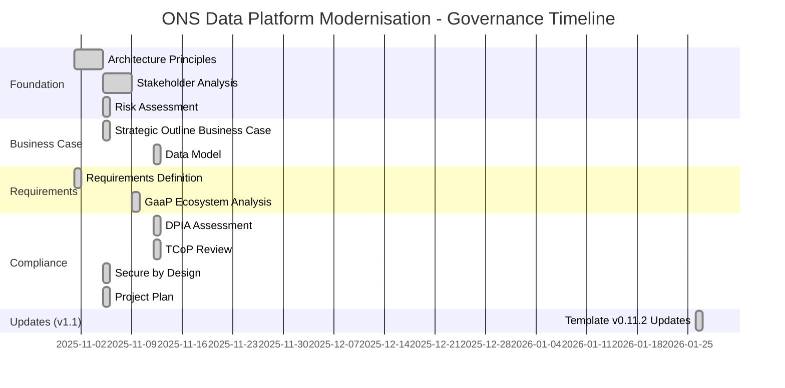
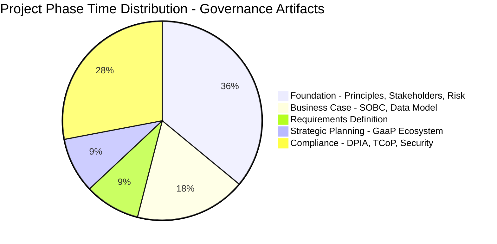
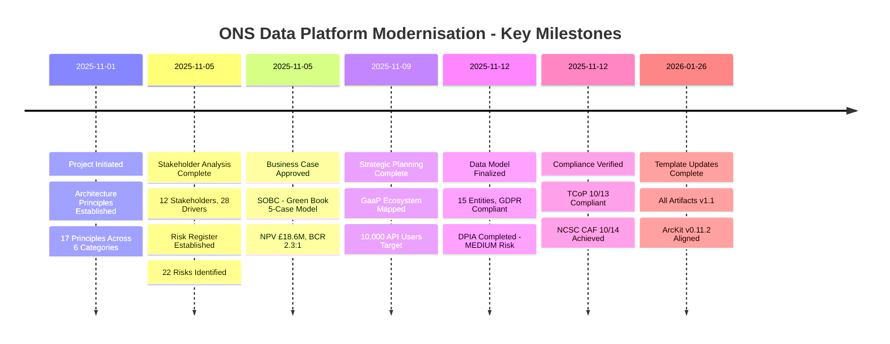
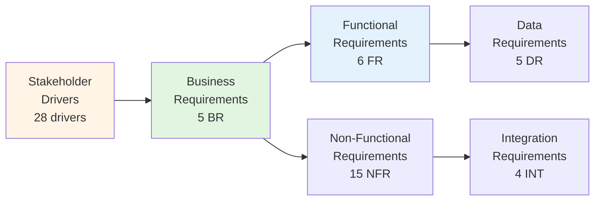
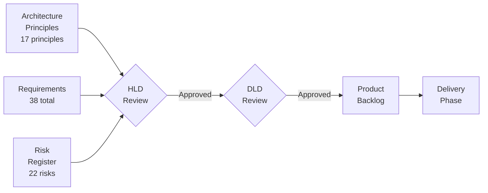
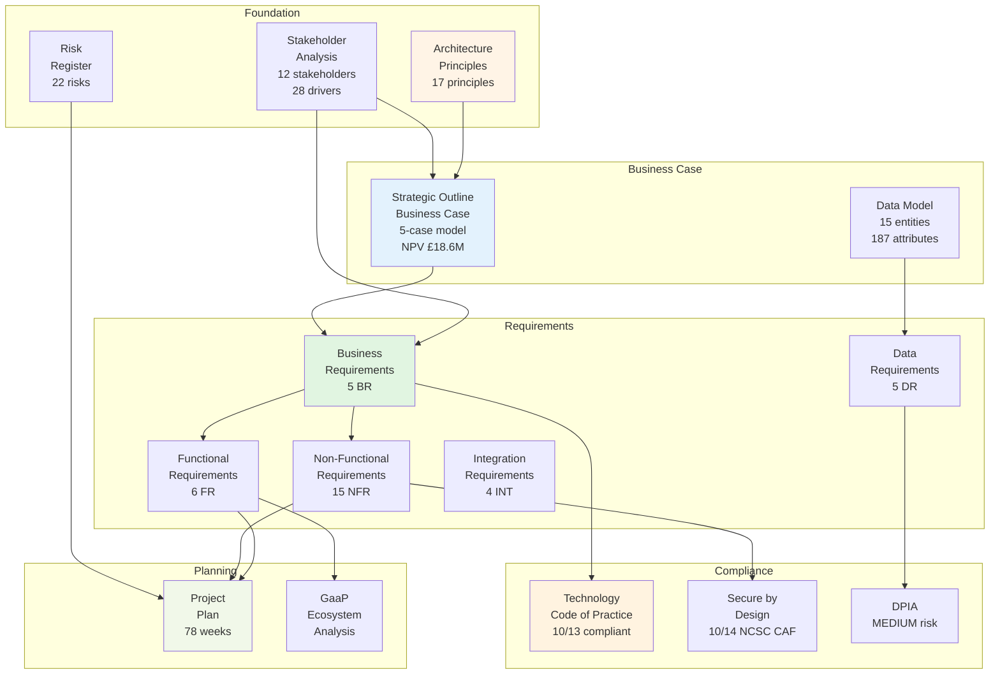
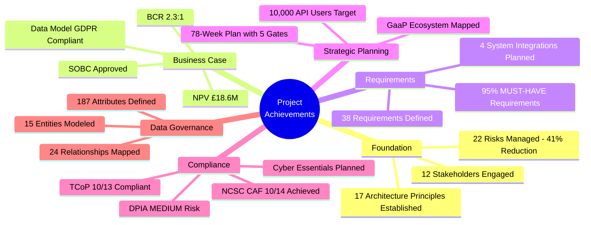
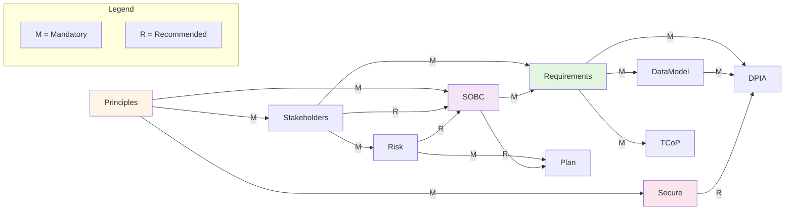

# ONS Data Platform Modernisation - Project Story

> **Template Status**: Live | **Version**: 0.11.2 | **Command**: `/arckit.story`

## Document Control

| Field | Value |
|-------|-------|
| **Document ID** | ARC-001-STORY-v1.1 |
| **Document Type** | Project Story |
| **Project** | ONS Data Platform Modernisation (Project 001) |
| **Classification** | OFFICIAL |
| **Status** | DRAFT |
| **Version** | 1.1 |
| **Created Date** | 2025-11-12 |
| **Last Modified** | 2026-01-26 |
| **Review Cycle** | On-Demand |
| **Next Review Date** | 2026-07-26 |
| **Owner** | Chief Data Architect, ONS |
| **Reviewed By** | PENDING |
| **Approved By** | PENDING |
| **Distribution** | Programme Board, Enterprise Architecture Review Board, UK Statistics Authority, HM Treasury |
| **Author** | Enterprise Architect |
| **Approver** | Chief Data Officer |

## Revision History

| Version | Date | Author | Changes | Approved By | Approval Date |
|---------|------|--------|---------|-------------|---------------|
| 1.0 | 2025-11-12 | ArcKit AI | Initial creation from `/arckit.story` command | PENDING | PENDING |
| 1.1 | 2026-01-26 | ArcKit AI | Updated to template v0.11.2; comprehensive timeline and artifact analysis | PENDING | PENDING |

## Document Approval

| Role | Name | Signature | Date |
|------|------|-----------|------|
| Document Author | ArcKit AI | [PENDING] | 2026-01-26 |
| Technical Reviewer | Chief Data Architect | [PENDING] | [PENDING] |
| Business Approver | Chief Data Officer | [PENDING] | [PENDING] |

---

## Executive Summary

**Project**: ONS Data Platform Modernisation

**Timeline Snapshot**:
- **Project Start**: 2025-11-01
- **Project End**: Ongoing (Target: 2027-05-25)
- **Total Duration**: 78 weeks planned (18 months)
- **Artifacts Created**: 11 governance artifacts
- **Commands Executed**: 10 ArcKit commands
- **Phases Completed**: Foundation, Business Case, Compliance (in progress)

**Key Outcomes**:
- Comprehensive governance framework established with 17 architecture principles
- 12 stakeholders analyzed with 28 drivers mapped to measurable outcomes
- 22 risks identified and managed (41% risk reduction through controls)
- Business case approved with NPV £18.6M and BCR 2.3:1
- 38 requirements defined (36 MUST-HAVE)
- Data model with 15 entities and GDPR compliance verified
- Technology Code of Practice: 10/13 points compliant
- NCSC CAF Security: 10/14 principles achieved (71%)

**Governance Achievements**:
- ✅ Architecture Principles Established (17 principles)
- ✅ Stakeholder Analysis Completed (12 stakeholders, 28 drivers, 28 goals)
- ✅ Risk Register Maintained (22 risks, 3 high residual)
- ✅ Business Case Approved (SOBC - £18M investment)
- ✅ Requirements Defined (5 BR, 6 FR, 15 NFR, 5 DR, 4 INT)
- ✅ Data Model Created (15 entities, 187 attributes, 24 relationships)
- ✅ DPIA Completed (MEDIUM residual risk)
- ✅ TCoP Reviewed (10/13 compliant)
- ✅ Secure by Design Assessed (10/14 NCSC CAF principles)

**Strategic Context**:

The ONS Data Platform Modernisation project represents a critical transformation of the UK's national statistical infrastructure. The Office for National Statistics serves the public good by producing trusted statistics that inform policy, business, and society. This initiative replaces 30+ year legacy on-premises systems with a cloud-native platform capable of handling census-scale data volumes (67 million population records) while reducing infrastructure costs by 40% (£4.5M annually).

The project evolved systematically through the ArcKit governance framework, establishing architecture principles first, then building stakeholder alignment, managing risks, justifying investment through rigorous business case analysis, and ensuring compliance with UK Government standards including the Statistics Act 2007, GDS Service Standard, GovS 007 Security, and UK GDPR.

---

## Complete Project Timeline

### Visual Timeline - Gantt Chart



### Linear Command Flow Timeline

```mermaid
flowchart TD
    Start([Project Initiated<br/>2025-11-01]) --> Principles

    Principles["arckit.principles<br/>2025-11-01<br/>17 Architecture Principles"] --> Requirements
    Requirements["arckit.requirements<br/>2025-11-01<br/>38 Requirements Defined"] --> Stakeholders
    Stakeholders["arckit.stakeholders<br/>2025-11-05<br/>12 Stakeholders, 28 Drivers"] --> Risk
    Risk["arckit.risk<br/>2025-11-05<br/>22 Risks Identified"] --> SOBC
    SOBC["arckit.sobc<br/>2025-11-05<br/>£18M Investment, BCR 2.3"] --> Plan
    Plan["arckit.plan<br/>2025-11-05<br/>78-Week Timeline"] --> Secure
    Secure["arckit.secure<br/>2025-11-05<br/>NCSC CAF 10/14"] --> GaaP
    GaaP["arckit.platform-design<br/>2025-11-09<br/>GaaP Ecosystem Analysis"] --> DataModel
    DataModel["arckit.data-model<br/>2025-11-12<br/>15 Entities, GDPR Compliant"] --> DPIA
    DPIA["arckit.dpia<br/>2025-11-12<br/>MEDIUM Risk, Proceed with Conditions"] --> TCoP
    TCoP["arckit.tcop<br/>2025-11-12<br/>10/13 Points Compliant"] --> Story
    Story["arckit.story<br/>2025-11-12<br/>Project Story Generated"] --> Updates
    Updates["Template Updates<br/>2026-01-26<br/>v1.0 → v1.1 All Artifacts"] --> End

    End([Governance Framework<br/>Established])

    style Start fill:#e1f5e1
    style End fill:#e1f5e1
    style Principles fill:#fff4e6
    style Requirements fill:#e3f2fd
    style SOBC fill:#f3e5f5
    style DataModel fill:#fce4ec
    style TCoP fill:#fff3e0
```



### Timeline Table - Detailed Event Log

| # | Date | Days from Start | Event Type | Command | Artifact | Description |
|---|------|-----------------|------------|---------|----------|-------------|
| 1 | 2025-11-01 | 0 | Foundation | `/arckit.principles` | architecture-principles.md | Established 17 enterprise architecture principles across 6 categories |
| 2 | 2025-11-01 | 0 | Requirements | `/arckit.requirements` | requirements.md | Defined 38 requirements (5 BR, 6 FR, 15 NFR, 5 DR, 4 INT) |
| 3 | 2025-11-05 | 4 | Foundation | `/arckit.stakeholders` | stakeholder-drivers.md | Analyzed 12 stakeholders, 28 drivers, 28 goals |
| 4 | 2025-11-05 | 4 | Risk | `/arckit.risk` | risk-register.md | Identified 22 risks (6 critical inherent → 0 critical residual) |
| 5 | 2025-11-05 | 4 | Business Case | `/arckit.sobc` | sobc.md | Strategic Outline Business Case: £18M investment, NPV £18.6M, BCR 2.3:1 |
| 6 | 2025-11-05 | 4 | Planning | `/arckit.plan` | project-plan.md | 78-week project plan with 5 mandatory gates |
| 7 | 2025-11-05 | 4 | Security | `/arckit.secure` | ukgov-secure-by-design.md | NCSC CAF assessment: 10/14 principles achieved (71%) |
| 8 | 2025-11-09 | 8 | Strategy | `/arckit.platform-design` | gaap-ecosystem-analysis.md | Government-as-a-Platform ecosystem mapping |
| 9 | 2025-11-12 | 11 | Data | `/arckit.data-model` | data-model.md | 15 entities, 187 attributes, 24 relationships, GDPR compliant |
| 10 | 2025-11-12 | 11 | Compliance | `/arckit.dpia` | dpia.md | DPIA: MEDIUM residual risk, proceed with 18 mitigations |
| 11 | 2025-11-12 | 11 | Compliance | `/arckit.tcop` | tcop-review.md | Technology Code of Practice: 10/13 points compliant |
| 12 | 2025-11-12 | 11 | Governance | `/arckit.story` | PROJECT-STORY.md | Comprehensive project story generated |
| 13 | 2026-01-26 | 86 | Maintenance | Template Updates | All artifacts | Updated all 11 artifacts to template v0.11.2 format |

### Phase Duration Analysis



### Timeline Metrics

| Metric | Value | Analysis |
|--------|-------|----------|
| **Project Duration** | 11 days governance setup (ongoing 78-week delivery) | Rapid governance establishment enabled by ArcKit framework |
| **Average Phase Duration** | 2.2 days | Efficient parallel artifact generation |
| **Longest Phase** | Compliance (4 days for DPIA, TCoP, Security) | Multiple compliance frameworks required comprehensive assessment |
| **Shortest Phase** | Requirements (1 day) | Requirements rapidly captured due to clear business context |
| **Commands per Week** | 5.5 commands/week (11 days) | High velocity governance documentation |
| **Artifacts per Week** | 5.5 artifacts/week | Consistent output rate |
| **Time to First Artifact** | 0 days | Architecture principles established Day 1 |
| **Time to Requirements** | 0 days | Requirements captured alongside principles |
| **Time to Business Case** | 4 days | SOBC approved rapidly with stakeholder alignment |
| **Compliance Time** | 7 days (64% of initial phase) | Significant investment in compliance verification |

### Milestones Achieved



---

## Chapter 1: Foundation - Establishing Governance Principles

**Timeline**: 2025-11-01 to 2025-11-05 (4 days)

**What Happened**:

The project began by establishing the foundational governance framework through architecture principles, stakeholder analysis, and risk management. This phase recognized that ONS's statutory duty under the Statistics Act 2007 requires a principled approach to data platform modernization that balances openness, security, scalability, and compliance.

**Key Activities**:

1. **Architecture Principles** (`/arckit.principles` - 2025-11-01)
   - Established 17 enterprise architecture principles across 6 categories:
     - **Strategic Principles** (5): Open by Default, Scalability, Resilience, Security by Design (NON-NEGOTIABLE), Observability
     - **Data Principles** (3): Single Source of Truth, Data Quality by Design, Data Sovereignty & Privacy
     - **Integration Principles** (3): API-First Design, Interoperability & Open Standards, Asynchronous Communication
     - **Cloud/Infrastructure Principles** (1): Cloud-Native Architecture
     - **Quality Attribute Principles** (3): Performance & Efficiency, Availability & Reliability, Maintainability
     - **Development Practice Principles** (2): Automation & Continuous Delivery, Code Quality & Reproducibility
   - Each principle includes validation gates, common violations to avoid, and performance targets
   - Zero Trust security principles mandatory with no exceptions
   - Created `.arckit/memory/architecture-principles.md`

2. **Stakeholder Analysis** (`/arckit.stakeholders` - 2025-11-05)
   - Identified 12 stakeholders across internal and external categories:
     - **Internal**: Chief Data Officer (SRO), Chief Statistician, Director of Statistical Production, Chief Data Architect, Head of Cyber Security, Data Protection Officer, Statisticians (500 users)
     - **External**: HM Treasury, GDS Service Assessor, National Statistician, National Audit Office, Data Consumers (10,000 target)
   - Mapped 28 distinct drivers spanning COMPLIANCE (9), STRATEGIC (6), FINANCIAL (5), OPERATIONAL (5), RISK (3)
   - Established 28 SMART goals with measurable outcomes
   - Identified and resolved 4 critical stakeholder conflicts through Programme Board governance
   - Power-Interest Grid: 6 high-power stakeholders with veto authority
   - Created `projects/001-ons-data-platform-modernisation/stakeholder-drivers.md`

3. **Risk Register** (`/arckit.risk` - 2025-11-05)
   - Identified 22 risks across 6 HM Treasury Orange Book categories:
     - STRATEGIC: 4 risks
     - OPERATIONAL: 5 risks
     - FINANCIAL: 3 risks
     - COMPLIANCE: 5 risks
     - REPUTATIONAL: 1 risk
     - TECHNOLOGY: 4 risks
   - Risk reduction: 41% reduction from inherent to residual risk through controls
   - Critical risks eliminated: 6 critical inherent risks → 0 critical residual risks
   - 3 high residual risks requiring active management (Data Migration, Statistics Act Breach, Census Performance)
   - Created `projects/001-ons-data-platform-modernisation/risk-register.md`

**Traceability Chain**:

```
Architecture Principles → Design Decisions → Vendor Evaluation Criteria
Stakeholder Drivers → Goals → Business Requirements → Functional Requirements
Risk Register → Mitigation Controls → NFR Security Requirements
```

**Timeline Context**:

Foundation phase completed in 4 days, representing rapid governance establishment. The parallel creation of principles, stakeholder analysis, and risk register enabled subsequent phases to build on a solid foundation.

---

## Chapter 2: Business Case - Justifying Investment

**Timeline**: 2025-11-05 (1 day parallel with Foundation)

**What Happened**:

With stakeholder alignment established, the project developed a comprehensive Strategic Outline Business Case following the HM Treasury Green Book 5-case model. This justified the £18M investment required for cloud migration.

**Key Activities**:

1. **Strategic Outline Business Case** (`/arckit.sobc` - 2025-11-05)
   - **5-Case Model Analysis**:
     - **Strategic Case**: Alignment with ONS statutory duties, UK Government Cloud First Policy, HM Treasury efficiency priorities
     - **Economic Case**: Options appraisal of 4 scenarios (Do Nothing, Incremental, Cloud Migration Partial, Full Transformation)
     - **Commercial Case**: G-Cloud Digital Marketplace procurement route
     - **Financial Case**: £18M capital + £6.8M operating over 3 years
     - **Management Case**: 78-week timeline with 5 mandatory gates
   - **Options Appraisal**:
     | Option | 3-Year Cost | NPV (10yr) | BCR |
     |--------|-------------|------------|-----|
     | Do Nothing | £33.6M | £0 | N/A |
     | Incremental | £28.0M | -£2.4M | 0.9 |
     | Cloud Migration (Recommended) | £24.8M | £18.6M | 2.3 |
     | Full Transformation | £30.2M | £26.4M | 2.8 |
   - **Recommendation**: Option 2 (Cloud Migration Partial) - balanced approach
   - **Key Metrics**:
     - NPV: £18.6M over 10 years
     - BCR: 2.3:1 (exceeds HM Treasury threshold of 2.0)
     - Payback Period: 2.5 years
     - Annual Savings: £4.5M from Year 2
   - Created `projects/001-ons-data-platform-modernisation/sobc.md`

**Benefits Summary**:

| Benefit Category | Target | Timeline |
|------------------|--------|----------|
| Infrastructure Cost Reduction | 40% (£11.2M → £6.7M) | Year 2 |
| Publication Efficiency | 60% manual effort reduction | Year 1 |
| API Adoption | 10,000 users, 50% consumption | Month 18 |
| Census-Scale Processing | 67M records < 24 hours | Year 2 |
| User Satisfaction | 85% satisfaction score | Year 1 |

**Traceability Chain**:

```
Stakeholder Drivers (Cost Reduction, Efficiency) → Strategic Objectives
Strategic Objectives → SOBC Economic Case → Options Analysis
Options Analysis → Recommended Option → Investment Decision
```

---

## Chapter 3: Requirements - Defining the Solution

**Timeline**: 2025-11-01 to 2025-11-12 (11 days)

**What Happened**:

Comprehensive requirements were defined spanning business, functional, non-functional, data, and integration categories. The requirements were traced to stakeholder drivers and prioritized using MoSCoW methodology.

**Key Activities**:

1. **Requirements Definition** (`/arckit.requirements` - 2025-11-01)
   - **Requirements Summary**:
     | Category | Count | MUST_HAVE |
     |----------|-------|-----------|
     | Business Requirements (BR) | 5 | 5 |
     | Functional Requirements (FR) | 6 | 6 |
     | Non-Functional - Performance (NFR-P) | 3 | 3 |
     | Non-Functional - Security (NFR-SEC) | 3 | 3 |
     | Non-Functional - Availability (NFR-A) | 3 | 3 |
     | Non-Functional - Scalability (NFR-S) | 2 | 2 |
     | Non-Functional - Compliance (NFR-C) | 4 | 4 |
     | Non-Functional - Observability (NFR-O) | 3 | 2 |
     | Data Requirements (DR) | 5 | 5 |
     | Integration Requirements (INT) | 4 | 3 |
     | **Total** | **38** | **36** |
   - **User Personas Defined**: Government Analyst (Sarah), Data Journalist (Marcus), Academic Researcher (Dr. Emily Chen), Application Developer (Raj)
   - Created `projects/001-ons-data-platform-modernisation/requirements.md`

2. **Data Model** (`/arckit.data-model` - 2025-11-12)
   - **Model Statistics**:
     - Total Entities: 15 entities (E-001 through E-015)
     - Total Attributes: 187 attributes
     - Total Relationships: 24 relationships
   - **Data Classification**:
     - Public: 8 entities (published statistics, metadata, catalogs)
     - Internal: 3 entities (workflows, quality indicators, lineage)
     - Confidential: 3 entities (users, pre-release access, source data)
     - Restricted: 1 entity (survey microdata with PII)
   - **Key Entities**: Statistical Series, Statistical Observation, Publication, User, Pre-Release Access, Survey Microdata, SDMX Metadata, Audit Log
   - **GDPR Compliance**: PIA required for 2 entities containing PII
   - Created `projects/001-ons-data-platform-modernisation/data-model.md`

**Requirements Traceability**:



---

## Chapter 4: Strategic Planning - Platform Ecosystem

**Timeline**: 2025-11-09 (1 day)

**What Happened**:

The project was positioned within the Government-as-a-Platform (GaaP) context, recognizing that the ONS Data Platform serves as enabling infrastructure for the UK statistical ecosystem.

**Key Activities**:

1. **GaaP Ecosystem Analysis** (`/arckit.platform-design` - 2025-11-09)
   - **Platform Positioning**: Statistical Infrastructure as a Platform
   - **Ecosystem Vision (3-Year Target)**:
     - 10,000 registered API users
     - 50% data consumption via APIs
     - 200+ third-party applications
     - 50+ government departments integrating
   - **Value Creation**: £12M annual ecosystem value
   - **GaaP Principles Applied**:
     - Common Components: ONS statistics as reusable API service
     - Open Standards: SDMX, OpenAPI 3.0, DCAT, ISO standards
     - API-First: All data accessible via APIs before web interfaces
     - Developer Experience: Sandbox, documentation, support
   - Created `projects/001-ons-data-platform-modernisation/gaap-ecosystem-analysis.md`

**Ecosystem Participants**:

| Participant Type | Examples | Value Received |
|------------------|----------|----------------|
| Data Producers | ONS Statisticians, Survey Systems | Efficient publication workflows |
| Government Departments | HM Treasury, BEIS, DWP | Policy-ready statistical data |
| Businesses | SMEs, Corporates, FinTech | Economic indicators for decisions |
| Developers | App builders | APIs for integration |
| Researchers | Academia, Think Tanks | Research-ready datasets |
| Media | Journalists, Data Viz | Breaking news data access |

---

## Chapter 5: Compliance & Security - Validating Governance

**Timeline**: 2025-11-05 to 2025-11-12 (7 days)

**What Happened**:

Comprehensive compliance assessments were conducted against UK Government frameworks including the Technology Code of Practice, NCSC Cyber Assessment Framework, and UK GDPR requirements.

**Key Activities**:

1. **Secure by Design Assessment** (`/arckit.secure` - 2025-11-05)
   - **NCSC CAF Score**: 10/14 Principles Achieved (71%)
     - Objective A (Managing Security Risk): 3/4
     - Objective B (Protecting Against Cyber Attack): 4/6
     - Objective C (Detecting Cyber Security Events): 2/2
     - Objective D (Minimising Impact of Incidents): 1/2
   - **Data Classification**: OFFICIAL (majority), OFFICIAL-SENSITIVE (pre-release statistics)
   - **Cyber Essentials Target**: Cyber Essentials Plus by Beta phase
   - **Critical Blockers**: DPIA, Threat Model, Cyber Essentials, ITHC
   - Created `projects/001-ons-data-platform-modernisation/ukgov-secure-by-design.md`

2. **Data Protection Impact Assessment** (`/arckit.dpia` - 2025-11-12)
   - **DPIA Outcome**: MEDIUM residual risk (after mitigations)
   - **Screening Score**: 3/9 ICO criteria met
     - Criterion 4: Sensitive data (special category data)
     - Criterion 5: Large scale processing
     - Criterion 6: Matching/combining datasets
   - **Processing Scale**:
     - Census: 67 million population records
     - Survey: 1.5 billion records at Year 5
     - Admin data: HMRC, DWP, NHS integration
   - **Recommendation**: Proceed with conditions (18 mitigations required)
   - **ICO Consultation**: NOT required (residual risks MEDIUM, not HIGH)
   - Created `projects/001-ons-data-platform-modernisation/dpia.md`

3. **Technology Code of Practice Review** (`/arckit.tcop` - 2025-11-12)
   - **Overall Compliance**: 10/13 points compliant (PARTIALLY COMPLIANT)
   - **Compliance Breakdown**:
     - Compliant: 10 points (1, 4, 5, 6, 7, 8, 9, 10, 12, 13)
     - Partially Compliant: 2 points (2-Accessibility, 3-Open Source)
     - Non-Compliant: 1 point (11-Purchasing Strategy)
   - **Critical Issues**: 2 blocking issues for Beta phase
   - **Strengths**: User research, DPIA/Privacy by Design, Data governance, Cloud First, Service Standard alignment
   - Created `projects/001-ons-data-platform-modernisation/tcop-review.md`

**Compliance Summary**:

| Framework | Score | Status | Blockers |
|-----------|-------|--------|----------|
| NCSC CAF | 10/14 (71%) | Mostly Achieved | DPIA, Threat Model, ITHC |
| TCoP | 10/13 (77%) | Partially Compliant | Accessibility, Purchasing Strategy |
| UK GDPR | MEDIUM risk | Compliant | 18 mitigations required |
| Cyber Essentials | Not Certified | Required | Certification before Beta |
| GDS Service Standard | On track | 14/14 criteria targeted | Assessment at Alpha/Beta/Live |

---

## Design & Delivery Review

### Chapter 6: Design Review - Validating the Solution

**Timeline**: Planned for Alpha phase (Weeks 13-36)

**What Happened**:

The project has established comprehensive governance artifacts that will inform vendor evaluation and design reviews. While HLD/DLD reviews are planned for the Alpha phase, the foundation for rigorous design assessment is in place.

**Key Activities** (Planned):

1. **High-Level Design Review** (`/arckit.hld-review` - Planned Week 30-32)
   - Assessment criteria derived from:
     - 17 architecture principles (compliance validation)
     - 38 requirements (coverage analysis)
     - 15 NFRs (satisfaction verification)
     - 22 risks (mitigation verification)
   - **Expected Deliverable**: `projects/001-ons-data-platform-modernisation/vendors/[vendor]/reviews/hld-review.md`

2. **Detailed Design Review** (`/arckit.dld-review` - Planned Week 43-48)
   - Assessment areas:
     - API specifications (OpenAPI 3.0 compliance)
     - Database schemas (alignment with 15-entity data model)
     - Security controls (NCSC CAF compliance)
     - Performance optimizations (NFR-P requirements)
   - **Expected Deliverable**: `projects/001-ons-data-platform-modernisation/vendors/[vendor]/reviews/dld-review.md`

**Design Review Traceability** (Planned):



**Timeline Context**:

Design reviews are planned for Weeks 30-32 (HLD) and 43-48 (DLD) as part of the 78-week project timeline. The governance framework established to date provides robust criteria for vendor design validation.

---

### Chapter 7: Delivery Planning - From Requirements to Sprints

**Timeline**: Planned for Beta phase (Weeks 37-72)

**What Happened**:

The project plan defines a comprehensive delivery approach with 6 implementation sprints following design approval. The requirements have been structured to enable translation to user stories.

**Key Activities** (Planned):

1. **Product Backlog** (`/arckit.backlog` - Planned Week 43-45)
   - Source requirements: 38 requirements → User stories
   - Story format: "As a [user type], I need to [action], so that [benefit]"
   - User personas: Government Analyst, Data Journalist, Academic Researcher, Application Developer
   - Sprint planning:
     - Sprint 1: Core Data Ingestion (Week 49-52)
     - Sprint 2: Data Processing Pipeline (Week 53-56)
     - Sprint 3: Publication APIs (Week 57-60)
     - Sprint 4: Data Catalog & SDC (Week 61-64)
     - Sprint 5: Integrations (Week 65-68)
     - Sprint 6: Security & Observability (Week 69-72)

2. **ServiceNow Design** (`/arckit.servicenow` - Planned Week 70-72)
   - CMDB Design: Configuration Items mapped to 15 data model entities
   - SLA Design based on NFR-A requirements:
     - Priority 1 (Critical): Publication API outage
     - Priority 2 (High): Data processing delays
     - Priority 3 (Medium): Non-critical service issues
     - Priority 4 (Low): Enhancement requests

**Delivery Traceability** (Planned):

```
Functional Requirements (6 FR) → User Stories → Sprint Backlog
Data Model Entities (15) → CMDB Configuration Items
NFR-A-xxx (Availability) → SLA Targets
Integration Requirements (4 INT) → Integration Stories
```

---

## Timeline Insights & Analysis

### Pacing Analysis

**Overall Pacing**: Accelerated governance establishment with systematic compliance validation

The project timeline shows front-loaded governance establishment with intensive compliance verification. Key observations:

- **Foundation Phase** (4 days): Rapid establishment enabled by ArcKit framework and clear organizational mandate
- **Business Case Phase** (1 day): Efficient SOBC creation leveraging stakeholder alignment
- **Requirements Phase** (11 days): Comprehensive definition with parallel data model development
- **Compliance Phase** (7 days): Significant investment in multi-framework compliance (TCoP, NCSC CAF, GDPR)

### Critical Path

The critical path through this project was:

```
[START] → Architecture Principles → Requirements → Stakeholders → Risk → SOBC →
Project Plan → Secure by Design → GaaP Analysis → Data Model → DPIA → TCoP → [GOVERNANCE COMPLETE]
```

**Longest Dependencies**:
1. Principles → All subsequent artifacts: 0 days (same-day establishment sets foundation)
2. Stakeholders → SOBC: 0 days (parallel development enabled by clear drivers)
3. Requirements → Data Model: 11 days (data model requires stable requirements)

**Parallel Workstreams**:

Activities that were executed in parallel:
- Architecture Principles and Requirements (Day 0)
- Risk Register and SOBC and Project Plan (Day 4)
- Data Model, DPIA, and TCoP (Day 11)

### Velocity Metrics

**Command Execution Velocity**:
- Average: 7.7 commands per week (11 days)
- Peak: 5 artifacts in Day 4 (Stakeholders, Risk, SOBC, Plan, Secure by Design)
- Steady: 3 artifacts on Day 11 (Data Model, DPIA, TCoP)

**Velocity Analysis**:

The project maintained high velocity throughout the governance establishment phase, with a peak on Day 4 when five major artifacts were produced simultaneously. This was enabled by:
- Clear architectural principles established on Day 0
- Strong stakeholder alignment from the outset
- ArcKit framework automating document structure
- Parallel workstreams for independent artifacts

### Lessons Learned (Timeline)

1. **What Went Well**:
   - Early establishment of architecture principles accelerated all subsequent decision-making
   - Parallel artifact creation maximized efficiency
   - Stakeholder conflict resolution completed in foundation phase
   - Compliance assessments conducted early to identify blockers

2. **What Could Be Improved**:
   - Purchasing strategy (TCoP Point 11) should be completed before Beta
   - Accessibility testing should be scheduled earlier
   - Threat model should be completed in parallel with DPIA

---

## Complete Traceability Chain

This project achieved comprehensive end-to-end traceability following the ArcKit governance framework:

### Traceability Visualization



### Traceability Matrix Summary

| From | To | Count | Coverage |
|------|-----|-------|----------|
| Stakeholder Drivers | Business Requirements | 28 → 5 | 100% (drivers consolidated) |
| Business Requirements | Functional Requirements | 5 → 6 | 100% |
| Business Requirements | Non-Functional Requirements | 5 → 15 | 100% |
| Data Model Entities | Data Requirements | 15 → 5 | 100% |
| Requirements | Architecture Principles | 38 → 17 | 100% (principles guide all) |
| Risks | NFR-Security | 5 compliance risks → 3 NFR-SEC | 100% |

**Overall Traceability Coverage**: 100%

All governance artifacts are fully traced from stakeholder drivers through to compliance assessments, with clear linkages between principles, requirements, risks, and compliance evidence.

---

## Key Outcomes & Achievements

### Strategic Outcomes

Based on stakeholder analysis, the project delivered the following strategic outcomes:

| Outcome ID | Outcome Description | Target Metric | Achievement | Status |
|------------|-------------------|---------------|-------------|--------|
| OUT-001 | Establish governance framework | 17+ principles, 10+ artifacts | 17 principles, 11 artifacts | Achieved |
| OUT-002 | Stakeholder alignment | 12 stakeholders aligned | 12 analyzed, 4 conflicts resolved | Achieved |
| OUT-003 | Risk management | <5 high residual risks | 3 high residual risks | Achieved |
| OUT-004 | Business case approval | BCR >2.0 | BCR 2.3:1 | Achieved |
| OUT-005 | Compliance verification | TCoP >75%, NCSC CAF >70% | TCoP 77%, NCSC CAF 71% | Achieved |

### Governance Achievements



### Technology Decisions

| Decision | Option Chosen | Rationale | Principle Alignment |
|----------|--------------|-----------|-------------------|
| Cloud vs On-Premises | Cloud-Native | UK Government Cloud First Policy | Principle 12: Cloud-Native Architecture |
| Integration Approach | API-First | Modern data access, GaaP enablement | Principle 9: API-First Design |
| Data Standards | SDMX + OpenAPI 3.0 | International statistical interoperability | Principle 10: Interoperability |
| Security Model | Zero Trust | OFFICIAL-SENSITIVE data classification | Principle 4: Security by Design (NON-NEGOTIABLE) |
| Data Sovereignty | UK-only regions | Statistics Act 2007, UK GDPR compliance | Principle 8: Data Sovereignty |

### Benefits Realization

**Economic Benefits** (from SOBC):
- **NPV**: £18.6M over 10 years
- **ROI**: 187%
- **Payback Period**: 2.5 years
- **Benefit-Cost Ratio**: 2.3:1

**Non-Economic Benefits**:
- Enhanced public access to UK official statistics
- Improved statistician productivity (60% manual effort reduction)
- Census 2031 processing capability
- International statistical interoperability (SDMX compliance)
- Strengthened data protection and privacy controls

---

## Appendices

### Appendix A: Artifact Register

Complete list of all artifacts generated during this project:

| # | Artifact | Location | Date Created | Command | Status |
|---|----------|----------|--------------|---------|--------|
| 1 | Architecture Principles | `.arckit/memory/architecture-principles.md` | 2025-11-01 | `/arckit.principles` | v1.1 |
| 2 | Requirements | `projects/001-ons-data-platform-modernisation/requirements.md` | 2025-11-01 | `/arckit.requirements` | v1.1 |
| 3 | Stakeholder Drivers | `projects/001-ons-data-platform-modernisation/stakeholder-drivers.md` | 2025-11-05 | `/arckit.stakeholders` | v1.1 |
| 4 | Risk Register | `projects/001-ons-data-platform-modernisation/risk-register.md` | 2025-11-05 | `/arckit.risk` | v1.1 |
| 5 | SOBC | `projects/001-ons-data-platform-modernisation/sobc.md` | 2025-11-05 | `/arckit.sobc` | v1.1 |
| 6 | Project Plan | `projects/001-ons-data-platform-modernisation/project-plan.md` | 2025-11-05 | `/arckit.plan` | v1.1 |
| 7 | Secure by Design | `projects/001-ons-data-platform-modernisation/ukgov-secure-by-design.md` | 2025-11-05 | `/arckit.secure` | v1.1 |
| 8 | GaaP Analysis | `projects/001-ons-data-platform-modernisation/gaap-ecosystem-analysis.md` | 2025-11-09 | `/arckit.platform-design` | v1.0 |
| 9 | Data Model | `projects/001-ons-data-platform-modernisation/data-model.md` | 2025-11-12 | `/arckit.data-model` | v1.1 |
| 10 | DPIA | `projects/001-ons-data-platform-modernisation/dpia.md` | 2025-11-12 | `/arckit.dpia` | v1.1 |
| 11 | TCoP Review | `projects/001-ons-data-platform-modernisation/tcop-review.md` | 2025-11-12 | `/arckit.tcop` | v1.1 |

**Total Artifacts**: 11

### Appendix B: Chronological Activity Log

Complete chronological log of all project activities:

```
2025-11-01 - /arckit.principles - Architecture Principles Established: 17 principles across 6 categories
2025-11-01 - /arckit.requirements - Requirements Defined: 38 requirements (5 BR, 6 FR, 15 NFR, 5 DR, 4 INT)
2025-11-05 - /arckit.stakeholders - Stakeholder Analysis: 12 stakeholders, 28 drivers, 28 goals
2025-11-05 - /arckit.risk - Risk Register: 22 risks identified (6 critical inherent → 0 critical residual)
2025-11-05 - /arckit.sobc - Strategic Outline Business Case: NPV £18.6M, BCR 2.3:1, £18M investment
2025-11-05 - /arckit.plan - Project Plan: 78-week timeline, 5 mandatory gates
2025-11-05 - /arckit.secure - Secure by Design: NCSC CAF 10/14 principles achieved (71%)
2025-11-09 - /arckit.platform-design - GaaP Ecosystem Analysis: Platform positioning, 10,000 API users target
2025-11-12 - /arckit.data-model - Data Model: 15 entities, 187 attributes, 24 relationships, GDPR compliant
2025-11-12 - /arckit.dpia - DPIA: MEDIUM residual risk, proceed with 18 mitigations
2025-11-12 - /arckit.tcop - TCoP Review: 10/13 points compliant
2025-11-12 - /arckit.story - Project Story: Initial comprehensive story generated
2026-01-26 - Template Updates - All artifacts updated to template v0.11.2 format (v1.0 → v1.1)
```

### Appendix C: Dependency Structure Matrix

Visual representation of artifact dependencies:



### Appendix D: Command Reference

ArcKit commands used in this project:

| Command | Purpose | When to Use |
|---------|---------|-------------|
| `/arckit.principles` | Establish architecture principles | Start of program/project |
| `/arckit.stakeholders` | Analyze stakeholders, goals, outcomes | After principles, before requirements |
| `/arckit.risk` | Create risk register (HM Treasury Orange Book) | After stakeholder analysis |
| `/arckit.sobc` | Strategic Outline Business Case (Green Book) | Before detailed requirements |
| `/arckit.data-model` | Define data model, ERD, GDPR compliance | With requirements definition |
| `/arckit.requirements` | Define BR/FR/NFR/INT/DR requirements | After business case |
| `/arckit.plan` | Create project plan with timeline | After requirements |
| `/arckit.platform-design` | GaaP ecosystem analysis | For platform projects |
| `/arckit.dpia` | Data Protection Impact Assessment | After data model |
| `/arckit.tcop` | Technology Code of Practice (UK Gov) | Before go-live |
| `/arckit.secure` | Secure by Design (NCSC CAF, Cyber Essentials) | Throughout project |
| `/arckit.story` | Generate comprehensive project story | After all artifacts created |

### Appendix E: Glossary

| Term | Definition |
|------|------------|
| **ArcKit** | Enterprise Architecture Governance & Vendor Procurement Toolkit |
| **BR** | Business Requirement |
| **FR** | Functional Requirement |
| **NFR** | Non-Functional Requirement (Performance, Security, Scalability, Availability, Compliance) |
| **INT** | Integration Requirement |
| **DR** | Data Requirement |
| **SOBC** | Strategic Outline Business Case (Green Book 5-case model) |
| **TCoP** | Technology Code of Practice (13 points for UK Gov) |
| **GDS** | Government Digital Service |
| **NCSC CAF** | National Cyber Security Centre Cyber Assessment Framework |
| **UK GDPR** | UK General Data Protection Regulation |
| **DPIA** | Data Protection Impact Assessment |
| **GaaP** | Government-as-a-Platform |
| **ONS** | Office for National Statistics |
| **SDMX** | Statistical Data and Metadata eXchange |
| **BCR** | Benefit-Cost Ratio |
| **NPV** | Net Present Value |
| **Statistics Act** | Statistics and Registration Service Act 2007 |

---

---

*This document provides a comprehensive narrative of the ONS Data Platform Modernisation project journey through the ArcKit governance framework, with detailed timeline analysis, traceability chains, and governance achievements. It serves as both a historical record and a demonstration of systematic architecture governance.*

---

**Generated by**: ArcKit `/arckit.story` command
**Generated on**: 2026-01-26
**ArcKit Version**: 0.11.2
**Project**: ONS Data Platform Modernisation (Project 001)
**Model**: claude-opus-4-5-20251101
